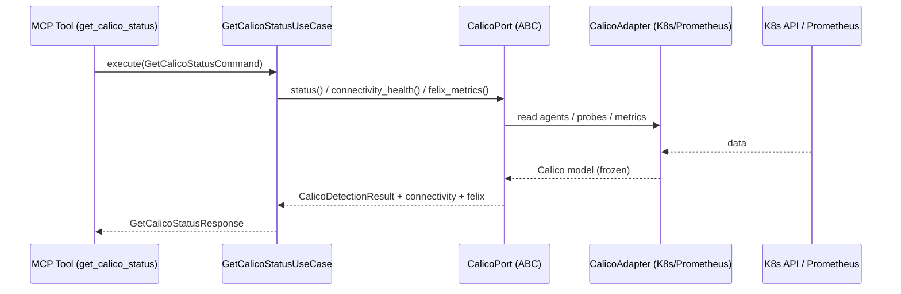

# Use Case 180 — Get Calico Status

## Sample Questions

- "Are the calico-node / felix agents healthy and is the datapath functional?"
- "How many calico-node agents are ready out of the total across the cluster?"
- "Is there any felix error or degraded dataplane connectivity right now?"
- "Is the Calico datapath healthy enough to trust a network diagnosis?"
- "Are all calico-node healthz probes passing on every node?"
- "Show me the per-node calico-node status and a global degradation summary."

---

"Get the Calico dataplane health and connectivity status — ready/total agent counts, felix errors, per-node status and a global degraded summary." The user asks via `get_calico_status`. The flow crosses the hexagonal layers: MCP Tool → `GetCalicoStatusUseCase` → `CalicoPort` (driven port) → `CalicoK8sAdapter` / `CalicoPrometheusAdapter` (secondary adapters) → Kubernetes API / Prometheus.

### Flow 1 — Get Calico Status execution

## Key Points

- `GetCalicoStatusUseCase` depends only on `CalicoPort` — never on a Kubernetes SDK.
- Degradation is never hidden: agent shortfall, felix errors or a degraded connectivity probe all upgrade the status to `DEGRADED`.
- `NOT_INSTALLED` is returned honestly when Calico is absent — never a fabricated health value.
- `get_calico_status` is registered in `mcp/tools/get_calico_status.py` and synced to the control-plane cache.

## Related Files

- `src/hexawyn/domain/models/calico.py`
- `src/hexawyn/domain/services/calico/get_calico_status_service.py`
- `src/hexawyn/application/ports/driven/calico_port.py`
- `src/hexawyn/application/use_case/calico/get_calico_status/get_calico_status_use_case.py`
- `src/hexawyn/adapters/secondary/calico/calico_k8s_adapter.py`
- `src/hexawyn/adapters/secondary/calico/calico_prometheus_adapter.py`
- `src/hexawyn/mcp/adapters/calico_adapters.py`
- `src/hexawyn/mcp/tools/get_calico_status.py`
