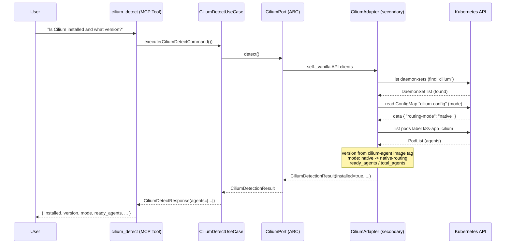
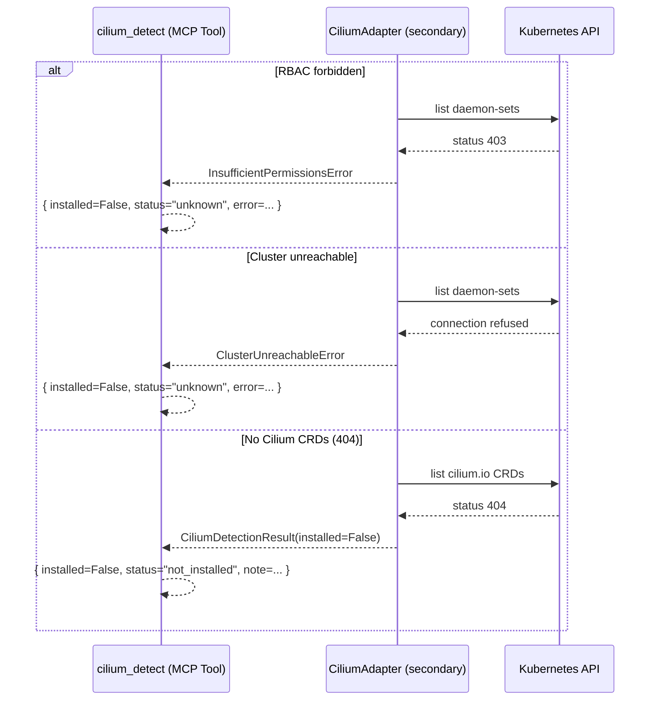
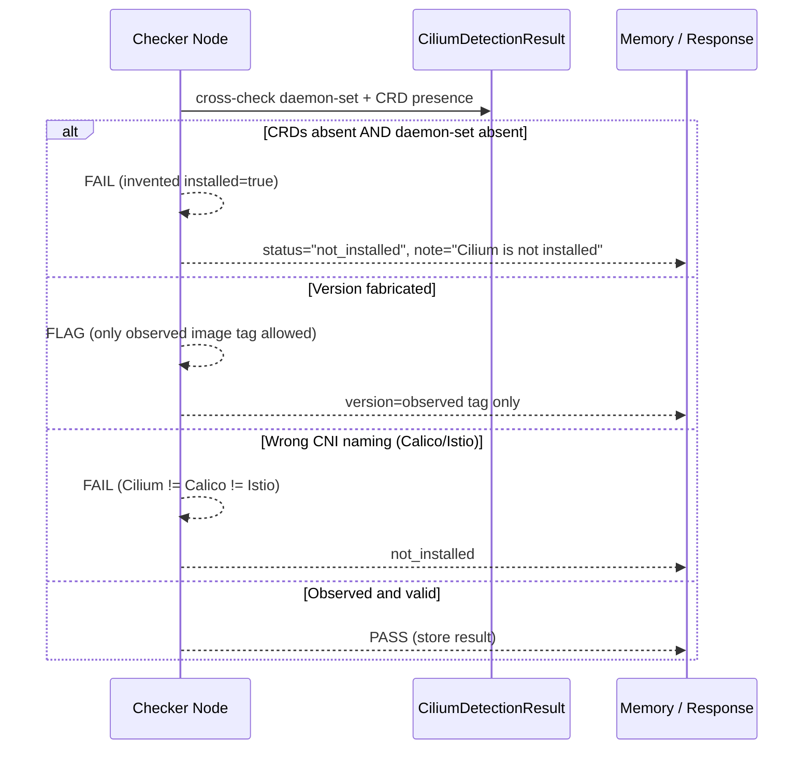
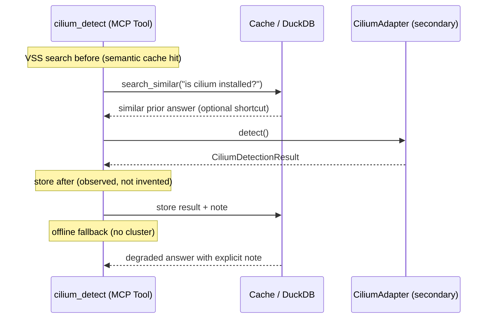

# Use Case 181 — Cilium Detect

## Sample Questions

- "Is Cilium installed in my cluster and what version is running?"
- "Is Cilium in tunnel mode or native-routing mode on this cluster?"
- "Are all Cilium agent pods ready, or is any node's dataplane degraded?"
- "Show me the Cilium agent health per node and whether the CNI is functional"
- "What routing mode is configured in the cilium-config ConfigMap?"

---

A platform/SRE engineer asks whether Cilium is the active CNI. The tool reports the
observed version, routing mode, and per-node agent health, with an honest degraded
summary. The flow crosses the hexagonal layers: MCP Tool → CiliumDetectUseCase →
CiliumPort (driven port) → CiliumAdapter (secondary) → VanillaAdapter → Kubernetes API.

### Flow 1 — Happy Path: Detect a Healthy Cilium Installation

### Flow 2 — Errors: RBAC, Unreachable, Not Installed

### Flow 3 — Checker Node: Honest Verification

### Flow 4 — DuckDB Memory: Query-Before, Store-After, Offline Fallback

## Key Points

- `CiliumDetectUseCase` depends only on `CiliumPort` — never on a cloud SDK or k8s client.
- `installed` is set only from observed signals: a `cilium` DaemonSet OR `cilium.io` CRDs.
- `version` is the raw image tag of the `cilium-agent` container; digests become `None`.
- `mode` (tunnel / native-routing / cluster / ipvlan) comes from the `cilium-config` ConfigMap; unknown stays `UNKNOWN`.
- A degraded cluster reports `status="degraded"` with a `{ready}/{total} agents ready` summary.

## Test Coverage

| Test | File | Status |
|---|---|---|
| `test_detect_installed_with_agents` | `tests/unit/adapters/secondary/gitops/test_cilium_adapter.py` | ✅ |
| `test_detect_version_raw_preserved` | `tests/unit/adapters/secondary/gitops/test_cilium_adapter.py` | ✅ |
| `test_detect_degraded_when_agents_not_ready` | `tests/unit/adapters/secondary/gitops/test_cilium_adapter.py` | ✅ |
| `test_detect_mode_native_routing` | `tests/unit/adapters/secondary/gitops/test_cilium_adapter.py` | ✅ |
| `test_detect_not_installed_when_no_daemonset_and_no_crds` | `tests/unit/adapters/secondary/gitops/test_cilium_adapter.py` | ✅ |
| `test_detect_rbac_403_raises_insufficient_permissions` | `tests/unit/adapters/secondary/gitops/test_cilium_adapter.py` | ✅ |
| `test_execute_returns_response` | `tests/unit/application/use_case/cilium/test_uc_cilium_detect_use_case.py` | ✅ |
| `test_cilium_detect_returns_dict` | `tests/unit/mcp/tools/test_tool_cilium_detect.py` | ✅ |
| `test_build_cilium_adapter` | `tests/unit/test_server.py` | ✅ |

## Related Files

- `src/hexawyn/domain/models/cilium.py` — `CiliumAgentHealth`, `CiliumDetectionResult`
- `src/hexawyn/application/ports/driven/cilium_port.py` — `CiliumPort` (ABC)
- `src/hexawyn/application/ports/driving/cilium_detect/cilium_detect_service_port.py` — `CiliumDetectServicePort`
- `src/hexawyn/application/use_case/cilium/cilium_detect/` — Command, Response, UseCase
- `src/hexawyn/adapters/secondary/gitops/cilium_adapter.py` — `CiliumAdapter`
- `src/hexawyn/mcp/tools/cilium_detect.py` — MCP tool
- `src/hexawyn/mcp/server.py` — `build_cilium_adapter()` wiring
