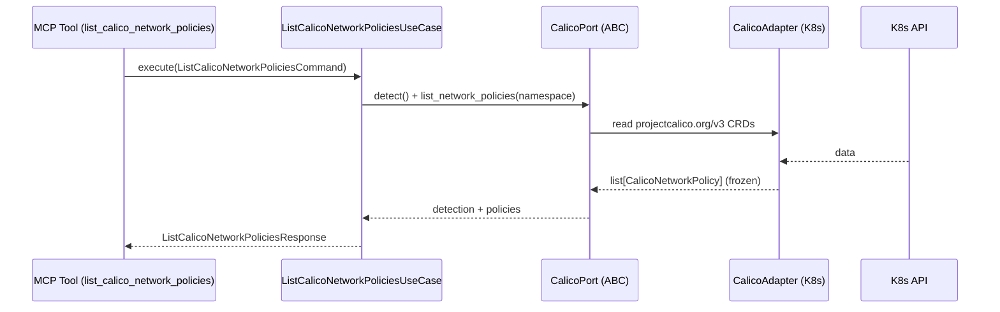

# Use Case 181 — List Calico Network Policies

## Sample Questions

- "List all Calico network policies in this cluster."
- "Show me the Calico NetworkPolicies in the default namespace."
- "What GlobalNetworkPolicies exist cluster-wide for Calico?"
- "List Calico policies with their endpoint selector and allow/deny action."
- "Show the ingress/egress rule summary of each Calico policy."
- "Are there Calico policies denying traffic to the production namespace?"

---

"List CalicoNetworkPolicy (namespaced) and GlobalNetworkPolicy (cluster-wide) with endpoint selector, action and ingress/egress rule summary." The user asks via `list_calico_network_policies`. The flow crosses the hexagonal layers: MCP Tool → `ListCalicoNetworkPoliciesUseCase` → `CalicoPort` (driven port) → `CalicoK8sAdapter` (secondary adapter) → Kubernetes API.

### Flow 1 — List Calico Network Policies execution

## Key Points

- `ListCalicoNetworkPoliciesUseCase` depends only on `CalicoPort` — never on a Kubernetes SDK.
- Namespaced `CalicoNetworkPolicy` and cluster-wide `GlobalNetworkPolicy` are distinguished by `kind`.
- Rule extraction (selector, allow/deny action, ingress/egress summary) lives in the pure domain service.
- `NOT_INSTALLED` is returned honestly when the `projectcalico.org` CRD group is absent.
- `list_calico_network_policies` is registered in `mcp/tools/list_calico_network_policies.py` and synced to the control-plane cache.

## Related Files

- `src/hexawyn/domain/models/calico.py`
- `src/hexawyn/domain/services/calico/network_policy_service.py`
- `src/hexawyn/application/ports/driven/calico_port.py`
- `src/hexawyn/application/use_case/calico/list_calico_network_policies/list_calico_network_policies_use_case.py`
- `src/hexawyn/adapters/secondary/calico/calico_k8s_adapter.py`
- `src/hexawyn/mcp/adapters/calico_adapters.py`
- `src/hexawyn/mcp/tools/list_calico_network_policies.py`
