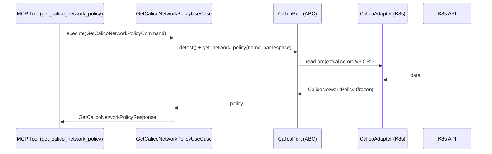

# Use Case 182 — Get Calico Network Policy

## Sample Questions

- "Show me the full detail of Calico network policy default-deny."
- "What selector and action does the Calico policy allow-api have?"
- "List the ingress and egress rules of the Calico GlobalNetworkPolicy global-default."
- "Get the full spec of the Calico network policy payment-allow in the payments namespace."
- "Is the Calico policy checkout-restrict a deny policy and what does it match?"

---

"Get the full detail of a specific CalicoNetworkPolicy or GlobalNetworkPolicy — name, scope, endpoint selector, action and ingress/egress rules." The user asks via `get_calico_network_policy`. The flow crosses the hexagonal layers: MCP Tool → `GetCalicoNetworkPolicyUseCase` → `CalicoPort` (driven port) → `CalicoK8sAdapter` (secondary adapter) → Kubernetes API.

### Flow 1 — Get Calico Network Policy execution

## Key Points

- `GetCalicoNetworkPolicyUseCase` depends only on `CalicoPort` — never on a Kubernetes SDK.
- A 404 from the API is translated to `ResourceNotFoundError` (a `HexawynError`), never a raw K8s error.
- Non-Calico kinds (e.g. a vanilla `networking.k8s.io/v1` NetworkPolicy) are refused with a clear error.
- `NOT_INSTALLED` is returned honestly when the `projectcalico.org` CRD group is absent.
- `get_calico_network_policy` is registered in `mcp/tools/get_calico_network_policy.py` and synced to the control-plane cache.

## Related Files

- `src/hexawyn/domain/models/calico.py`
- `src/hexawyn/domain/services/calico/network_policy_service.py`
- `src/hexawyn/application/ports/driven/calico_port.py`
- `src/hexawyn/application/use_case/calico/get_calico_network_policy/get_calico_network_policy_use_case.py`
- `src/hexawyn/adapters/secondary/calico/calico_k8s_adapter.py`
- `src/hexawyn/mcp/adapters/calico_adapters.py`
- `src/hexawyn/mcp/tools/get_calico_network_policy.py`
