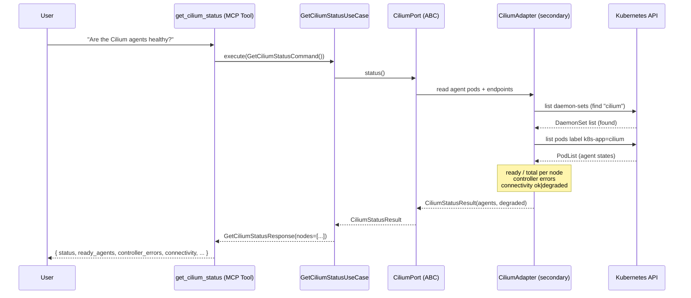
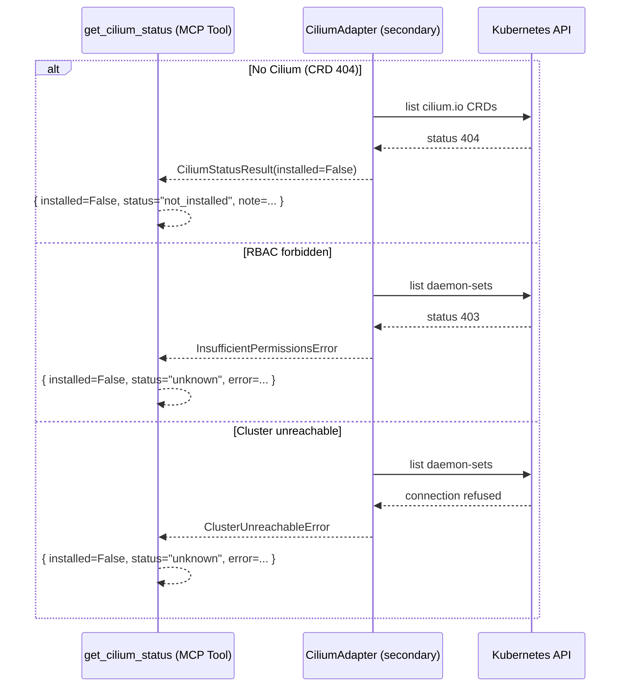
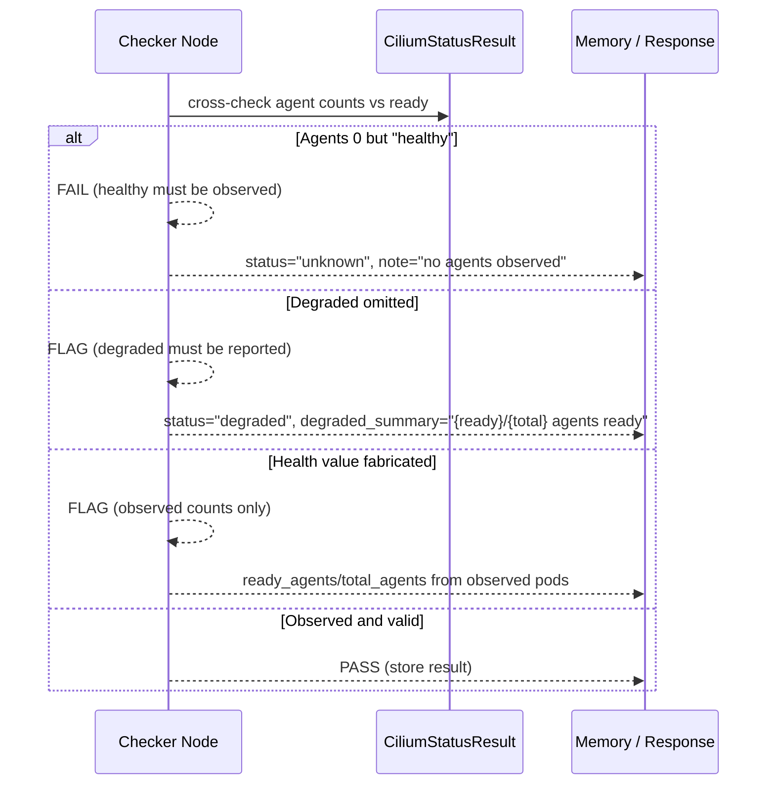
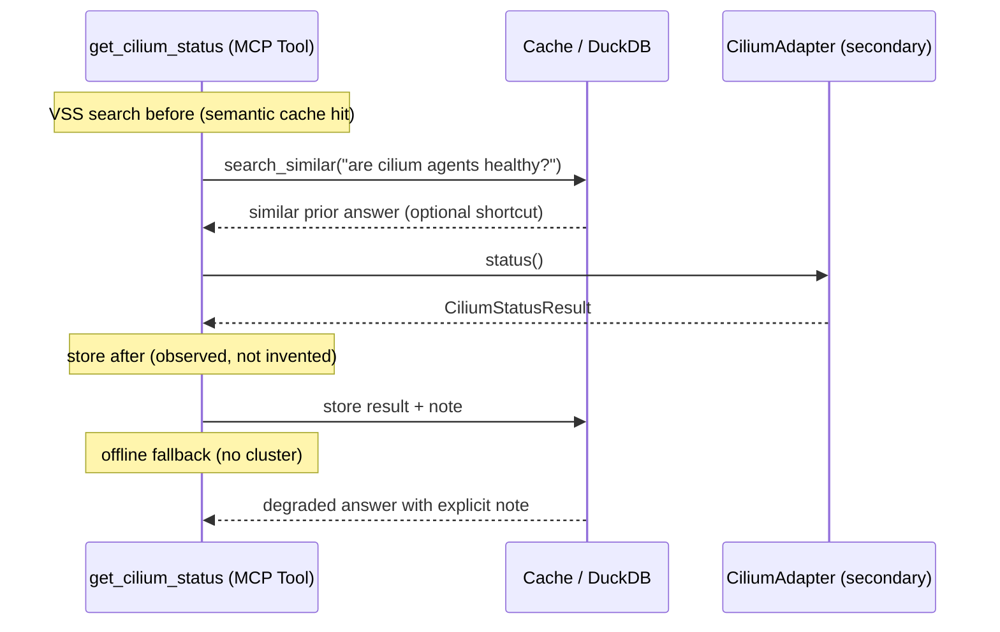

# Use Case 182 — Get Cilium Status

## Sample Questions

- "Are the Cilium agents healthy and is the datapath functional on my cluster?"
- "How many Cilium agents are ready out of the total scheduled across nodes?"
- "Show me the per-node Cilium agent status and whether connectivity is OK"
- "Are there any Cilium controller errors or unhealthy agents right now?"
- "Is any node's dataplane degraded, and which nodes are affected?"

---

A platform/SRE engineer asks whether the Cilium agents and the datapath are
healthy before trusting a network diagnosis. The tool aggregates per-node agent
health into a ready/total summary, surfaces controller errors and a connectivity
probe result, and reports a global degraded summary. When Cilium is absent it
returns NOT_INSTALLED — never a fabricated value. The flow crosses the
hexagonal layers: MCP Tool → GetCiliumStatusUseCase → CiliumPort (driven port)
→ CiliumAdapter (secondary) → VanillaAdapter → Kubernetes API.

### Flow 1 — Happy Path: Read Datapath Health

### Flow 2 — Errors: Not Installed, Unreachable, RBAC

### Flow 3 — Checker Node: Honest Status

### Flow 4 — DuckDB Memory: Query-Before, Store-After, Offline Fallback

## Key Points

- `GetCiliumStatusUseCase` depends only on `CiliumPort` — never on a k8s client.
- `status` is `healthy` only when every observed agent is ready; an empty agent
  list is reported as `unknown`, never `healthy`.
- `ready_agents`/`total_agents` come from observed pods; `controller_errors`
  counts non-ready or restarted agents.
- `connectivity` is `ok`/`degraded` derived from readiness; `degraded_summary`
  is a `{ready}/{total} agents ready` string when any agent is down.
- NOT_INSTALLED is returned when the `cilium.io` CRD group is absent — never a
  fabricated value.

## Test Coverage

| Test | File | Status |
|---|---|---|
| `test_status_healthy_when_all_ready` | `tests/unit/adapters/secondary/gitops/test_cilium_adapter.py` | ✅ |
| `test_status_degraded_when_some_down` | `tests/unit/adapters/secondary/gitops/test_cilium_adapter.py` | ✅ |
| `test_status_not_installed` | `tests/unit/adapters/secondary/gitops/test_cilium_adapter.py` | ✅ |
| `test_status_unreachable_raises_cluster_unreachable` | `tests/unit/adapters/secondary/gitops/test_cilium_adapter.py` | ✅ |
| `test_healthy_when_all_ready` | `tests/unit/domain/services/test_cilium_status_report_builder.py` | ✅ |
| `test_execute_returns_healthy_response` | `tests/unit/application/use_case/cilium/test_uc_get_cilium_status_use_case.py` | ✅ |
| `test_get_cilium_status_returns_dict` | `tests/unit/mcp/tools/test_tool_get_cilium_status.py` | ✅ |

## Related Files

- `src/hexawyn/domain/models/cilium.py` — `CiliumStatusResult`, `CiliumAgentHealth`
- `src/hexawyn/domain/services/cilium/status_report_builder.py` — pure status logic
- `src/hexawyn/application/ports/driven/cilium_port.py` — `CiliumPort` (`status()`)
- `src/hexawyn/application/use_case/cilium/get_cilium_status/` — Command, Response, UseCase
- `src/hexawyn/adapters/secondary/gitops/cilium_adapter.py` — `CiliumAdapter.status()`
- `src/hexawyn/mcp/tools/get_cilium_status.py` — MCP tool
- `src/hexawyn/mcp/adapters/cilium_adapters.py` — `build_cilium_adapter()` wiring
