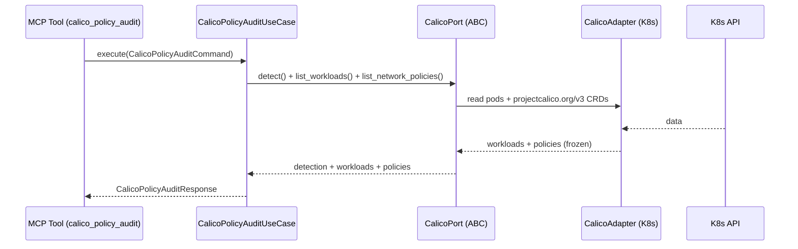

# Use Case 183 — Calico Policy Audit

## Sample Questions

- "Which Calico-selected workloads have no ingress or egress restriction?"
- "Find namespaces without a default-deny Calico policy covering their workloads."
- "Audit Calico L3/L4 coverage gaps and rank them by risk."
- "Which namespaces have Calico policies but no default-deny rule?"
- "Show me the Calico workloads lacking any L7 (HTTP/TLS) restriction."
- "Are there workload namespaces with no Calico NetworkPolicy at all?"

---

"Audit Calico network policies for L3/L4 coverage gaps — flag namespaces whose workloads lack a default-deny restriction and rank the gaps by risk." The user asks via `calico_policy_audit`. The flow crosses the hexagonal layers: MCP Tool → `CalicoPolicyAuditUseCase` → `CalicoPort` (driven port) → `CalicoK8sAdapter` (secondary adapter) → Kubernetes API.

### Flow 1 — Calico Policy Audit execution

## Key Points

- `CalicoPolicyAuditUseCase` depends only on `CalicoPort` — never on a Kubernetes SDK.
- A real default-deny check is made (a `deny`/mixed rule), not a boolean presence probe.
- Findings are ranked by risk (critical > medium > low) then workload count, reusing the existing `risk_classifier`.
- On absent Calico the result degrades to the vanilla NetworkPolicy view with an honest `NOT_INSTALLED` marker.
- `calico_policy_audit` is registered in `mcp/tools/calico_policy_audit.py` and synced to the control-plane cache.

## Related Files

- `src/hexawyn/domain/models/calico.py`
- `src/hexawyn/domain/services/calico/policy_audit_service.py`
- `src/hexawyn/domain/services/network_policy/risk_classifier.py`
- `src/hexawyn/application/ports/driven/calico_port.py`
- `src/hexawyn/application/use_case/calico/calico_policy_audit/calico_policy_audit_use_case.py`
- `src/hexawyn/adapters/secondary/calico/calico_k8s_adapter.py`
- `src/hexawyn/mcp/adapters/calico_adapters.py`
- `src/hexawyn/mcp/tools/calico_policy_audit.py`
