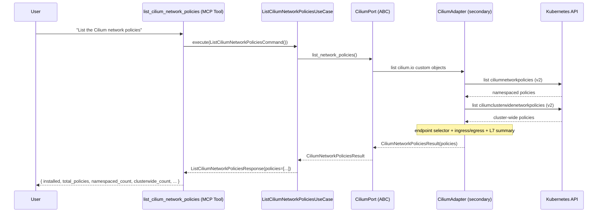
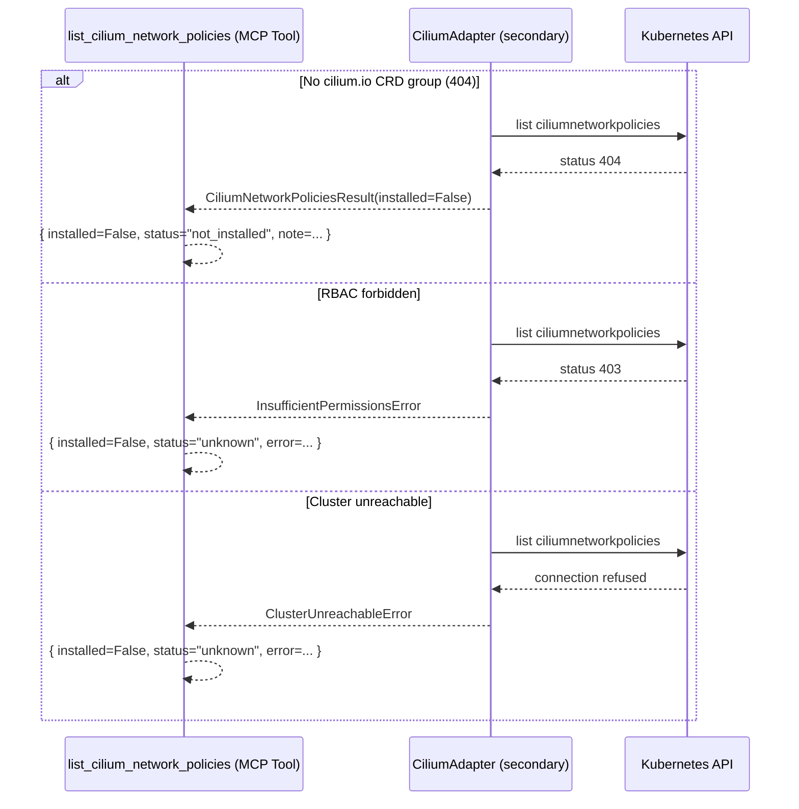
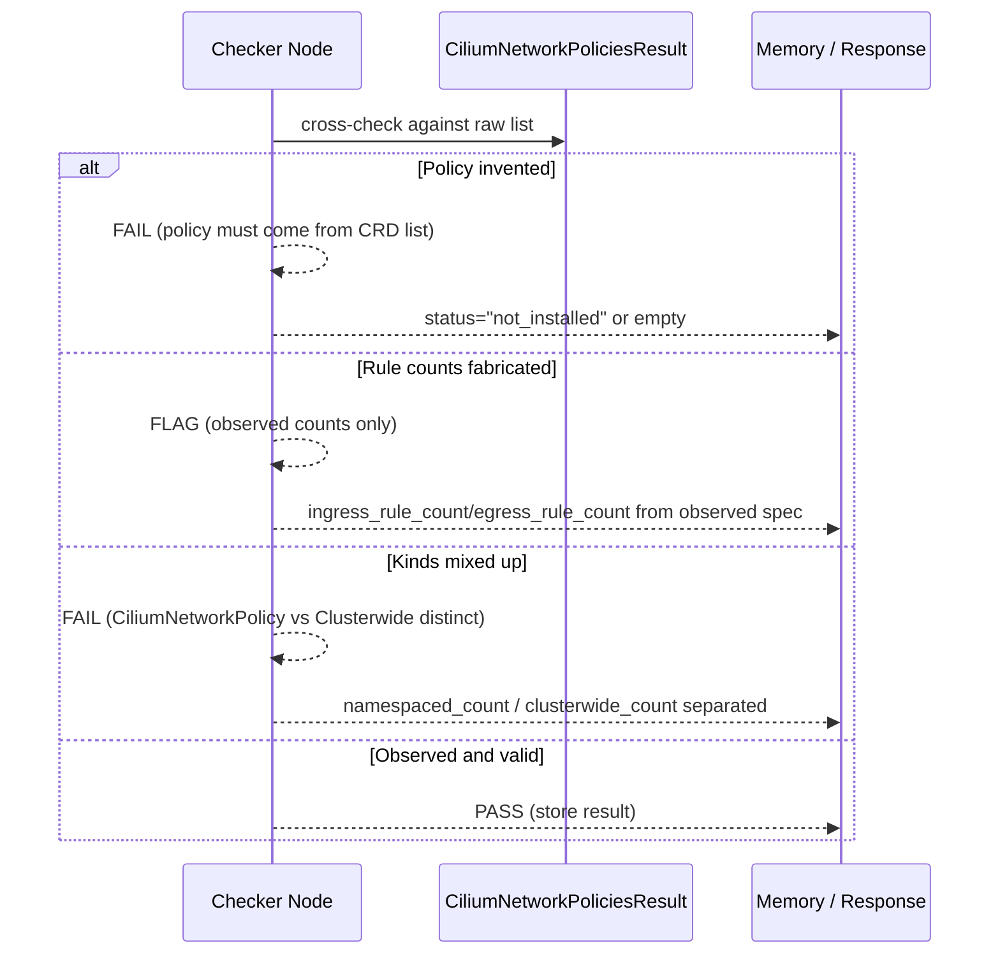
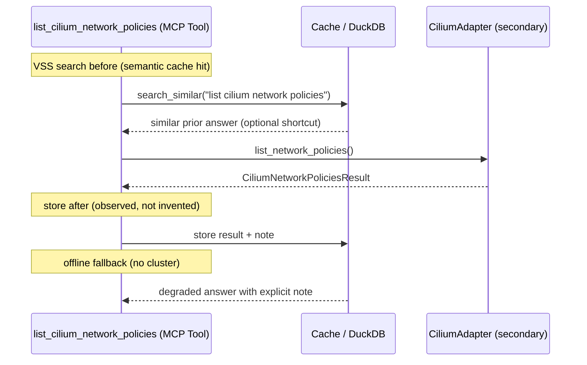

# Use Case 183 — List Cilium Network Policies

## Sample Questions

- "List all the Cilium network policies defined in my cluster"
- "What CiliumNetworkPolicy rules exist in the payments namespace?"
- "Are there any Cilium cluster-wide network policies applying to the whole cluster?"
- "Show me all Cilium L7 network policies with their ingress and egress rules"
- "Which Cilium policies apply to the database endpoints via their selectors?"

---

A security/platform engineer asks to see every Cilium L3/L4/L7 rule before
auditing connectivity. The tool enumerates both `CiliumNetworkPolicy` and
`CiliumClusterwideNetworkPolicy` custom resources, extracting the endpoint
selector and a per-policy ingress/egress + L7 rule summary — never the vanilla
`NetworkPolicy`. When the `cilium.io` CRD group is absent it returns
NOT_INSTALLED. The flow crosses the hexagonal layers: MCP Tool →
ListCiliumNetworkPoliciesUseCase → CiliumPort (driven port) → CiliumAdapter
(secondary) → VanillaAdapter → Kubernetes API.

### Flow 1 — Happy Path: List Policies Across Kinds

### Flow 2 — Errors: Not Installed, Unreachable, RBAC

### Flow 3 — Checker Node: Honest Inventory

### Flow 4 — DuckDB Memory: Query-Before, Store-After, Offline Fallback

## Key Points

- `ListCiliumNetworkPoliciesUseCase` depends only on `CiliumPort`.
- Reads the `cilium.io/v2` `ciliumnetworkpolicies` and
  `ciliumclusterwidenetworkpolicies` CRDs — never the vanilla `NetworkPolicy`.
- Each policy exposes its `endpointSelector` (rendered, or reported as-is when
  malformed) plus ingress/egress/L7 rule counts and raw L7 protocol names.
- NOT_INSTALLED is returned only when the CRD group is absent (both kinds 404).
- Kind breakdown (`namespaced_count` / `clusterwide_count`) is kept distinct.

## Test Coverage

| Test | File | Status |
|---|---|---|
| `test_lists_both_kinds_with_summary` | `tests/unit/adapters/secondary/gitops/test_cilium_adapter.py` | ✅ |
| `test_not_installed_when_group_absent` | `tests/unit/adapters/secondary/gitops/test_cilium_adapter.py` | ✅ |
| `test_rbac_403_raises_insufficient_permissions` | `tests/unit/adapters/secondary/gitops/test_cilium_adapter.py` | ✅ |
| `test_extracts_selector_and_rules` | `tests/unit/domain/services/test_cilium_network_policy_summary.py` | ✅ |
| `test_counts_l7_rules_and_protocols` | `tests/unit/domain/services/test_cilium_network_policy_summary.py` | ✅ |
| `test_execute_returns_policy_list` | `tests/unit/application/use_case/cilium/test_uc_list_cilium_network_policies_use_case.py` | ✅ |
| `test_list_cilium_network_policies_returns_dict` | `tests/unit/mcp/tools/test_tool_list_cilium_network_policies.py` | ✅ |

## Related Files

- `src/hexawyn/domain/models/cilium.py` — `CiliumNetworkPolicyInfo`, `CiliumNetworkPoliciesResult`
- `src/hexawyn/domain/services/cilium/network_policy_summary.py` — L3/L4/L7 pure rule summary
- `src/hexawyn/application/ports/driven/cilium_port.py` — `CiliumPort.list_network_policies()`
- `src/hexawyn/application/use_case/cilium/list_cilium_network_policies/` — Command, Response, UseCase
- `src/hexawyn/adapters/secondary/gitops/cilium_adapter.py` — `CiliumAdapter.list_network_policies()`
- `src/hexawyn/mcp/tools/list_cilium_network_policies.py` — MCP tool
