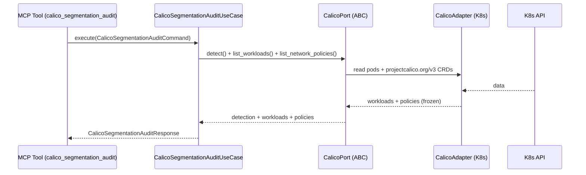

# Use Case 184 — Calico Segmentation Audit

## Sample Questions

- "Which workloads can reach each other through Calico without a policy?"
- "Build the Calico east-west segmentation matrix for all tiers."
- "Which tier-to-tier paths are allowed but unrestricted by a Calico policy?"
- "Is my Calico setup fully segmented by default-deny, or are there gaps?"
- "Show me the unreachable paths a policy should block between tiers."
- "Compare the Calico segmentation view against the vanilla NetworkPolicy view."

---

"Audit east-west segmentation based on Calico selectors and policies — build a tier-to-tier reachability matrix and flag allowed-but-unrestricted paths against the vanilla view." The user asks via `calico_segmentation_audit`. The flow crosses the hexagonal layers: MCP Tool → `CalicoSegmentationAuditUseCase` → `CalicoPort` (driven port) → `CalicoK8sAdapter` (secondary adapter) → Kubernetes API.

### Flow 1 — Calico Segmentation Audit execution

## Key Points

- `CalicoSegmentationAuditUseCase` depends only on `CalicoPort` — never on a Kubernetes SDK.
- Calico has no Cilium-style identities; the matrix is derived from observed endpoint selectors + allow/deny actions + Calico policy order (broad GlobalNetworkPolicy before namespaced).
- The `view` field explicitly separates the Calico view from the vanilla NetworkPolicy view (graceful fallback).
- `NOT_INSTALLED` is returned honestly when the `projectcalico.org` CRD group is absent.
- `calico_segmentation_audit` is registered in `mcp/tools/calico_segmentation_audit.py` and synced to the control-plane cache.

## Related Files

- `src/hexawyn/domain/models/calico.py`
- `src/hexawyn/domain/services/calico/segmentation_service.py`
- `src/hexawyn/application/ports/driven/calico_port.py`
- `src/hexawyn/application/use_case/calico/calico_segmentation_audit/calico_segmentation_audit_use_case.py`
- `src/hexawyn/adapters/secondary/calico/calico_k8s_adapter.py`
- `src/hexawyn/mcp/adapters/calico_adapters.py`
- `src/hexawyn/mcp/tools/calico_segmentation_audit.py`
