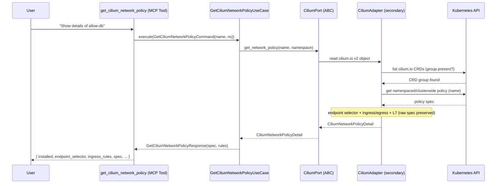
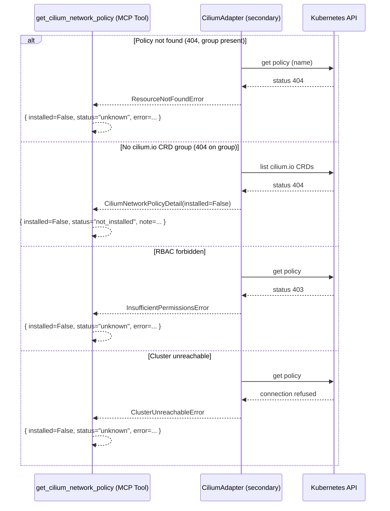
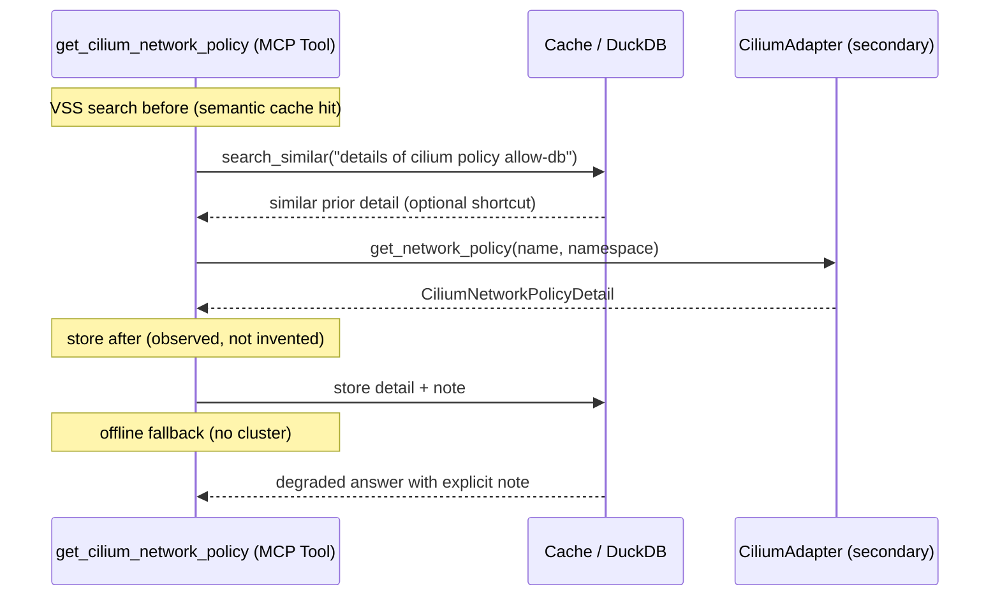

# Use Case 184 — Get Cilium Network Policy

## Sample Questions

- "Show me the full details of the Cilium network policy allow-db"
- "What are the exact ingress and egress rules of the Cilium policy securing payments?"
- "Are there any HTTP or gRPC L7 rules in the Cilium network policy api-allow?"
- "Which endpoints does the cluster-wide Cilium policy global-allow select?"
- "Show the full spec of CiliumNetworkPolicy 'deny-external' with its L7 rules"

---

A security/platform engineer wants the full detail of a specific Cilium
network policy to understand its exact L3/L4/L7 rules before auditing
connectivity. The tool reads a single `cilium.io/v2` policy and returns the
endpoint selector, ingress/egress rule summaries and the raw spec. A missing
policy raises `ResourceNotFoundError`; an absent `cilium.io` CRD group returns
NOT_INSTALLED. The flow crosses the hexagonal layers: MCP Tool →
GetCiliumNetworkPolicyUseCase → CiliumPort (driven port) → CiliumAdapter
(secondary) → VanillaAdapter → Kubernetes API.

### Flow 1 — Happy Path: Fetch a Policy Detail



### Flow 2 — Errors: Not Found, Not Installed, RBAC, Unreachable



### Flow 3 — Checker Node: Honest Detail

```mermaid
sequenceDiagram
    participant Checker as Checker Node
    participant Detail as CiliumNetworkPolicyDetail
    participant Store as Memory / Response

    Checker->>Detail: cross-check rules against raw spec

    alt Rules invented
        Checker-->>Checker: FAIL (rules must come from the object)
        Checker-->>Store: ingress_rules/egress_rules from observed spec
    else Namespace fabricated
        Checker-->>Checker: FLAG (namespace observed only; cluster-wide -> None)
        Checker-->>Store: namespace from metadata
    else Wrong kind (vanilla NetworkPolicy)
        Checker-->>Checker: FAIL (Cilium kind only)
        Checker-->>Store: kind CiliumNetworkPolicy / CiliumClusterwideNetworkPolicy
    else Observed and valid
        Checker-->>Store: PASS (store detail)
    end
```

### Flow 4 — DuckDB Memory: Query-Before, Store-After, Offline Fallback



## Key Points

- `GetCiliumNetworkPolicyUseCase` depends only on `CiliumPort`.
- Reads a single `cilium.io/v2` object — never the vanilla `NetworkPolicy`.
- Returns the endpoint selector, ingress/egress rule summaries and the raw
  `spec` (empty spec reported empty, malformed rules preserved as-is).
- A missing policy raises `ResourceNotFoundError` (not a raw K8s 404); an absent
  `cilium.io` CRD group returns NOT_INSTALLED.
- A command without a `name` is rejected (validation error).

## Test Coverage

| Test | File | Status |
|---|---|---|
| `test_get_namespaced_policy` | `tests/unit/adapters/secondary/gitops/test_cilium_adapter.py` | ✅ |
| `test_get_not_found_raises_resource_not_found` | `tests/unit/adapters/secondary/gitops/test_cilium_adapter.py` | ✅ |
| `test_get_clusterwide_policy` | `tests/unit/adapters/secondary/gitops/test_cilium_adapter.py` | ✅ |
| `test_builds_full_spec_with_summaries` | `tests/unit/domain/services/test_policy_detail_builder.py` | ✅ |
| `test_extracts_l7_protocols_from_both_directions` | `tests/unit/domain/services/test_policy_detail_builder.py` | ✅ |
| `test_execute_returns_full_detail` | `tests/unit/application/use_case/cilium/test_uc_get_cilium_network_policy_use_case.py` | ✅ |
| `test_get_cilium_network_policy_returns_dict` | `tests/unit/mcp/tools/test_tool_get_cilium_network_policy.py` | ✅ |

## Related Files

- `src/hexawyn/domain/models/cilium.py` — `CiliumNetworkPolicyDetail`, `CiliumRuleSummary`, `CiliumL7RuleSummary`
- `src/hexawyn/domain/services/cilium/policy_detail_builder.py` — pure detail builder (L3/L4/L7)
- `src/hexawyn/application/ports/driven/cilium_port.py` — `CiliumPort.get_network_policy()`
- `src/hexawyn/application/use_case/cilium/get_cilium_network_policy/` — Command, Response, UseCase
- `src/hexawyn/adapters/secondary/gitops/cilium_adapter.py` — `CiliumAdapter.get_network_policy()`
- `src/hexawyn/mcp/tools/get_cilium_network_policy.py` — MCP tool
