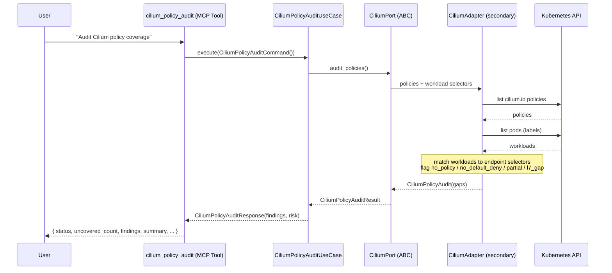
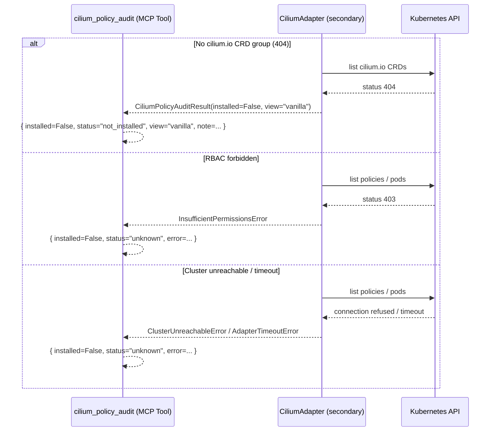
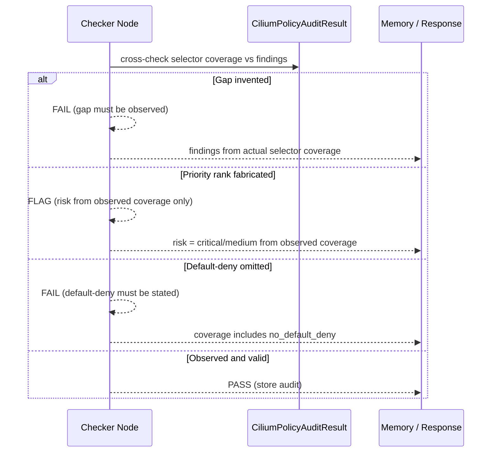
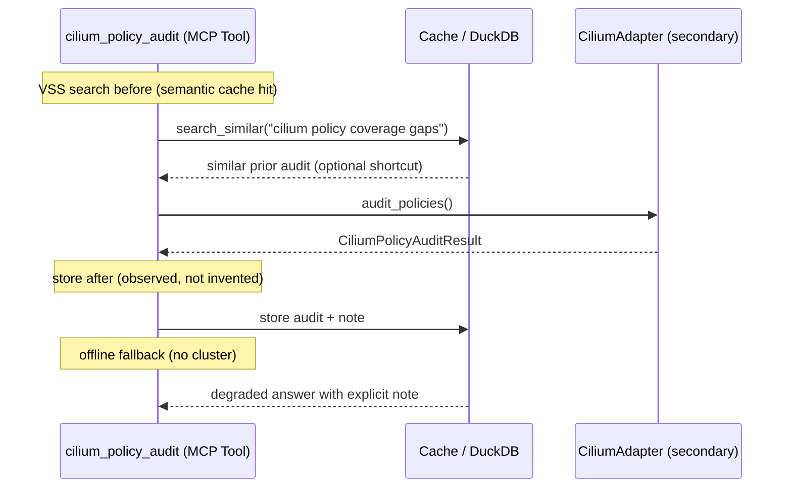

# Use Case 185 — Cilium Policy Audit

## Sample Questions

- "Which workloads selected by Cilium policies have no ingress or egress restriction?"
- "Audit my Cilium network policy coverage and show me the exposure gaps"
- "Are there any workloads in the cluster not covered by a Cilium policy?"
- "Which namespaces have Cilium workloads lacking a default-deny or L7 rule?"
- "Show me the Cilium policy coverage gaps ranked by risk per namespace"

---

A security engineer wants to find Cilium-policy-selected workloads with no
ingress/egress restriction or no L7 rule so they can prioritize fixes. The tool
compares each workload's labels against the endpoint selectors of the
`cilium.io/v2` policies and flags coverage gaps (no policy, no default-deny,
partial restriction, L3/L4-only), ranked by risk and grouped per namespace. When
Cilium is absent the view degrades to "vanilla" and a NOT_INSTALLED marker is
returned. The flow crosses the hexagonal layers: MCP Tool →
CiliumPolicyAuditUseCase → CiliumPort (driven port) → CiliumAdapter (secondary)
→ VanillaAdapter → Kubernetes API.

### Flow 1 — Happy Path: Audit Coverage

### Flow 2 — Errors: Not Installed (Vanilla fallback), RBAC, Unreachable

### Flow 3 — Checker Node: Honest Audit

### Flow 4 — DuckDB Memory: Query-Before, Store-After, Offline Fallback

## Key Points

- `CiliumPolicyAuditUseCase` depends only on `CiliumPort`.
- Compares workload labels against Cilium policy endpoint selectors; a workload
  is matched when the policy's `matchLabels` is a subset of its labels.
- Coverage states: `no_policy`, `no_default_deny`, `partial`, `l7_gap`, and
  `covered` (excluded from findings).
- Risk (critical / medium) is derived only from observed coverage; findings are
  deduplicated per workload.
- When Cilium is absent the result reports `view="vanilla"` and
  NOT_INSTALLED — never a fabricated Cilium audit.

## Test Coverage

| Test | File | Status |
|---|---|---|
| `test_audit_flags_workload_without_policy` | `tests/unit/adapters/secondary/gitops/test_cilium_adapter.py` | ✅ |
| `test_audit_fully_covered` | `tests/unit/adapters/secondary/gitops/test_cilium_adapter.py` | ✅ |
| `test_audit_not_installed_returns_vanilla_view` | `tests/unit/adapters/secondary/gitops/test_cilium_adapter.py` | ✅ |
| `test_no_policy_gap` | `tests/unit/domain/services/test_policy_audit.py` | ✅ |
| `test_fully_covered_no_gaps` | `tests/unit/domain/services/test_policy_audit.py` | ✅ |
| `test_l7_gap` | `tests/unit/domain/services/test_policy_audit.py` | ✅ |
| `test_overlapping_selectors_deduplicated` | `tests/unit/domain/services/test_policy_audit.py` | ✅ |
| `test_execute_returns_findings` | `tests/unit/application/use_case/cilium/test_uc_cilium_policy_audit_use_case.py` | ✅ |

## Related Files

- `src/hexawyn/domain/models/cilium.py` — `CiliumWorkload`, `CiliumAuditFinding`, `CiliumPolicyAuditResult`
- `src/hexawyn/domain/services/cilium/policy_audit.py` — pure coverage matching + risk
- `src/hexawyn/application/ports/driven/cilium_port.py` — `CiliumPort.audit_policies()`
- `src/hexawyn/application/use_case/cilium/cilium_policy_audit/` — Command, Response, UseCase
- `src/hexawyn/adapters/secondary/gitops/cilium_adapter.py` — `CiliumAdapter.audit_policies()`
- `src/hexawyn/mcp/tools/cilium_policy_audit.py` — MCP tool
