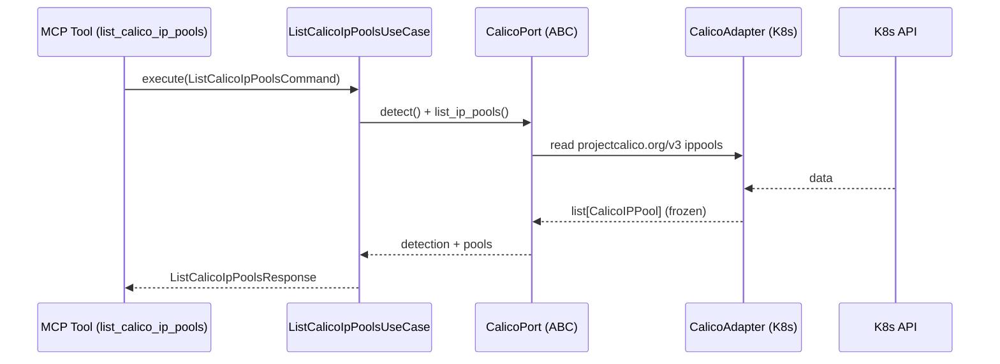

# Use Case 185 — List Calico IP Pools

## Sample Questions

- "List the Calico IPPools and their CIDR allocation."
- "Are there any disabled Calico IPPools in the cluster?"
- "Which IPPools have NAT outgoing enabled for pod egress?"
- "List the Calico IPPools and their node selectors."
- "Show me all Calico IPPool CIDRs with their disabled and NAT state."

---

"List Calico IPPool resources — CIDR allocation, disabled flag, NAT outgoing and node selector — to spot misconfigured or disabled pools." The user asks via `list_calico_ip_pools`. The flow crosses the hexagonal layers: MCP Tool → `ListCalicoIpPoolsUseCase` → `CalicoPort` (driven port) → `CalicoK8sAdapter` (secondary adapter) → Kubernetes API.

### Flow 1 — List Calico IP Pools execution

## Key Points

- `ListCalicoIpPoolsUseCase` depends only on `CalicoPort` — never on a Kubernetes SDK.
- CIDR values are reported exactly as observed (never fabricated).
- `NOT_INSTALLED` is returned honestly when the `projectcalico.org` CRD group is absent.
- `list_calico_ip_pools` is registered in `mcp/tools/list_calico_ip_pools.py` and synced to the control-plane cache.

## Related Files

- `src/hexawyn/domain/models/calico.py`
- `src/hexawyn/application/ports/driven/calico_port.py`
- `src/hexawyn/application/use_case/calico/list_calico_ip_pools/list_calico_ip_pools_use_case.py`
- `src/hexawyn/adapters/secondary/calico/calico_k8s_adapter.py`
- `src/hexawyn/mcp/adapters/calico_adapters.py`
- `src/hexawyn/mcp/tools/list_calico_ip_pools.py`
