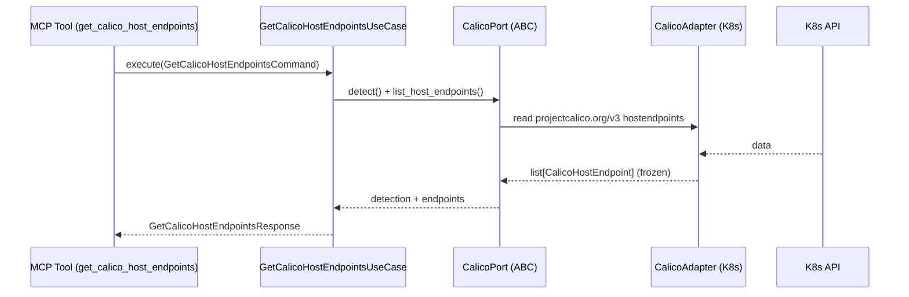

# Use Case 186 — Get Calico Host Endpoints

## Sample Questions

- "List the Calico HostEndpoints and the host interfaces they protect."
- "Which host nodes have Calico HostEndpoints with applied policies?"
- "Show me the HostEndpoint labels and expected IPs for each node interface."
- "Which host interfaces are covered by Calico policies vs unprotected?"
- "List the network interfaces outside pods that Calico is protecting."

---

"List Calico HostEndpoint resources — node, interface, expected IPs, labels and applied policies — to see which non-pod host interfaces Calico protects." The user asks via `get_calico_host_endpoints`. The flow crosses the hexagonal layers: MCP Tool → `GetCalicoHostEndpointsUseCase` → `CalicoPort` (driven port) → `CalicoK8sAdapter` (secondary adapter) → Kubernetes API.

### Flow 1 — Get Calico Host Endpoints execution

## Key Points

- `GetCalicoHostEndpointsUseCase` depends only on `CalicoPort` — never on a Kubernetes SDK.
- Labels, expected IPs and applied policies are reported exactly as observed (never fabricated).
- `NOT_INSTALLED` is returned honestly when the `projectcalico.org` CRD group is absent.
- `get_calico_host_endpoints` is registered in `mcp/tools/get_calico_host_endpoints.py` and synced to the control-plane cache.

## Related Files

- `src/hexawyn/domain/models/calico.py`
- `src/hexawyn/application/ports/driven/calico_port.py`
- `src/hexawyn/application/use_case/calico/get_calico_host_endpoints/get_calico_host_endpoints_use_case.py`
- `src/hexawyn/adapters/secondary/calico/calico_k8s_adapter.py`
- `src/hexawyn/mcp/adapters/calico_adapters.py`
- `src/hexawyn/mcp/tools/get_calico_host_endpoints.py`
