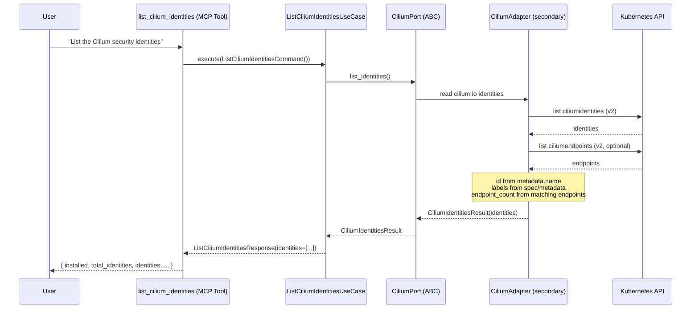
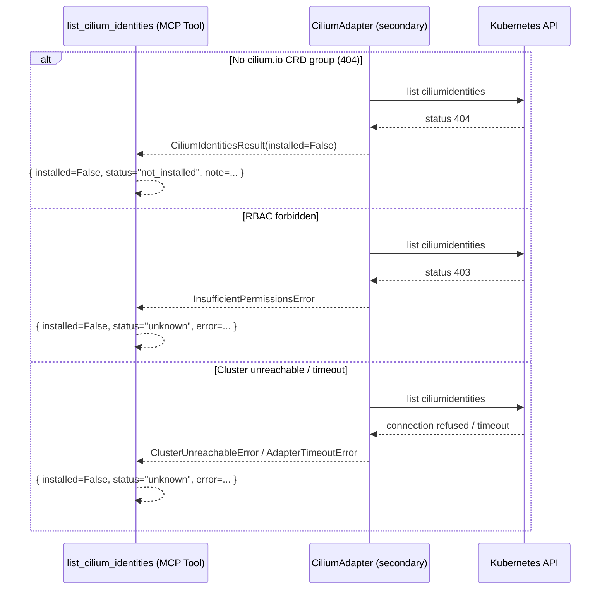
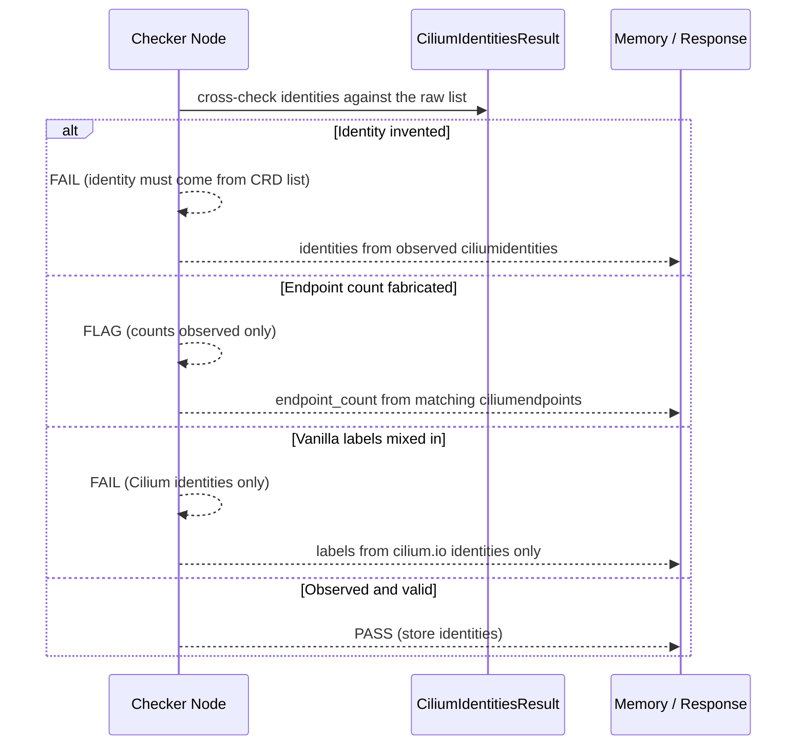
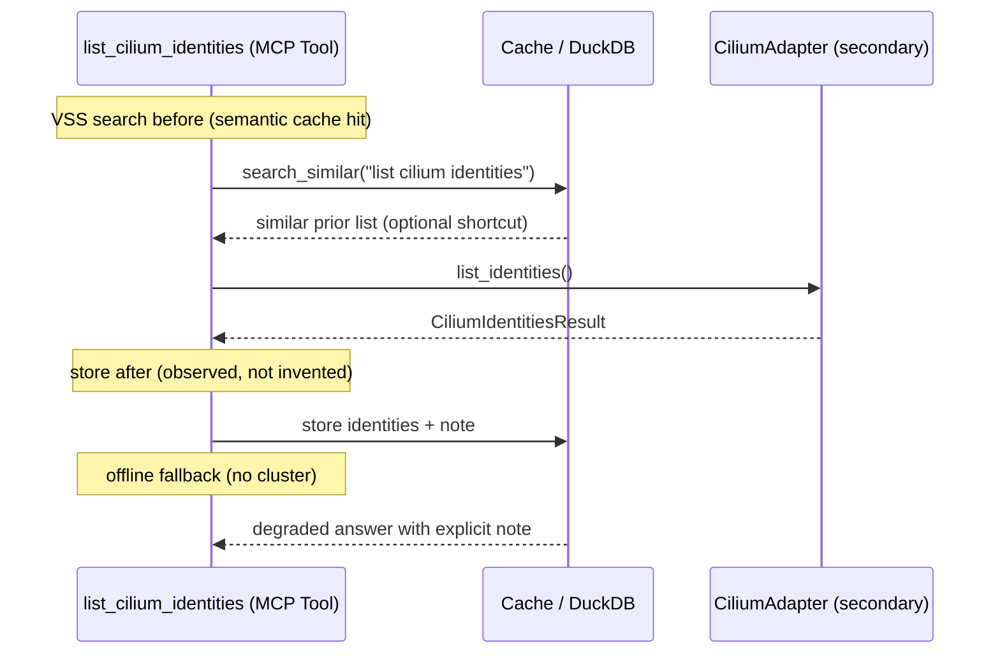

# Use Case 186 — List Cilium Identities

## Sample Questions

- "List all the Cilium security identities in my cluster"
- "Which pods share the same Cilium identity labels so I can gauge policy effect?"
- "Show me the Cilium identities in the payments namespace with their endpoint counts"
- "What are the numeric IDs and label sets of the Cilium security identities?"
- "How many endpoints are associated with each Cilium identity right now?"

---

A platform/security engineer wants to list the Cilium security identities
(endpoint ↔ labels mapping) to understand which set of pods share an identity
before interpreting policy effect. The tool reads the `cilium.io/v2`
`ciliumidentities` CRD and, when available, counts the associated
`ciliumendpoints` per identity. When the `cilium.io` CRD group is absent it
returns NOT_INSTALLED. The flow crosses the hexagonal layers: MCP Tool →
ListCiliumIdentitiesUseCase → CiliumPort (driven port) → CiliumAdapter
(secondary) → VanillaAdapter → Kubernetes API.

### Flow 1 — Happy Path: List Identities

### Flow 2 — Errors: Not Installed, RBAC, Unreachable

### Flow 3 — Checker Node: Honest Identities

### Flow 4 — DuckDB Memory: Query-Before, Store-After, Offline Fallback

## Key Points

- `ListCiliumIdentitiesUseCase` depends only on `CiliumPort`.
- Reads the `cilium.io/v2` `ciliumidentities` CRD — never vanilla labels.
- Each identity reports its numeric `id` (from `metadata.name`), its label set,
  and the count of matching `ciliumendpoints` (0 when the endpoints CRD is not
  available).
- NOT_INSTALLED is returned when the `cilium.io` CRD group is absent.
- A workload/label set is never invented — values come only from observed CRDs.

## Test Coverage

| Test | File | Status |
|---|---|---|
| `test_list_identities_with_endpoint_counts` | `tests/unit/adapters/secondary/gitops/test_cilium_adapter.py` | ✅ |
| `test_list_identities_not_installed` | `tests/unit/adapters/secondary/gitops/test_cilium_adapter.py` | ✅ |
| `test_lists_identities_with_endpoint_counts` | `tests/unit/domain/services/test_identity_builder.py` | ✅ |
| `test_identity_without_labels_reported_empty` | `tests/unit/domain/services/test_identity_builder.py` | ✅ |
| `test_malformed_id_preserved_raw` | `tests/unit/domain/services/test_identity_builder.py` | ✅ |
| `test_execute_returns_identities` | `tests/unit/application/use_case/cilium/test_uc_list_cilium_identities_use_case.py` | ✅ |
| `test_list_cilium_identities_returns_dict` | `tests/unit/mcp/tools/test_tool_list_cilium_identities.py` | ✅ |

## Related Files

- `src/hexawyn/domain/models/cilium.py` — `CiliumIdentityInfo`, `CiliumIdentitiesResult`
- `src/hexawyn/domain/services/cilium/identity_builder.py` — pure identity listing
- `src/hexawyn/application/ports/driven/cilium_port.py` — `CiliumPort.list_identities()`
- `src/hexawyn/application/use_case/cilium/list_cilium_identities/` — Command, Response, UseCase
- `src/hexawyn/adapters/secondary/gitops/cilium_adapter.py` — `CiliumAdapter.list_identities()`
- `src/hexawyn/mcp/tools/list_cilium_identities.py` — MCP tool
