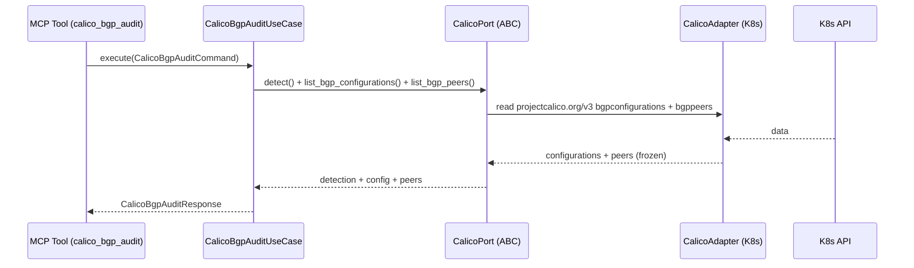

# Use Case 187 — Calico BGP Audit

## Sample Questions

- "Show me the Calico BGP configuration and peer state."
- "What AS number and node-to-node mesh is Calico BGP configured with?"
- "List the Calico BGPPeers with their peer IP, ASN and node selector."
- "Are the Calico BGP sessions reaching a healthy state right now?"
- "Which BGP service cluster IPs does the Calico config advertise?"

---

"Audit Calico BGP configuration — BGPConfiguration (ASN, node-to-node mesh, service cluster IPs), BGPPeers and session state." The user asks via `calico_bgp_audit`. The flow crosses the hexagonal layers: MCP Tool → `CalicoBgpAuditUseCase` → `CalicoPort` (driven port) → `CalicoK8sAdapter` (secondary adapter) → Kubernetes API.

### Flow 1 — Calico BGP Audit execution

## Key Points

- `CalicoBgpAuditUseCase` depends only on `CalicoPort` — never on a Kubernetes SDK.
- ASN, mesh and peers are reported exactly as observed (never fabricated).
- BGP **session state is never invented**: it is derived only from calico-node agent readiness and reported `unknown` when no agent health is observable.
- `NOT_INSTALLED` is returned honestly when the `projectcalico.org` CRD group is absent.
- `calico_bgp_audit` is registered in `mcp/tools/calico_bgp_audit.py` and synced to the control-plane cache.

## Related Files

- `src/hexawyn/domain/models/calico.py`
- `src/hexawyn/domain/services/calico/bgp_audit_service.py`
- `src/hexawyn/application/ports/driven/calico_port.py`
- `src/hexawyn/application/use_case/calico/calico_bgp_audit/calico_bgp_audit_use_case.py`
- `src/hexawyn/adapters/secondary/calico/calico_k8s_adapter.py`
- `src/hexawyn/mcp/adapters/calico_adapters.py`
- `src/hexawyn/mcp/tools/calico_bgp_audit.py`
