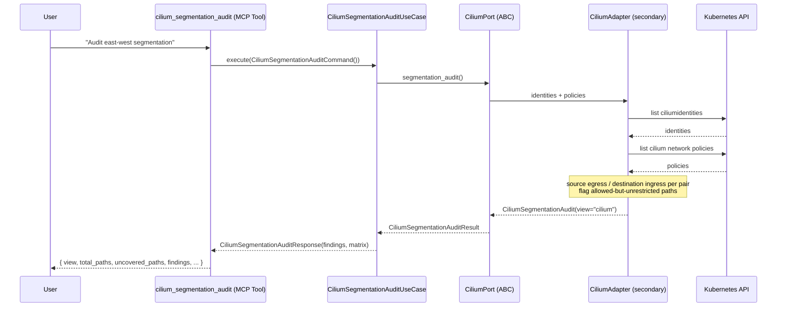
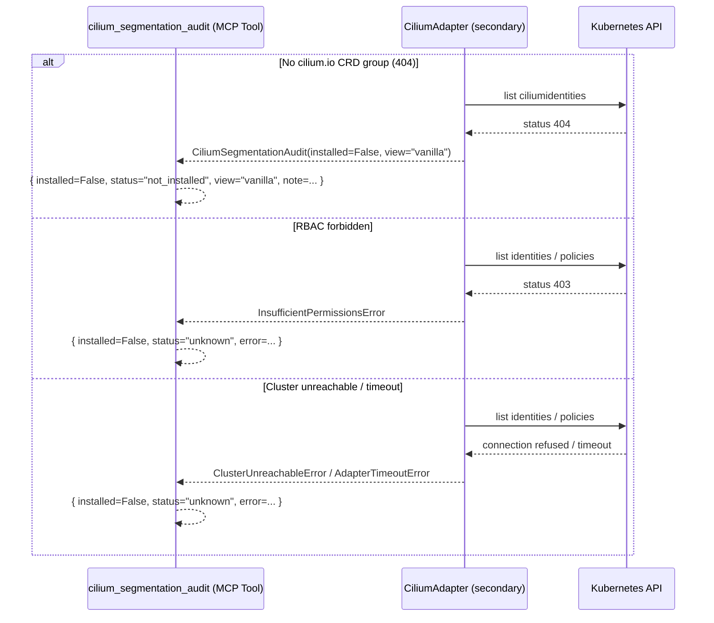
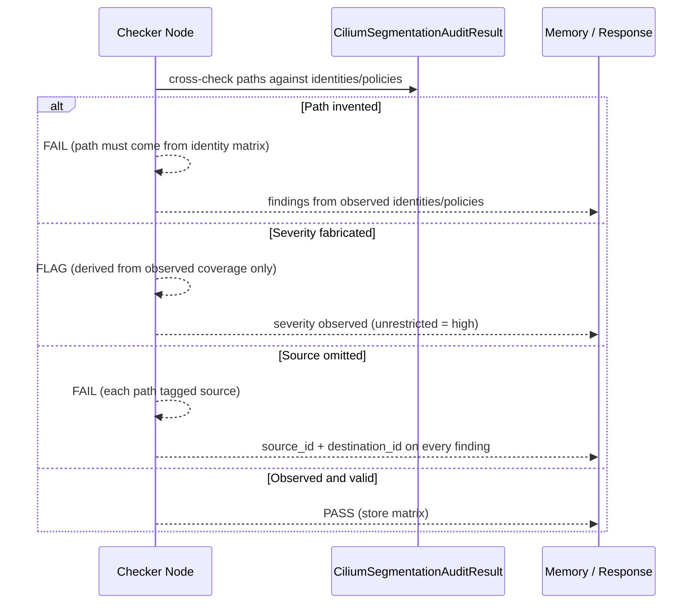
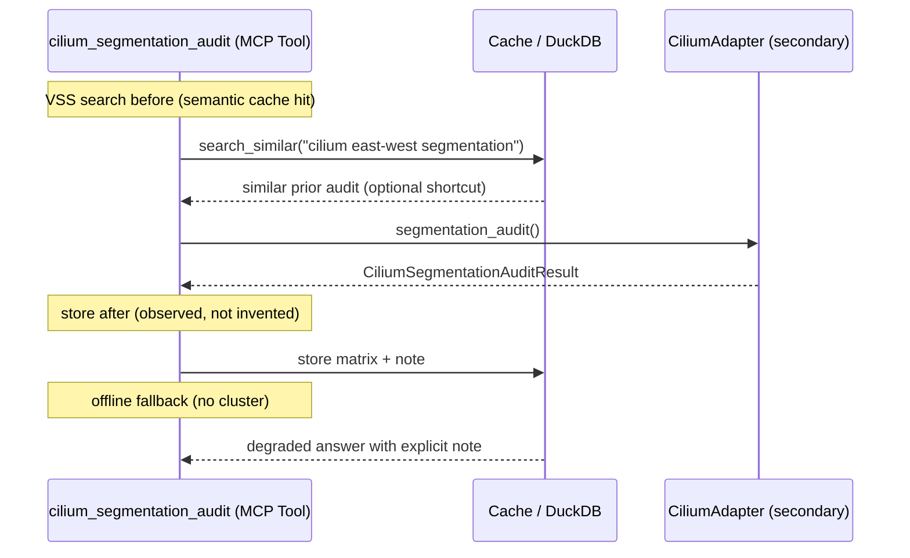

# Use Case 187 — Cilium Segmentation Audit

## Sample Questions

- "Which workloads can reach each other through Cilium identities without a policy?"
- "Audit my east-west segmentation and show me the allowed-but-unrestricted paths"
- "Which Cilium identities can talk to each other freely across tiers?"
- "Show me the reachability matrix between Cilium identities and where policies block traffic"
- "Are there any paths between Cilium identities that no policy restricts?"

---

A security engineer wants to audit east-west segmentation based on Cilium
identities and policies to confirm workloads in one tier cannot reach another
without a policy. The tool builds a reachability matrix from Cilium security
identities and their network policies, flagging allowed-but-unrestricted paths
(no source egress nor destination ingress policy). It explicitly distinguishes
the Cilium view from the vanilla NetworkPolicy view and returns NOT_INSTALLED
when Cilium is absent. The flow crosses the hexagonal layers: MCP Tool →
CiliumSegmentationAuditUseCase → CiliumPort (driven port) → CiliumAdapter
(secondary) → VanillaAdapter → Kubernetes API.

### Flow 1 — Happy Path: Build the Reachability Matrix

### Flow 2 — Errors: Not Installed (Vanilla fallback), RBAC, Unreachable

### Flow 3 — Checker Node: Honest Matrix

### Flow 4 — DuckDB Memory: Query-Before, Store-After, Offline Fallback

## Key Points

- `CiliumSegmentationAuditUseCase` depends only on `CiliumPort`.
- Reachability is computed purely from Cilium identities and policies; a path
  is flagged when neither the source egress nor the destination ingress is
  restricted by a Cilium policy.
- Each finding carries a source and destination identity and an observed
  severity; paths are deduplicated per identity pair.
- The `view` field explicitly distinguishes "cilium" from the "vanilla"
  NetworkPolicy fallback (used only when Cilium is absent).
- NOT_INSTALLED is returned when the `cilium.io` CRD group is absent — never a
  fabricated matrix.

## Test Coverage

| Test | File | Status |
|---|---|---|
| `test_flags_unrestricted_paths` | `tests/unit/adapters/secondary/gitops/test_cilium_adapter.py` | ✅ |
| `test_isolated_when_policy_restricts` | `tests/unit/adapters/secondary/gitops/test_cilium_adapter.py` | ✅ |
| `test_not_installed_returns_vanilla_view` | `tests/unit/adapters/secondary/gitops/test_cilium_adapter.py` | ✅ |
| `test_flags_unrestricted_path` | `tests/unit/domain/services/test_segmentation_audit_builder.py` | ✅ |
| `test_isolated_when_policy_blocks_paths` | `tests/unit/domain/services/test_segmentation_audit_builder.py` | ✅ |
| `test_single_identity_trivial_matrix` | `tests/unit/domain/services/test_segmentation_audit_builder.py` | ✅ |
| `test_large_matrix_compact_report` | `tests/unit/domain/services/test_segmentation_audit_builder.py` | ✅ |
| `test_execute_returns_findings` | `tests/unit/application/use_case/cilium/test_uc_cilium_segmentation_audit_use_case.py` | ✅ |

## Related Files

- `src/hexawyn/domain/models/cilium.py` — `CiliumPathFinding`, `CiliumSegmentationAuditResult`
- `src/hexawyn/domain/services/cilium/segmentation_audit_builder.py` — pure reachability matrix
- `src/hexawyn/application/ports/driven/cilium_port.py` — `CiliumPort.segmentation_audit()`
- `src/hexawyn/application/use_case/cilium/cilium_segmentation_audit/` — Command, Response, UseCase
- `src/hexawyn/adapters/secondary/gitops/cilium_adapter.py` — `CiliumAdapter.segmentation_audit()`
- `src/hexawyn/mcp/tools/cilium_segmentation_audit.py` — MCP tool
