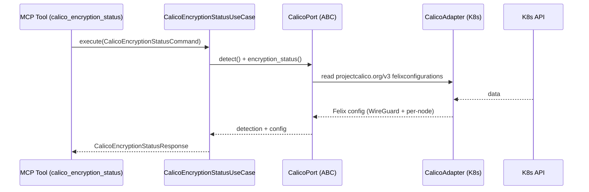

# Use Case 188 — Calico Encryption Status

## Sample Questions

- "Is Calico WireGuard encryption enabled on the dataplane?"
- "Is east-west Calico traffic encrypted with WireGuard?"
- "What is the WireGuard state per node in the FelixConfiguration?"
- "Which dataplane mode is Calico using alongside WireGuard?"
- "Are the Calico host endpoints encrypting traffic between nodes?"

---

"Report whether Calico wire-level encryption (WireGuard) is enabled from FelixConfiguration, including per-node state and the dataplane mode." The user asks via `calico_encryption_status`. The flow crosses the hexagonal layers: MCP Tool → `CalicoEncryptionStatusUseCase` → `CalicoPort` (driven port) → `CalicoK8sAdapter` (secondary adapter) → Kubernetes API.

### Flow 1 — Calico Encryption Status execution

## Key Points

- `CalicoEncryptionStatusUseCase` depends only on `CalicoPort` — never on a Kubernetes SDK.
- WireGuard state is never invented: it reflects exactly what `FelixConfiguration` reports (`None` when unobserved).
- Per-node overrides are reported from node-scoped FelixConfigurations (`node.<name>`).
- `NOT_INSTALLED` is returned honestly when the `projectcalico.org` CRD group is absent.
- `calico_encryption_status` is registered in `mcp/tools/calico_encryption_status.py` and synced to the control-plane cache.

## Related Files

- `src/hexawyn/domain/models/calico.py`
- `src/hexawyn/domain/services/calico/encryption_status_service.py`
- `src/hexawyn/application/ports/driven/calico_port.py`
- `src/hexawyn/application/use_case/calico/calico_encryption_status/calico_encryption_status_use_case.py`
- `src/hexawyn/adapters/secondary/calico/calico_k8s_adapter.py`
- `src/hexawyn/mcp/adapters/calico_adapters.py`
- `src/hexawyn/mcp/tools/calico_encryption_status.py`
