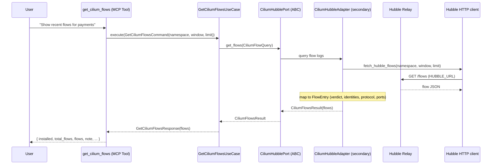
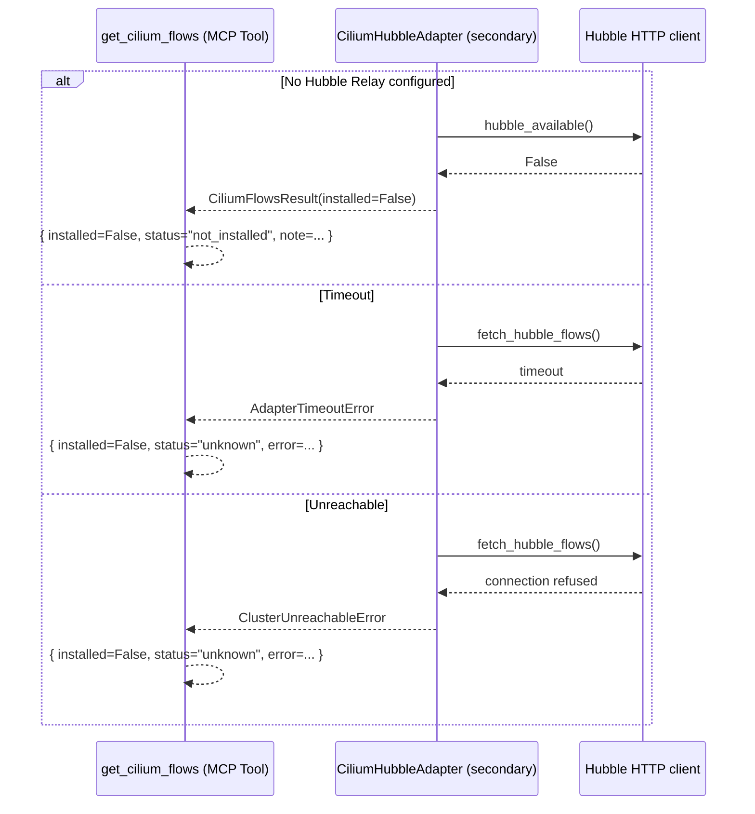
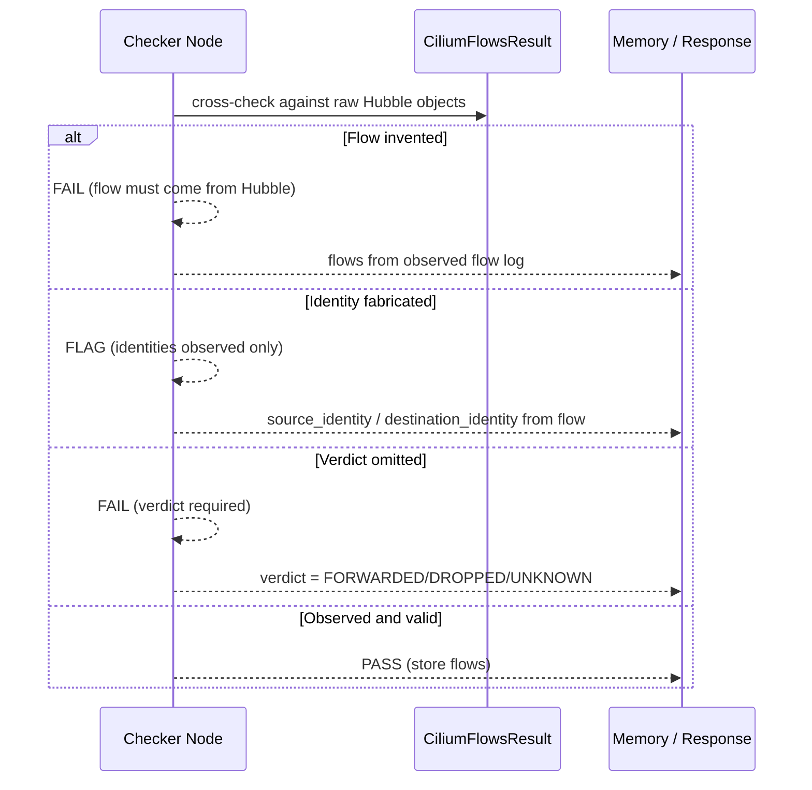
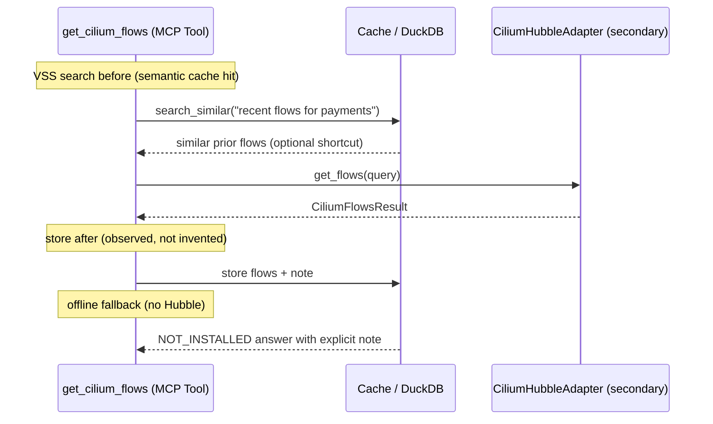

# Use Case 188 — Get Cilium Flows

## Sample Questions

- "Show me recent Hubble network flows for the payments namespace"
- "Which flows were dropped by Cilium in the last 15 minutes?"
- "What traffic is flowing between web and db pods, with verdicts and ports?"
- "Are there any forwarded flows hitting payment-api from outside the namespace?"
- "List the last 50 Cilium flows for pod web-0 with their source and destination identities"

---

A platform/observability engineer wants to query Cilium flow logs (Hubble) to
see the actual network flows between workloads and reason about traffic. The
tool queries a Hubble Relay HTTP endpoint, filtering by namespace/pod/direction
and window/limit, and returns each flow's source/destination identity, verdict
(forwarded/dropped), drop reason, protocol and ports. When Hubble Relay is not
configured it returns NOT_INSTALLED — never fabricated flows. The flow crosses
the hexagonal layers: MCP Tool → GetCiliumFlowsUseCase → CiliumHubblePort
(driven port) → CiliumHubbleAdapter (secondary) → Hubble Relay HTTP client.

### Flow 1 — Happy Path: Query Hubble Flows

### Flow 2 — Errors: Not Installed, Unreachable, Timeout

### Flow 3 — Checker Node: Honest Flows

### Flow 4 — DuckDB Memory: Query-Before, Store-After, Offline Fallback

## Key Points

- `GetCiliumFlowsUseCase` depends only on `CiliumHubblePort`.
- Flows are read from a Hubble Relay HTTP endpoint (`HUBBLE_URL`), filtered by
  namespace/pod/direction/verdict and bounded by window and limit.
- Each flow carries timestamp, source/destination (and namespace), identities,
  verdict (forwarded/dropped, `UNKNOWN` when absent), drop reason, protocol,
  destination port and optional L7 protocol.
- NOT_INSTALLED is returned when Hubble Relay is not configured — never a
  fabricated flow; transport errors are translated to `HexawynError`.

## Test Coverage

| Test | File | Status |
|---|---|---|
| `test_returns_flows` | `tests/unit/adapters/secondary/cilium/test_cilium_hubble_adapter.py` | ✅ |
| `test_not_installed_when_no_hubble_url` | `tests/unit/adapters/secondary/cilium/test_cilium_hubble_adapter.py` | ✅ |
| `test_fetch_returns_flows` | `tests/unit/adapters/secondary/cilium/test_hubble_client.py` | ✅ |
| `test_maps_flow_fields` | `tests/unit/domain/services/test_flow_builder.py` | ✅ |
| `test_missing_verdict_reported_unknown` | `tests/unit/domain/services/test_flow_builder.py` | ✅ |
| `test_filters_by_namespace` | `tests/unit/domain/services/test_flow_builder.py` | ✅ |
| `test_limit_clamps_volume` | `tests/unit/domain/services/test_flow_builder.py` | ✅ |
| `test_execute_returns_flows` | `tests/unit/application/use_case/cilium/test_uc_get_cilium_flows_use_case.py` | ✅ |

## Related Files

- `src/hexawyn/domain/models/cilium.py` — `CiliumFlowQuery`, `CiliumFlowEntry`, `CiliumFlowsResult`
- `src/hexawyn/domain/services/cilium/flow_builder.py` — pure flow mapping/filtering
- `src/hexawyn/adapters/secondary/cilium/hubble_client.py` — Hubble HTTP client (`HUBBLE_URL`)
- `src/hexawyn/adapters/secondary/cilium/cilium_hubble_adapter.py` — `CiliumHubbleAdapter`
- `src/hexawyn/application/ports/driven/cilium_hubble_port.py` — `CiliumHubblePort`
- `src/hexawyn/application/use_case/cilium/get_cilium_flows/` — Command, Response, UseCase
- `src/hexawyn/mcp/tools/get_cilium_flows.py` — MCP tool
- `src/hexawyn/mcp/adapters/cilium_adapters.py` — `build_cilium_hubble_adapter()`
