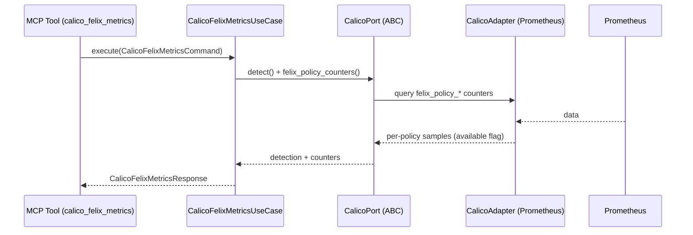

# Use Case 189 — Calico Felix Metrics

## Sample Questions

- "Which Calico policies are denying traffic right now?"
- "Show me the Felix allow/deny packet counters per Calico policy."
- "What is the deny volume of each Calico policy from Prometheus?"
- "Which policy is blocking the most packets right now?"
- "Are there Calico policies with unexpected deny counts to investigate?"

---

"Read Felix per-policy allow/deny packet and byte counters from Prometheus, ranked by deny volume, to find traffic blocked by a Calico policy." The user asks via `calico_felix_metrics`. The flow crosses the hexagonal layers: MCP Tool → `CalicoFelixMetricsUseCase` → `CalicoPort` (driven port) → `CalicoPrometheusAdapter` (secondary adapter) → Prometheus.

### Flow 1 — Calico Felix Metrics execution

## Key Points

- `CalicoFelixMetricsUseCase` depends only on `CalicoPort` — never on a Prometheus SDK.
- Counters are never invented: only observed Felix samples are aggregated and ranked by deny volume.
- When Prometheus is unreachable the result degrades to an honest `metrics_available: False` message (no crash).
- `NOT_INSTALLED` is returned honestly when the `projectcalico.org` CRD group is absent.
- `calico_felix_metrics` is registered in `mcp/tools/calico_felix_metrics.py` and synced to the control-plane cache.

## Related Files

- `src/hexawyn/domain/models/calico.py`
- `src/hexawyn/domain/services/calico/felix_metrics_service.py`
- `src/hexawyn/application/ports/driven/calico_port.py`
- `src/hexawyn/application/use_case/calico/calico_felix_metrics/calico_felix_metrics_use_case.py`
- `src/hexawyn/adapters/secondary/calico/calico_prometheus_adapter.py`
- `src/hexawyn/mcp/adapters/calico_adapters.py`
- `src/hexawyn/mcp/tools/calico_felix_metrics.py`
