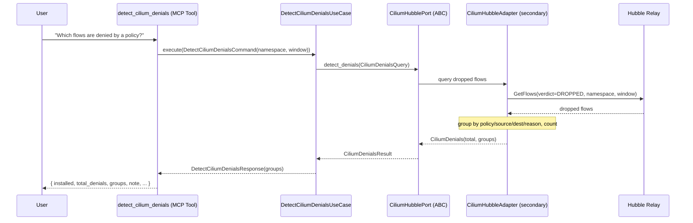
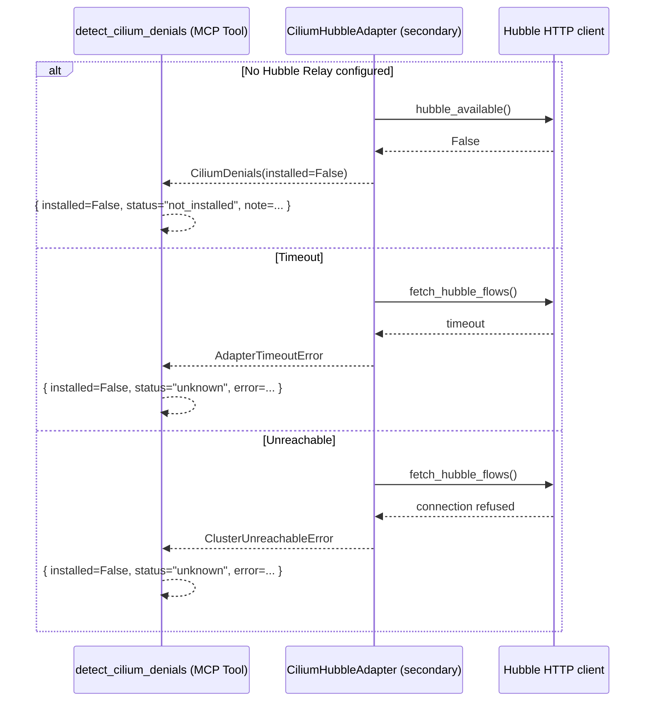
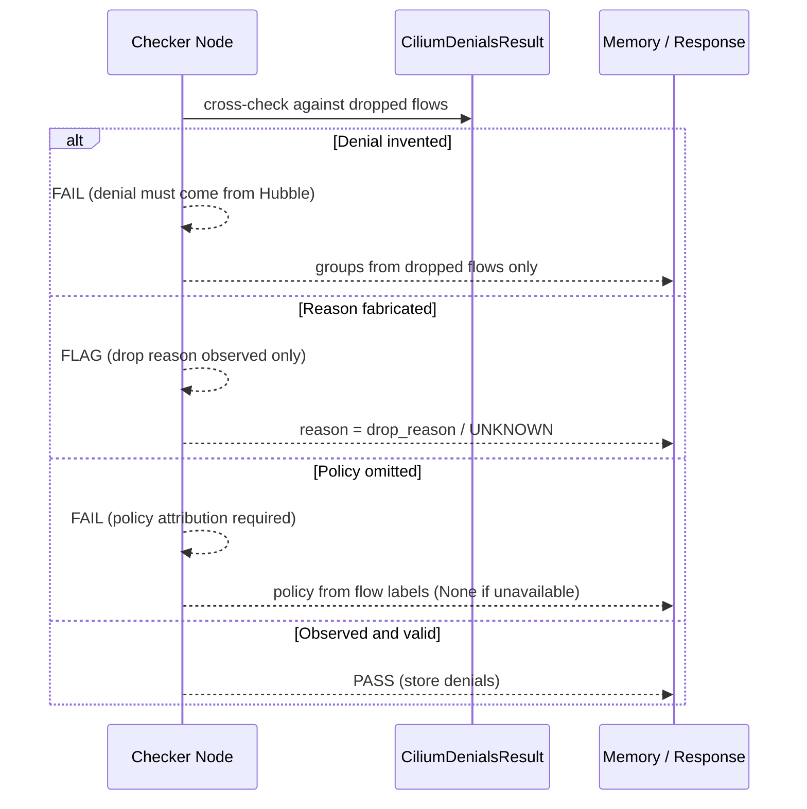
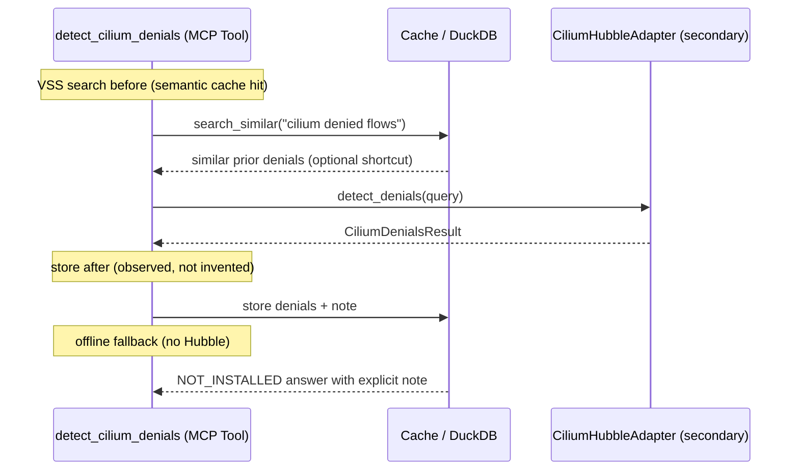

# Use Case 189 — Detect Cilium Denials

## Sample Questions

- "Which flows are being denied by a Cilium policy right now?"
- "Show me the dropped Cilium flows grouped by policy, source and destination"
- "Are there any Cilium policy denials in the payments namespace in the last 5 minutes?"
- "What traffic is blocked by a Cilium policy and why, with counts?"
- "List the Cilium policy denials with their drop reason and affected pods"

---

A security/platform engineer wants to detect dropped/denied flows (Cilium
policy denials) to find traffic blocked by a network policy and investigate
whether it is expected. The tool queries Hubble for `verdict=DROPPED` flows,
filtered by namespace and window, then aggregates them by policy / source /
destination / drop reason with counts. When Hubble Relay is absent it returns
NOT_INSTALLED — never fabricated denials. The flow crosses the hexagonal layers:
MCP Tool → DetectCiliumDenialsUseCase → CiliumHubblePort (driven port) →
CiliumHubbleAdapter (secondary) → Hubble Relay HTTP client.

### Flow 1 — Happy Path: Detect Dropped Flows

### Flow 2 — Errors: Not Installed, Unreachable, Timeout

### Flow 3 — Checker Node: Honest Denials

### Flow 4 — DuckDB Memory: Query-Before, Store-After, Offline Fallback

## Key Points

- `DetectCiliumDenialsUseCase` depends only on `CiliumHubblePort`.
- Queries Hubble with `verdict=DROPPED`, filtered by namespace and window, then
  aggregates into per-policy / source / destination / drop-reason counts.
- Each group carries the observed policy (from Hubble flow labels, `None` when
  unavailable), its drop reason (`UNKNOWN` when absent) and a count.
- NOT_INSTALLED is returned when Hubble Relay is not configured — never a
  fabricated denial; transport errors are translated to `HexawynError`.

## Test Coverage

| Test | File | Status |
|---|---|---|
| `test_detect_denials_groups_dropped` | `tests/unit/adapters/secondary/cilium/test_cilium_hubble_adapter.py` | ✅ |
| `test_detect_denials_not_installed` | `tests/unit/adapters/secondary/cilium/test_cilium_hubble_adapter.py` | ✅ |
| `test_groups_dropped_flows_by_policy_source_dest_reason` | `tests/unit/domain/services/test_denial_builder.py` | ✅ |
| `test_missing_reason_reported_unknown` | `tests/unit/domain/services/test_denial_builder.py` | ✅ |
| `test_zero_denials` | `tests/unit/domain/services/test_denial_builder.py` | ✅ |
| `test_execute_returns_groups` | `tests/unit/application/use_case/cilium/test_uc_detect_cilium_denials_use_case.py` | ✅ |
| `test_detect_cilium_denials_returns_dict` | `tests/unit/mcp/tools/test_tool_detect_cilium_denials.py` | ✅ |

## Related Files

- `src/hexawyn/domain/models/cilium.py` — `CiliumDenialsQuery`, `CiliumDenialGroup`, `CiliumDenialsResult`
- `src/hexawyn/domain/services/cilium/denial_builder.py` — pure dropped-flow aggregation
- `src/hexawyn/adapters/secondary/cilium/cilium_hubble_adapter.py` — `CiliumHubbleAdapter.detect_denials()`
- `src/hexawyn/application/ports/driven/cilium_hubble_port.py` — `CiliumHubblePort.detect_denials()`
- `src/hexawyn/application/use_case/cilium/detect_cilium_denials/` — Command, Response, UseCase
- `src/hexawyn/mcp/tools/detect_cilium_denials.py` — MCP tool
