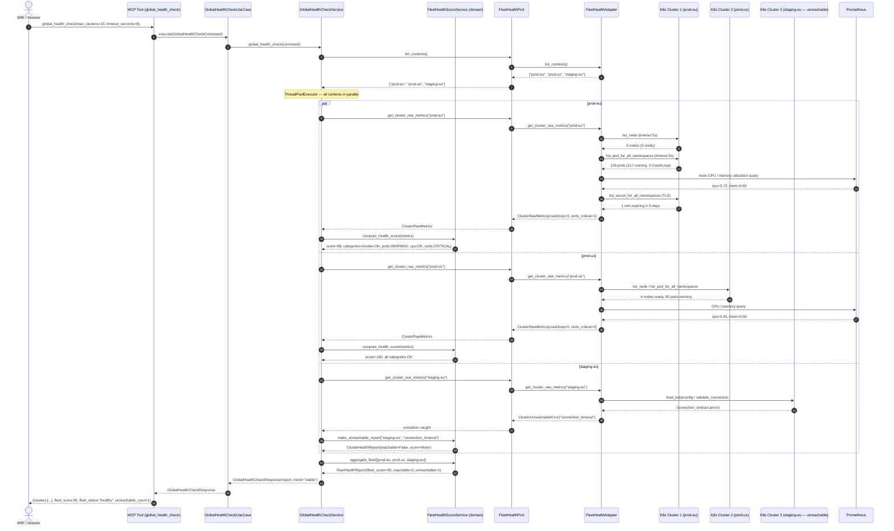
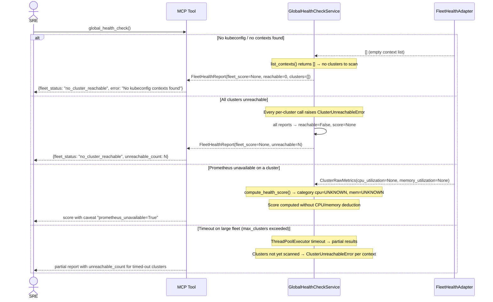
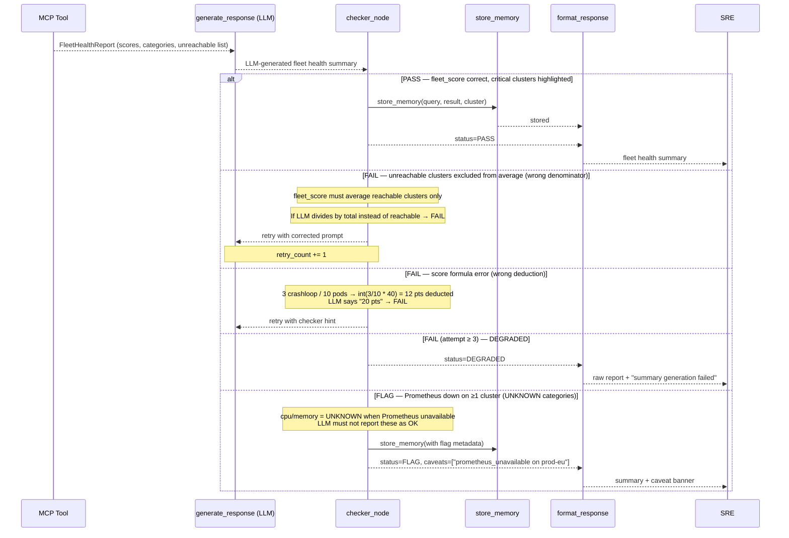
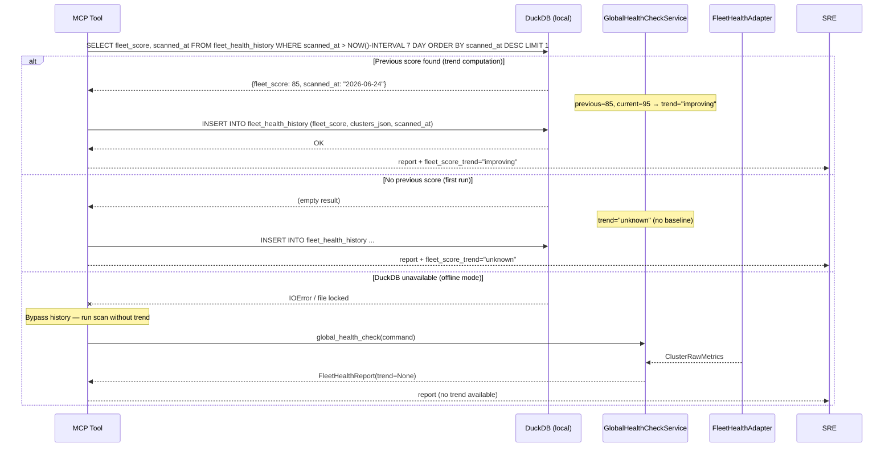

# Use Case 19 — Global Cluster Fleet Health Check

## Sample Questions

- "Give me a global health check of the cluster fleet — what is the overall status right now?"
- "Which cluster is the least healthy in my fleet?"
- "Are all my Kubernetes clusters reachable?"
- "What are the critical issues across all clusters?"
- "Is the fleet health improving or degrading compared to last week?"
- "Show me a breakdown by category — nodes, pods, CPU, certificates — for every cluster."

---

## Happy Path

---

## Error Flows

---

## Checker Node — Response Quality Validation

---

## DuckDB — Fleet Health Trend

---

## Key Points

- **Parallel execution** — `ThreadPoolExecutor` scans all contexts simultaneously; each cluster failure is caught individually so one unreachable cluster never blocks the others.
- **Score formula** — `score = 100 - 20×nodes_not_ready - int(crashloop/total×40) - cpu/mem pressure deductions - cert deductions - security deductions`, floored at 0.
- **Fleet aggregate** — `fleet_score` averages only reachable clusters; unreachable clusters are excluded from the denominator and counted in `unreachable_count`.
- **Prometheus optional** — when Prometheus is unavailable, CPU/memory categories become `UNKNOWN` (not `OK`); score is computed without those deductions.
- **Trend** — `fleet_score_trend` is derived from DuckDB history; `"improving"` when score rises >10%, `"degrading"` when it drops >10%, `"stable"` otherwise.

## Test Coverage

| Layer | File |
|-------|------|
| Domain score formula | `tests/unit/test_fleet_health_score_service.py` |
| Domain aggregation | `tests/unit/test_fleet_health_score_service.py` |
| Application service + parallelism | `tests/unit/test_global_health_check_use_case.py` |
| FleetHealthPort + use case | `tests/unit/test_global_health_check_use_case.py` |
| FleetHealthAdapter | `tests/unit/test_fleet_health_adapter.py` |

## Tests

| Test | Scenario |
|------|----------|
| `test_healthy_cluster_score_100` | Zero crashloop, zero pressure → score=100 |
| `test_3_crashloop_10_pods_deducts_12pts` | `int(3/10 * 40) = 12` pts deducted |
| `test_node_not_ready_deducts_20_each` | 1 node not ready → -20 pts |
| `test_cpu_over_90_deducts_15` | cpu_utilization=0.91 → -15 pts |
| `test_cert_critical_deducts_10` | 1 cert CRITICAL → -10 pts |
| `test_security_violations_capped_at_15` | 10 violations → max -15 pts |
| `test_score_floored_at_zero` | Many issues → score=0, never negative |
| `test_unreachable_excluded_from_aggregate` | 3 clusters, 1 unreachable → avg of 2 |
| `test_all_unreachable_fleet_score_none` | All unreachable → fleet_score=None |
| `test_trend_improving_when_score_rises` | previous=72, current=89 → "improving" |
| `test_trend_degrading_when_score_falls` | previous=89, current=72 → "degrading" |
| `test_prometheus_unavailable_cpu_unknown` | cpu_utilization=None → category=UNKNOWN |

## Related Files

- `src/hexawyn/domain/models/fleet_health.py`
- `src/hexawyn/domain/services/fleet_health/fleet_health_score_service.py`
- `src/hexawyn/application/ports/driven/fleet_health_port.py`
- `src/hexawyn/application/ports/driving/global_health_check/`
- `src/hexawyn/application/service/global_health_check_service.py`
- `src/hexawyn/application/use_case/global_health_check/global_health_check_use_case.py`
- `src/hexawyn/adapters/secondary/fleet_health_adapter.py`
- `src/hexawyn/mcp/tools/global_health_check.py`
