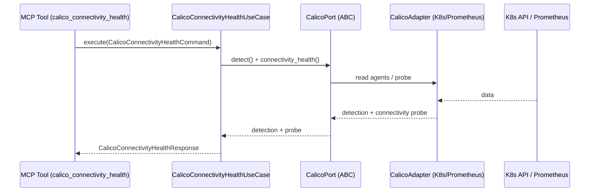

# Use Case 190 — Calico Connectivity Health

## Sample Questions

- "Is the Calico dataplane healthy end-to-end across all nodes?"
- "Are all calico-node agents ready and is the tunnel/BGP state healthy?"
- "Show me the per-node calico connectivity readiness and a global verdict."
- "Which calico-node agents are down or degraded right now?"
- "Is the Calico IPIP/VXLAN/eBPF dataplane functional before I investigate higher-level issues?"

---

"Run a Calico connectivity health check across nodes — per-node calico-node readiness, tunnel/BGP state summary and a global health verdict." The user asks via `calico_connectivity_health`. The flow crosses the hexagonal layers: MCP Tool → `CalicoConnectivityHealthUseCase` → `CalicoPort` (driven port) → `CalicoK8sAdapter` / `CalicoPrometheusAdapter` (secondary adapters) → Kubernetes API / Prometheus.

### Flow 1 — Calico Connectivity Health execution

## Key Points

- `CalicoConnectivityHealthUseCase` depends only on `CalicoPort` — never on a Kubernetes SDK.
- The healthy verdict is never invented: it requires every observed calico-node agent to be ready.
- Tunnel/BGP state summaries are derived honestly from the dataplane mode and agent health; unknown states are reported `UNKNOWN`.
- `NOT_INSTALLED` is returned honestly when the `projectcalico.org` CRD group is absent.
- `calico_connectivity_health` is registered in `mcp/tools/calico_connectivity_health.py` and synced to the control-plane cache.

## Related Files

- `src/hexawyn/domain/models/calico.py`
- `src/hexawyn/domain/services/calico/connectivity_health_service.py`
- `src/hexawyn/application/ports/driven/calico_port.py`
- `src/hexawyn/application/use_case/calico/calico_connectivity_health/calico_connectivity_health_use_case.py`
- `src/hexawyn/adapters/secondary/calico/calico_k8s_adapter.py`
- `src/hexawyn/adapters/secondary/calico/calico_prometheus_adapter.py`
- `src/hexawyn/mcp/adapters/calico_adapters.py`
- `src/hexawyn/mcp/tools/calico_connectivity_health.py`
