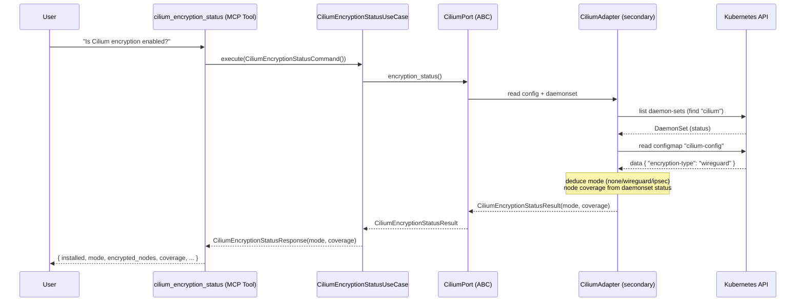
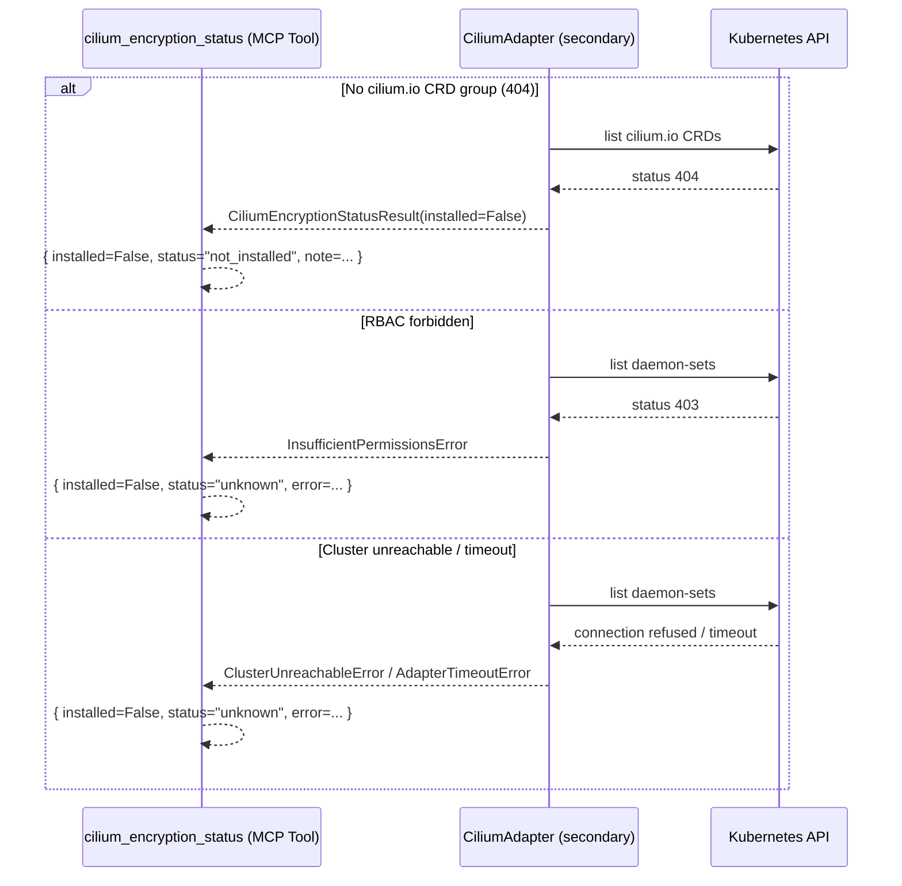
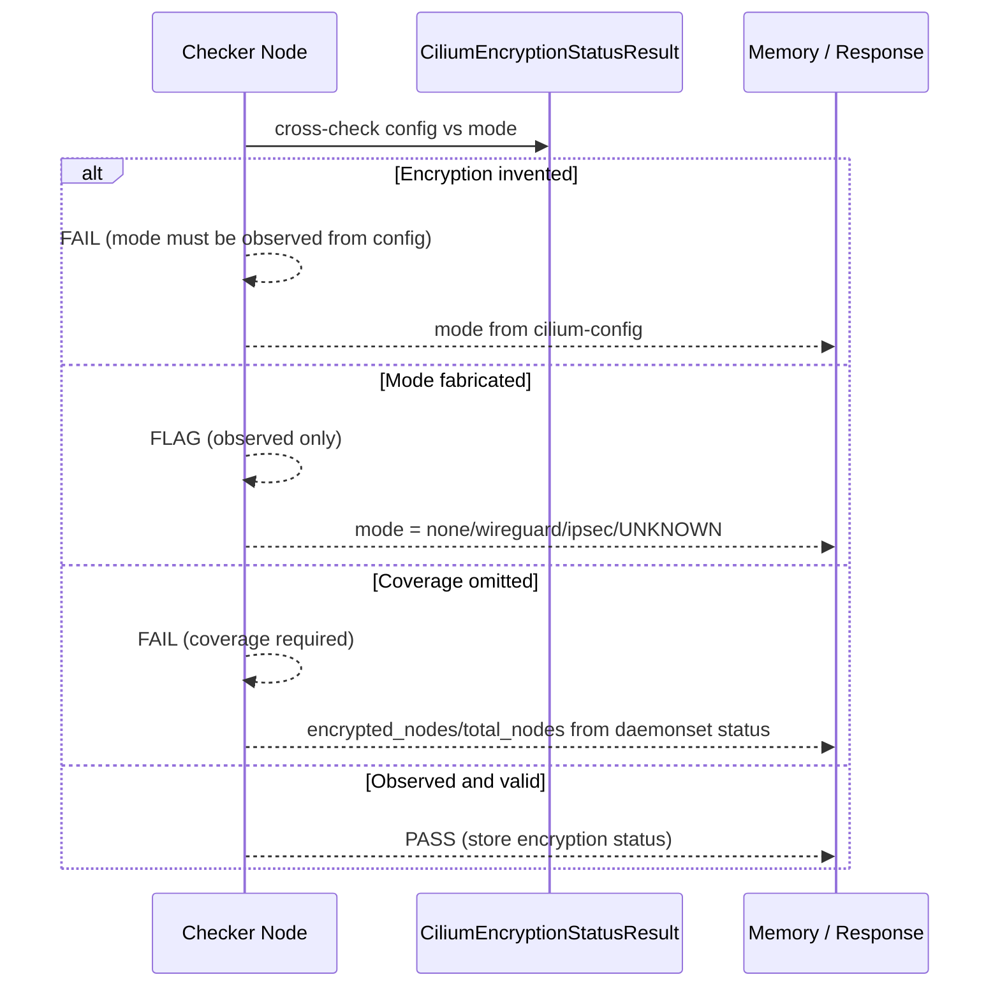
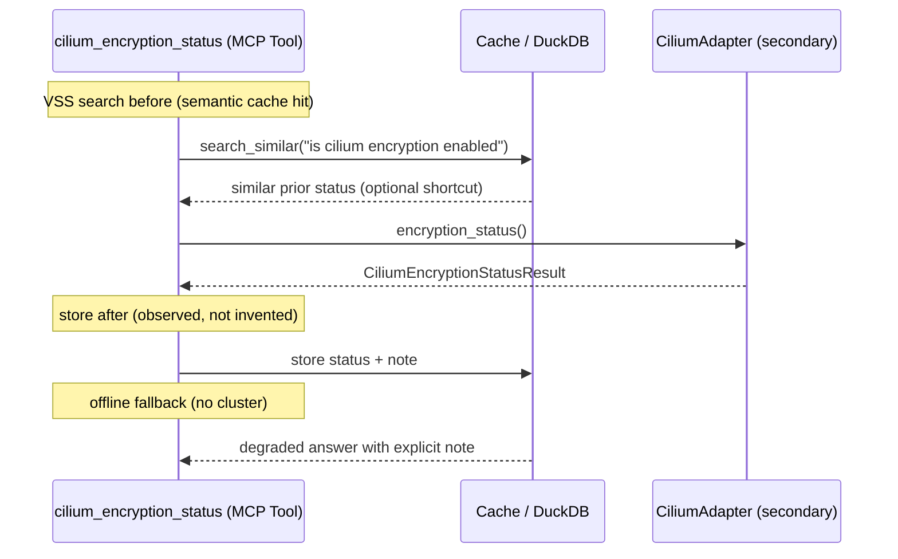

# Use Case 190 — Cilium Encryption Status

## Sample Questions

- "Is Cilium wire-level encryption (WireGuard or IPsec) enabled on my cluster?"
- "What encryption mode is Cilium using, and how many nodes are covered?"
- "Are my east-west workloads encrypted on the dataplane right now?"
- "Which Cilium encryption mode is configured, wireguard or ipsec?"
- "Show me the Cilium encryption status and node coverage"

---

A security engineer wants to verify that east-west traffic is encrypted on the
dataplane. The tool reads the observed Cilium configuration (`cilium-config`)
to report the encryption mode (none / wireguard / ipsec) and the node coverage
(encrypted nodes / total). When Cilium is absent it returns NOT_INSTALLED —
never a fabricated mode. The flow crosses the hexagonal layers: MCP Tool →
CiliumEncryptionStatusUseCase → CiliumPort (driven port) → CiliumAdapter
(secondary) → VanillaAdapter → Kubernetes API.

### Flow 1 — Happy Path: Read Encryption State

### Flow 2 — Errors: Not Installed, RBAC, Unreachable

### Flow 3 — Checker Node: Honest Encryption

### Flow 4 — DuckDB Memory: Query-Before, Store-After, Offline Fallback

## Key Points

- `CiliumEncryptionStatusUseCase` depends only on `CiliumPort`.
- `mode` comes from the observed `cilium-config` keys (`encryption-type`,
  `encryption-enabled`) — never inferred; an unreadable config yields `UNKNOWN`.
- `coverage` is `encrypted_nodes/total_nodes` from the Cilium DaemonSet status;
  a disabled mode reports `0/...`.
- NOT_INSTALLED is returned when the `cilium.io` CRD group is absent.

## Test Coverage

| Test | File | Status |
|---|---|---|
| `test_wireguard_enabled` | `tests/unit/adapters/secondary/gitops/test_cilium_adapter.py` | ✅ |
| `test_ipsec_enabled` | `tests/unit/adapters/secondary/gitops/test_cilium_adapter.py` | ✅ |
| `test_none_when_disabled` | `tests/unit/adapters/secondary/gitops/test_cilium_adapter.py` | ✅ |
| `test_wireguard_enabled_with_coverage` | `tests/unit/domain/services/test_encryption_status_builder.py` | ✅ |
| `test_deduce_wireguard` | `tests/unit/domain/services/test_encryption_status_builder.py` | ✅ |
| `test_execute_returns_status` | `tests/unit/application/use_case/cilium/test_uc_cilium_encryption_status_use_case.py` | ✅ |
| `test_cilium_encryption_status_returns_dict` | `tests/unit/mcp/tools/test_tool_cilium_encryption_status.py` | ✅ |

## Related Files

- `src/hexawyn/domain/models/cilium.py` — `CiliumEncryptionStatusResult`
- `src/hexawyn/domain/services/cilium/encryption_status_builder.py` — pure mode/coverage building
- `src/hexawyn/application/ports/driven/cilium_port.py` — `CiliumPort.encryption_status()`
- `src/hexawyn/application/use_case/cilium/cilium_encryption_status/` — Command, Response, UseCase
- `src/hexawyn/adapters/secondary/gitops/cilium_adapter.py` — `CiliumAdapter.encryption_status()`
- `src/hexawyn/mcp/tools/cilium_encryption_status.py` — MCP tool
