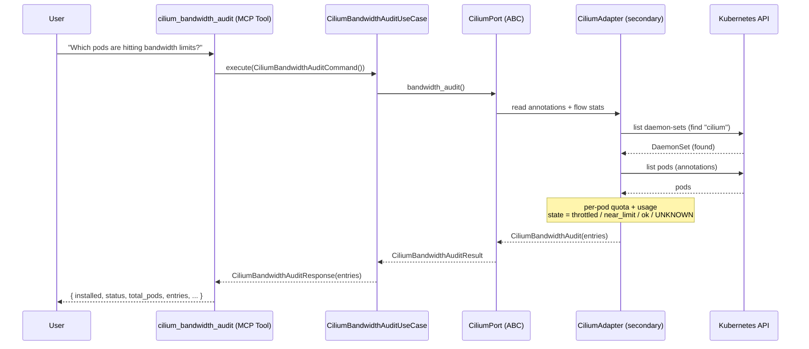
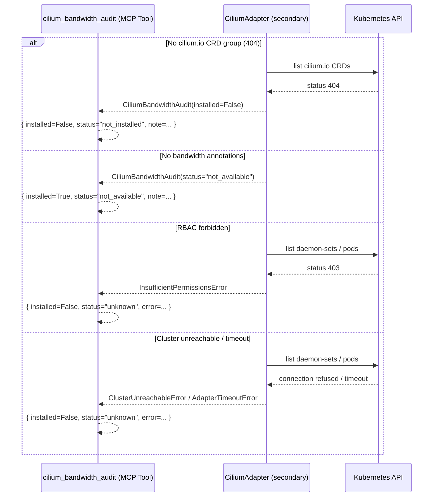
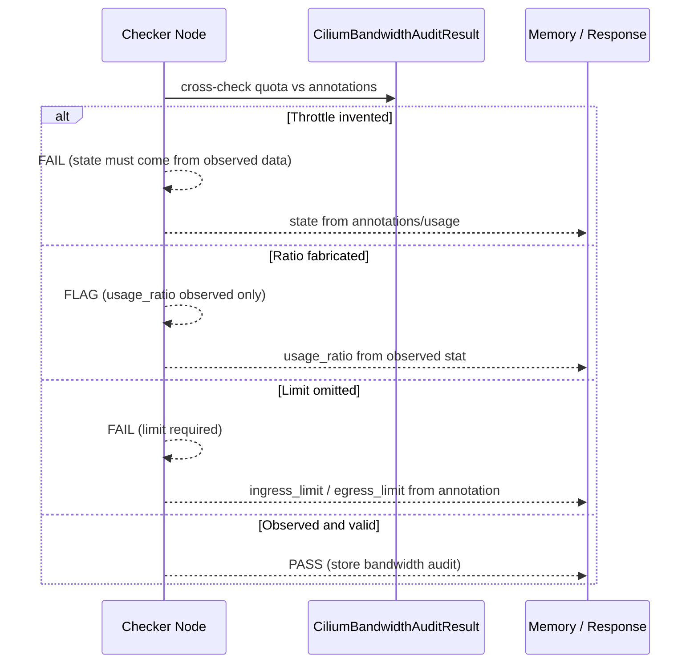
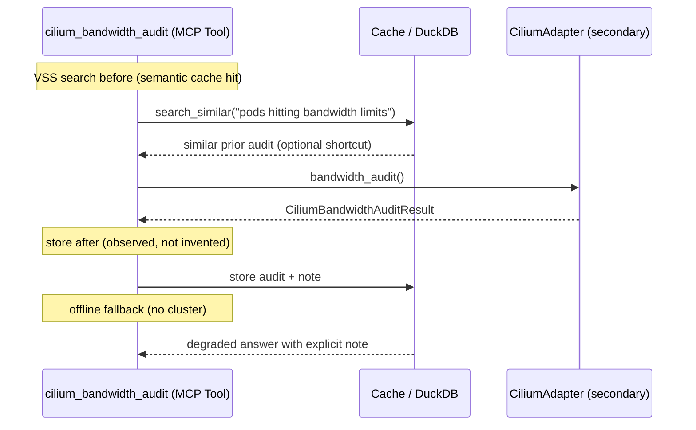

# Use Case 191 — Cilium Bandwidth Audit

## Sample Questions

- "Which pods are hitting their Cilium bandwidth limits and being throttled?"
- "Audit my Cilium bandwidth manager quotas and show me near-limit workloads"
- "Are any pods throttled by the Cilium bandwidth manager right now?"
- "Show me per-pod bandwidth quotas and anomalies across my cluster"
- "Which namespaces have workloads close to or over their egress bandwidth limit?"

---

A platform/FinOps engineer wants to audit Cilium bandwidth-manager quotas
(per-pod/auth) and usage to detect throttled workloads or unplanned bandwidth
spikes. The tool reads per-pod bandwidth annotations and flags throttled or
near-limit workloads, ranked by impact. When Cilium is absent it returns
NOT_INSTALLED; when the bandwidth manager is enabled but no bandwidth
annotations are found it reports NOT_AVAILABLE — never fabricated data. The
flow crosses the hexagonal layers: MCP Tool → CiliumBandwidthAuditUseCase →
CiliumPort (driven port) → CiliumAdapter (secondary) → VanillaAdapter →
Kubernetes API.

### Flow 1 — Happy Path: Audit Bandwidth Quotas

### Flow 2 — Errors: Not Installed, Not Available, RBAC, Unreachable

### Flow 3 — Checker Node: Honest Bandwidth

### Flow 4 — DuckDB Memory: Query-Before, Store-After, Offline Fallback

## Key Points

- `CiliumBandwidthAuditUseCase` depends only on `CiliumPort`.
- Reads per-pod bandwidth annotations and flags throttled (`throttled`) or
  near-limit (`near_limit`) workloads; a missing usage stat yields `UNKNOWN`.
- Anomalies are reported first (impact-ranked), not per-pod in arbitrary order.
- NOT_INSTALLED when Cilium is absent; NOT_AVAILABLE when the bandwidth manager
  is enabled but no bandwidth annotations are found.

## Test Coverage

| Test | File | Status |
|---|---|---|
| `test_flags_throttled_pod` | `tests/unit/adapters/secondary/gitops/test_cilium_adapter.py` | ✅ |
| `test_flags_near_limit` | `tests/unit/adapters/secondary/gitops/test_cilium_adapter.py` | ✅ |
| `test_no_annotations_returns_not_available` | `tests/unit/adapters/secondary/gitops/test_cilium_adapter.py` | ✅ |
| `test_throttled_wins` | `tests/unit/domain/services/test_bandwidth_builder.py` | ✅ |
| `test_near_limit` | `tests/unit/domain/services/test_bandwidth_builder.py` | ✅ |
| `test_flags_throttled_first` | `tests/unit/domain/services/test_bandwidth_builder.py` | ✅ |
| `test_execute_returns_entries` | `tests/unit/application/use_case/cilium/test_uc_cilium_bandwidth_audit_use_case.py` | ✅ |

## Related Files

- `src/hexawyn/domain/models/cilium.py` — `CiliumBandwidthEntry`, `CiliumBandwidthAuditResult`
- `src/hexawyn/domain/services/cilium/bandwidth_builder.py` — pure bandwidth classification
- `src/hexawyn/application/ports/driven/cilium_port.py` — `CiliumPort.bandwidth_audit()`
- `src/hexawyn/application/use_case/cilium/cilium_bandwidth_audit/` — Command, Response, UseCase
- `src/hexawyn/adapters/secondary/gitops/cilium_adapter.py` — `CiliumAdapter.bandwidth_audit()`
- `src/hexawyn/mcp/tools/cilium_bandwidth_audit.py` — MCP tool
