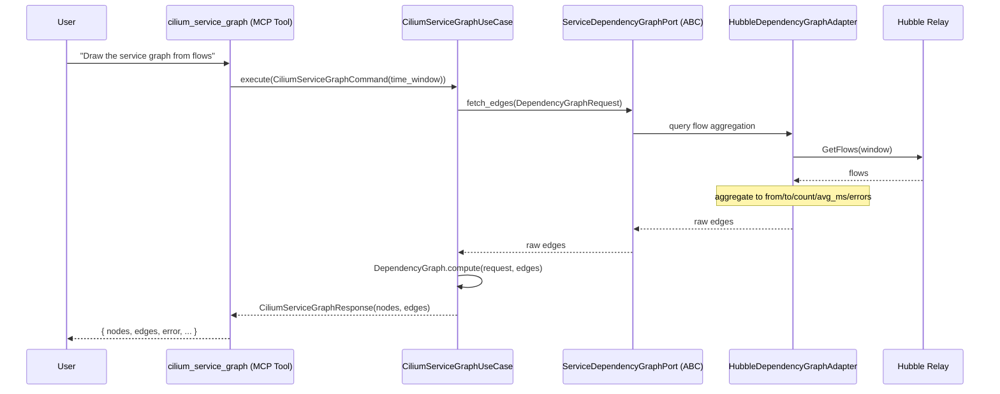
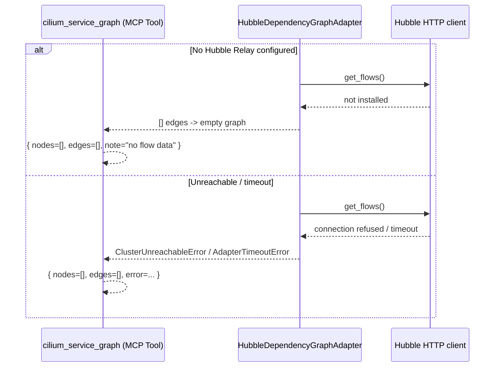
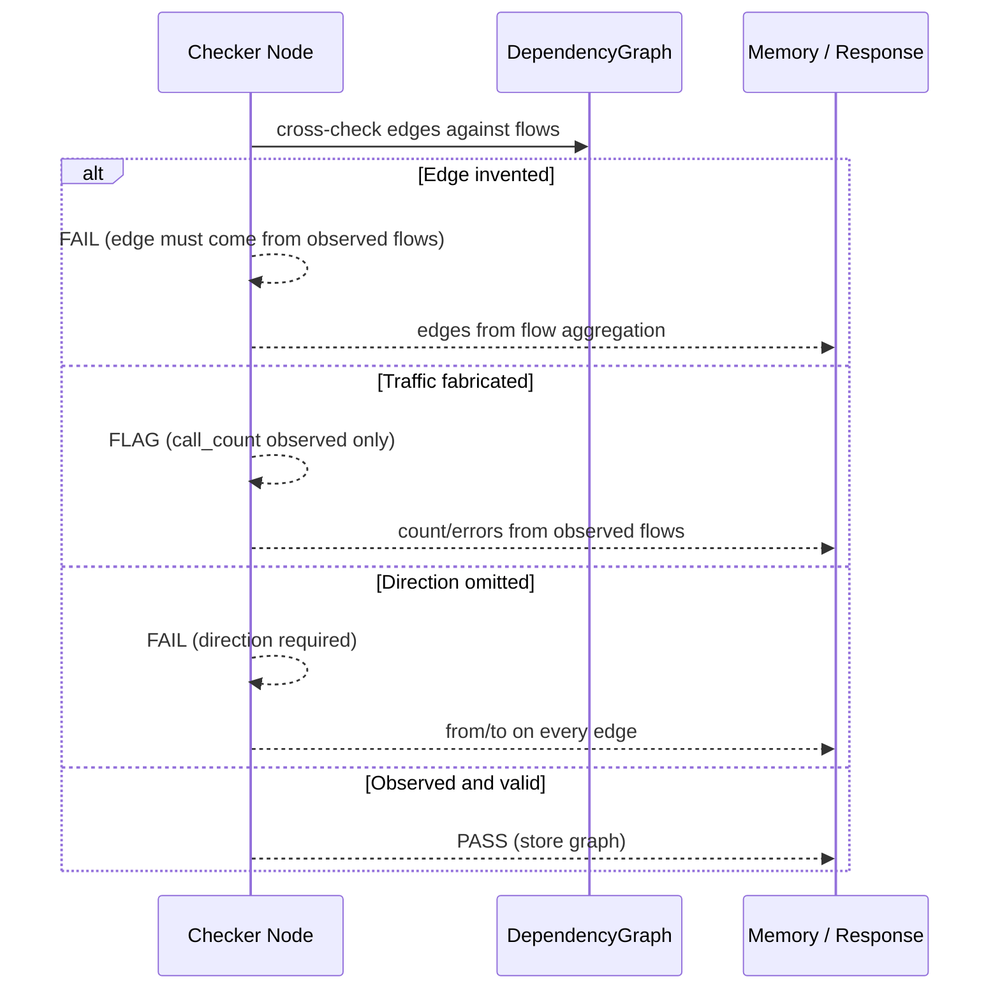
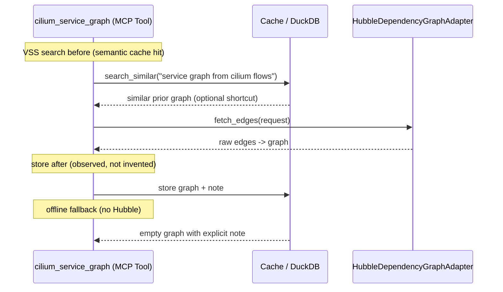

# Use Case 192 — Cilium Service Graph

## Sample Questions

- "Draw the service dependency graph from the Cilium flow logs in the payments namespace"
- "Which services talk to each other according to observed Cilium flows?"
- "Show me the Cilium-based service graph with edge traffic and dropped flows"
- "What is the actual connectivity between my workloads from Hubble flows?"
- "Build a service-to-service graph from the last hour of Cilium flows"

---

A platform/observability engineer wants to build a service↔service graph from
Cilium flows (Hubble) to visualize actual connectivity between workloads in a
namespace. The tool aggregates observed flows into graph edges (reusing the
`DependencyGraph.compute` logic from `service_dependency_graph`), so the result
is built from real observed traffic rather than an inferred topology. When
Hubble is unavailable it builds an empty graph (graceful fallback). The flow
crosses the hexagonal layers: MCP Tool → CiliumServiceGraphUseCase →
ServiceDependencyGraphPort (driven port) → HubbleDependencyGraphAdapter
(secondary) → CiliumHubblePort → Hubble Relay.

### Flow 1 — Happy Path: Build the Graph from Flows

### Flow 2 — Errors: Not Installed (Empty), Unreachable, Timeout

### Flow 3 — Checker Node: Honest Graph

### Flow 4 — DuckDB Memory: Query-Before, Store-After, Offline Fallback

## Key Points

- `CiliumServiceGraphUseCase` depends only on `ServiceDependencyGraphPort`.
- Reuses `DependencyGraph.compute` (from `service_dependency_graph`) — the only
  difference is the adapter (Hubble flows vs inferred topology).
- Edges are aggregated per `(source, target)` pair with observed flow count,
  average latency (`0` when not reported) and dropped count (error rate).
- An empty graph is returned when Hubble is unavailable or no flows are seen
  (graceful fallback); traffic is never fabricated.

## Test Coverage

| Test | File | Status |
|---|---|---|
| `test_builds_edges_from_flows` | `tests/unit/adapters/secondary/cilium/test_cilium_hubble_graph_adapter.py` | ✅ |
| `test_empty_when_hubble_not_installed` | `tests/unit/adapters/secondary/cilium/test_cilium_hubble_graph_adapter.py` | ✅ |
| `test_aggregates_by_pair` | `tests/unit/domain/services/test_graph_builder.py` | ✅ |
| `test_counts_dropped_as_errors` | `tests/unit/domain/services/test_graph_builder.py` | ✅ |
| `test_includes_self_loop` | `tests/unit/domain/services/test_graph_builder.py` | ✅ |
| `test_execute_builds_graph` | `tests/unit/application/use_case/cilium/test_uc_cilium_service_graph_use_case.py` | ✅ |
| `test_cilium_service_graph_returns_dict` | `tests/unit/mcp/tools/test_tool_cilium_service_graph.py` | ✅ |

## Related Files

- `src/hexawyn/domain/services/cilium/graph_builder.py` — pure flow→edge aggregation
- `src/hexawyn/adapters/secondary/cilium/cilium_hubble_graph_adapter.py` — `HubbleDependencyGraphAdapter`
- `src/hexawyn/application/ports/driven/service_dependency_graph_port.py` — `ServiceDependencyGraphPort` (reused)
- `src/hexawyn/domain/models/service_dependency_graph.py` — `DependencyGraph.compute` (reused)
- `src/hexawyn/application/use_case/cilium/cilium_service_graph/` — Command, Response, UseCase
- `src/hexawyn/mcp/tools/cilium_service_graph.py` — MCP tool
- `src/hexawyn/mcp/adapters/cilium_adapters.py` — `build_cilium_service_graph_adapter()`
