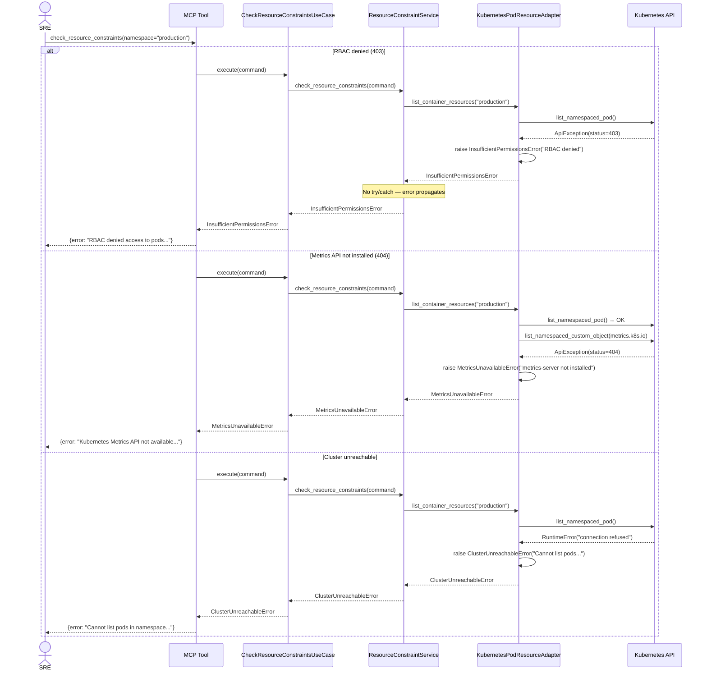
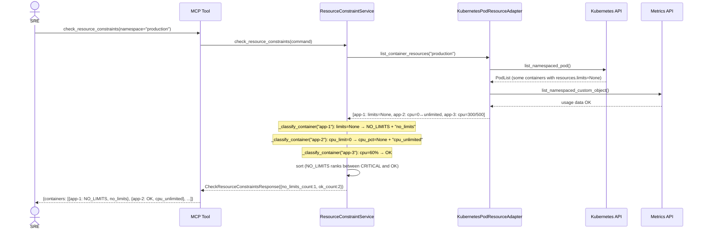
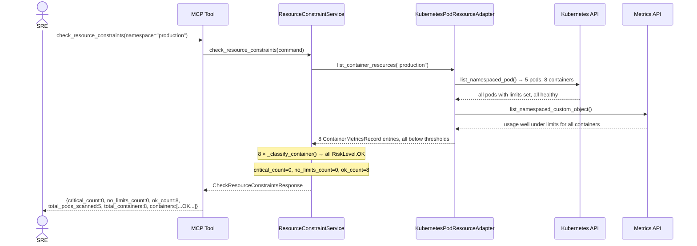

# Use Case 25 — Check Resource Constraints

## Sample Questions

- "Are any pods in production close to hitting their CPU or memory limits? Which ones are throttled or at risk of OOMKill?"
- "Show me all containers where CPU usage exceeds 80% of the limit"
- "Which pods are at risk of being OOMKilled in the staging namespace?"
- "Are there any pods running without resource limits configured?"
- "Give me a resource pressure report for all containers in production, sorted by risk"

---

Identifies containers at risk of CPU throttling (usage > 80% of limit) and OOMKill (memory usage > 85% of limit).
Each container is classified as CRITICAL, NO_LIMITS, or OK. Results are sorted by risk level (CRITICAL first).
Init containers are flagged separately. CPU limit 0 is treated as unlimited — no risk score computed.

---

## Flow 1 — Happy Path (payment-api at 96% CPU → CRITICAL, auth-service healthy)

```mermaid
sequenceDiagram
    actor SRE
    participant MCP as MCP Tool<br/>(check_resource_constraints)
    participant UC as CheckResourceConstraintsUseCase
    participant Svc as ResourceConstraintService
    participant Port as PodResourceMetricsPort (ABC)
    participant Adapter as KubernetesPodResourceAdapter
    participant K8s as Kubernetes API
    participant Metrics as Metrics API

    SRE->>MCP: check_resource_constraints(namespace="production")
    MCP->>UC: execute(CheckResourceConstraintsCommand)
    UC->>Svc: check_resource_constraints(command)

    Svc->>Port: list_container_resources("production")
    Port->>Adapter: list_container_resources("production")

    Adapter->>K8s: CoreV1Api.list_namespaced_pod(namespace="production")
    K8s-->>Adapter: PodList (spec.containers + spec.init_containers)
    Note over Adapter: Parse limits: cpu=500m, memory=512Mi<br/>Track init_container flag

    Adapter->>Metrics: CustomObjectsApi.list_namespaced_custom_object<br/>(metrics.k8s.io/v1beta1/pods)
    Metrics-->>Adapter: PodMetricsList (cpu=480m, memory=400Mi)

    Note over Adapter: _merge() → list[ContainerMetricsRecord]

    Adapter-->>Svc: [payment-api: cpu=480/500, mem=400Mi/512Mi, auth: cpu=100/500, mem=200Mi/512Mi]

    Note over Svc: _classify_container("payment-api"): cpu=96% > 80% → CRITICAL + "throttled"
    Note over Svc: _classify_container("auth-service"): cpu=20%, mem=39% → OK

    Svc->>Svc: sort by risk (CRITICAL → NO_LIMITS → OK)

    Svc-->>UC: CheckResourceConstraintsResponse(report)
    UC-->>MCP: response
    MCP-->>SRE: {critical_count:1, ok_count:1, containers:[payment-api:CRITICAL,...]}
```

---

## Flow 2 — Error Flows (RBAC denied, metrics-server missing, cluster unreachable)

---

## Flow 3 — Containers Without Resource Limits (NO_LIMITS classification)

---

## Flow 4 — All Pods Healthy (clean report, zero alerts)

---

## Key Points

- CPU threshold: **> 80%** of limit triggers CRITICAL (throttling risk)
- Memory threshold: **> 85%** of limit triggers CRITICAL (OOMKill risk)
- CPU limit **0** = explicitly unlimited → no CPU risk score, tagged `cpu_unlimited`
- Containers with **no limits set** (None) → classified as NO_LIMITS with `no_limits` tag
- Init containers are **included** but flagged with `is_init_container=True`
- Results sorted: **CRITICAL → NO_LIMITS → OK**; exact threshold values are NOT critical (e.g., CPU at exactly 80% is OK)

## Test Coverage

| Test | File | Scenario |
|---|---|---|
| `test_cpu_critical_above_threshold` | `test_check_resource_constraints.py` | CPU 96% > 80% → CRITICAL + "throttled" |
| `test_memory_critical_above_threshold` | `test_check_resource_constraints.py` | Memory 92% > 85% → CRITICAL + "oomkill_risk" |
| `test_both_cpu_and_memory_critical` | `test_check_resource_constraints.py` | Both CPU 90% + memory 88% → CRITICAL with both tags |
| `test_ok_below_both_thresholds` | `test_check_resource_constraints.py` | TC2: CPU 45%, memory 50% → OK |
| `test_no_cpu_limit_returns_no_limits` | `test_check_resource_constraints.py` | TC3: limits=None → NO_LIMITS + "no_limits" |
| `test_cpu_limit_zero_treated_as_unlimited` | `test_check_resource_constraints.py` | CPU limit=0 → cpu_pct=None, "cpu_unlimited" |
| `test_tc1_memory_critical_oomkill_risk` | `test_check_resource_constraints.py` | TC1: Memory 92% → CRITICAL OOMKill risk |
| `test_tc4_all_healthy_clean_report` | `test_check_resource_constraints.py` | TC4: 5 pods all within bounds → OK |
| `test_mixed_risks_sorted_critical_first` | `test_check_resource_constraints.py` | Sort order: CRITICAL before NO_LIMITS before OK |
| `test_payment_api_test_data` | `test_check_resource_constraints.py` | payment-api: CPU 96% throttled, memory 78% OK |
| `test_rbac_error_propagates` | `test_check_resource_constraints.py` | 403 → InsufficientPermissionsError |
| `test_metrics_unavailable_propagates` | `test_check_resource_constraints.py` | 404 → MetricsUnavailableError |
| `test_init_containers_included` | `test_check_resource_constraints.py` | Init + main containers both returned |
| `test_happy_path_returns_expected_keys` | `test_check_resource_constraints.py` | MCP tool returns correct JSON structure |
| `test_error_returns_error_key` | `test_check_resource_constraints.py` | MCP tool catches exceptions gracefully |

## Related Files

- `src/hexawyn/domain/models/resource_constraint.py` — `RiskLevel`, `ContainerResourceEntry`, `ResourceConstraintReport`
- `src/hexawyn/application/ports/driven/pod_resource_metrics_port.py` — `ContainerMetricsRecord`, `PodResourceMetricsPort`
- `src/hexawyn/application/ports/driving/check_resource_constraints/` — Command, Response, ServicePort
- `src/hexawyn/application/use_case/check_resource_constraints/check_resource_constraints_use_case.py`
- `src/hexawyn/application/service/resource_constraint_service.py` — `ResourceConstraintService`
- `src/hexawyn/adapters/secondary/kubernetes_pod_resource_adapter.py` — K8s + Metrics API adapter
- `src/hexawyn/mcp/tools/check_resource_constraints.py` — MCP entry point
