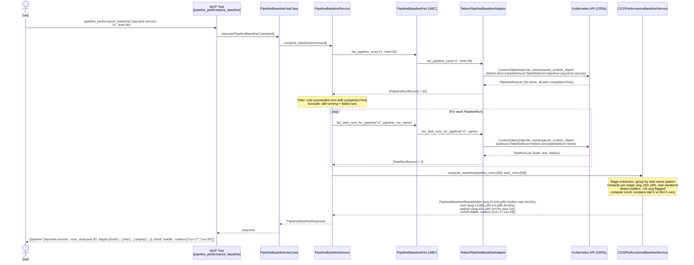
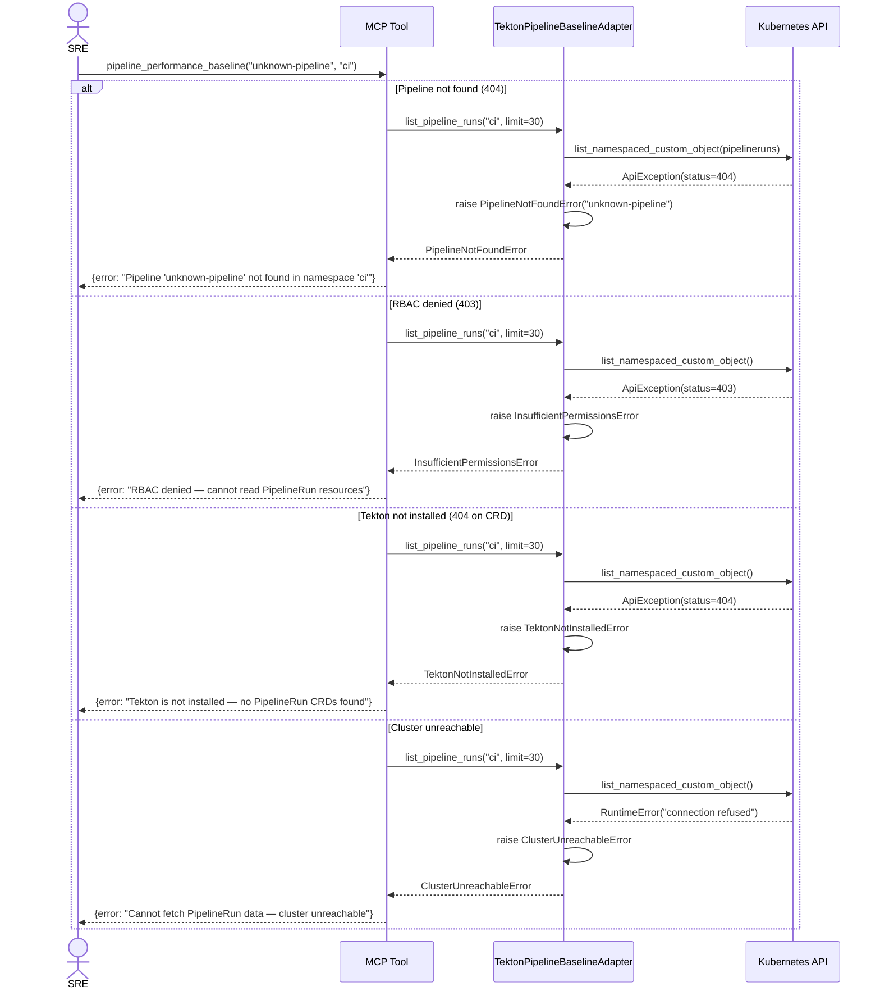
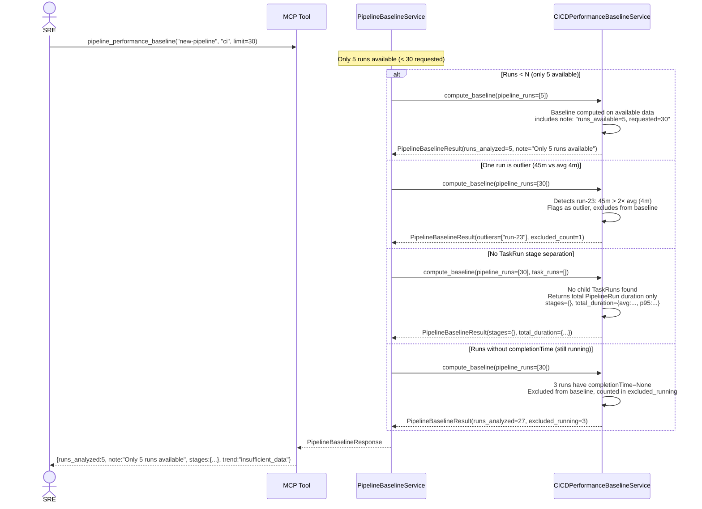
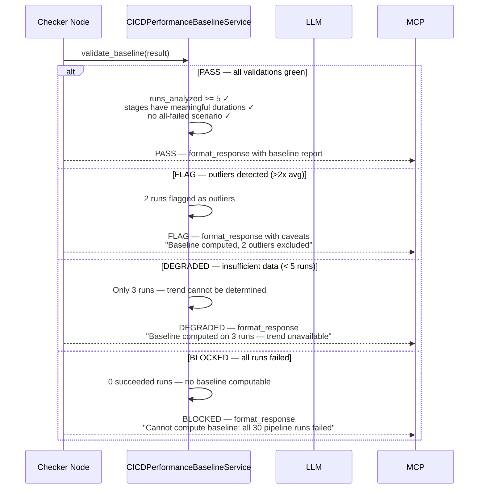

# Use Case 34 — Pipeline Performance Baseline

## Sample Questions

- "Establish a CI/CD performance baseline for the payment-service pipeline — what is the average build time, test time, and deploy time over the last 30 runs?"
- "Has the checkout pipeline been getting slower over the last week? Show me the trend."
- "Which pipeline runs are outliers — taking more than double the average build time?"
- "Give me the p50 and p95 durations for each stage of the deploy-api pipeline"
- "Is the CI pipeline performance improving, stable, or degrading compared to last month?"

---

Fetches the last N PipelineRuns for a given pipeline name (default: 30), extracts per-stage durations (build/test/deploy) from child TaskRuns, computes statistical baselines (average, p50, p95, max), identifies outlier runs (>2x average), determines trend direction (improving/stable/degrading), and returns a structured baseline report.

---

## Flow 1 — Happy Path (payment-service: 30 runs, stable ~4m build time)

---

## Flow 2 — Error Flows (Pipeline not found, Tekton not installed, RBAC denied, cluster unreachable)

---

## Flow 3 — Edge Cases (fewer than N runs, outlier exclusion, no stage separation, in-progress runs)

---

## Flow 4 — Checker Node (validation)

---

## Key Points

- Fetches last N PipelineRuns via **label selector** `pipeline=<name>` from Tekton CRDs
- Extracts per-stage durations by grouping child TaskRuns by **task name pattern** (build/test/deploy) with best-effort matching when stage names vary
- Filters out runs with `completionTime=None` (still running) and **failed runs** — baseline computed only on succeeded runs
- Detects **outliers**: any run whose duration exceeds **2× the stage average** is flagged and excluded from the baseline
- Computes **trend**: compares average duration of last 5 runs vs first 5 runs → improving (faster), stable (±10%), degrading (slower)
- When fewer than N runs are available, baseline is computed on available data with `runs_available` note

## Test Coverage

| Test | File | Scenario |
|---|---|---|
| `test_stable_30_runs_returns_correct_baseline` | `test_pipeline_performance_baseline.py` | 30 runs, stable ~4m build → avg=4m, trend=stable |
| `test_last_5_runs_degrading_flags_outliers` | `test_pipeline_performance_baseline.py` | Last 5 runs avg 8m (double) → trend=degrading, outliers flagged |
| `test_only_5_runs_computes_with_note` | `test_pipeline_performance_baseline.py` | 5 runs available → baseline on available data, note added |
| `test_single_45m_run_flagged_as_outlier` | `test_pipeline_performance_baseline.py` | One run 45m vs avg 4m → flagged outlier, excluded |
| `test_no_taskrun_stages_returns_total_only` | `test_pipeline_performance_baseline.py` | No TaskRun stage separation → total duration returned |
| `test_pipeline_not_found_raises_error` | `test_pipeline_performance_baseline.py` | Pipeline name not found → PipelineNotFoundError |
| `test_runs_without_completion_time_excluded` | `test_pipeline_performance_baseline.py` | Runs with completionTime=None → excluded from baseline |
| `test_all_failed_runs_returns_empty_baseline` | `test_pipeline_performance_baseline.py` | All runs failed → baseline only on succeeded (0) |
| `test_stage_names_vary_best_effort_matching` | `test_pipeline_performance_baseline.py` | Stage names vary between runs → best-effort matching |
| `test_parallel_tasks_noted` | `test_pipeline_performance_baseline.py` | TaskRun durations don't add up to total (parallel) → noted |
| `test_trend_computation_improving` | `test_pipeline_performance_baseline.py` | First 5 avg 5m, last 5 avg 3m → trend=improving |
| `test_trend_computation_stable` | `test_pipeline_performance_baseline.py` | First 5 avg 4m, last 5 avg 4.2m (within ±10%) → stable |
| `test_p50_p95_max_computed_correctly` | `test_pipeline_performance_baseline.py` | 30 durations → p50 and p95 computed via statistics module |
| `test_happy_path_returns_expected_json_keys` | `test_pipeline_performance_baseline.py` | MCP tool JSON structure validation |

## Related Files

- `src/hexawyn/domain/models/pipeline_baseline.py` — `PipelineBaselineResult`, `StageStats`, `OutlierRecord`
- `src/hexawyn/domain/services/pipeline_baseline/cicd_performance_baseline_service.py` — Stats computation, outlier detection, trend analysis
- `src/hexawyn/application/ports/driven/pipeline_baseline_port.py` — `PipelineBaselineRecord`, `TaskRunStageRecord`, `PipelineBaselinePort`
- `src/hexawyn/application/ports/driving/pipeline_performance_baseline/` — Command, Response, ServicePort
- `src/hexawyn/application/use_case/pipeline_performance_baseline/` — UseCase
- `src/hexawyn/application/service/pipeline_performance_baseline_service.py` — Application service
- `src/hexawyn/adapters/secondary/tekton_pipeline_baseline_adapter.py` — K8s CRD adapter
- `src/hexawyn/mcp/tools/pipeline_performance_baseline.py` — MCP entry point
