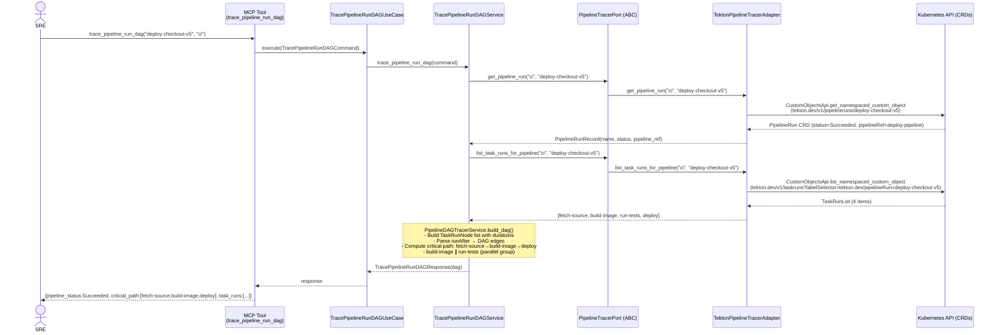
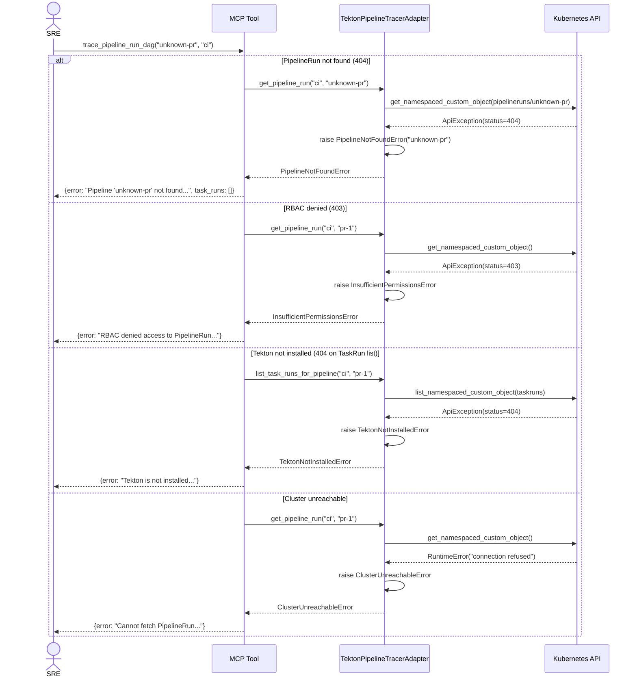
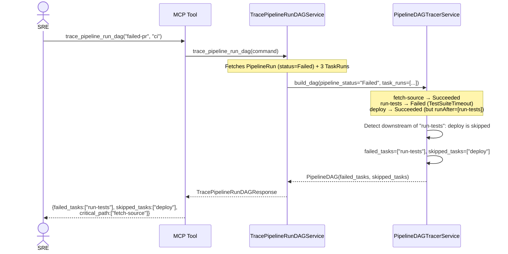
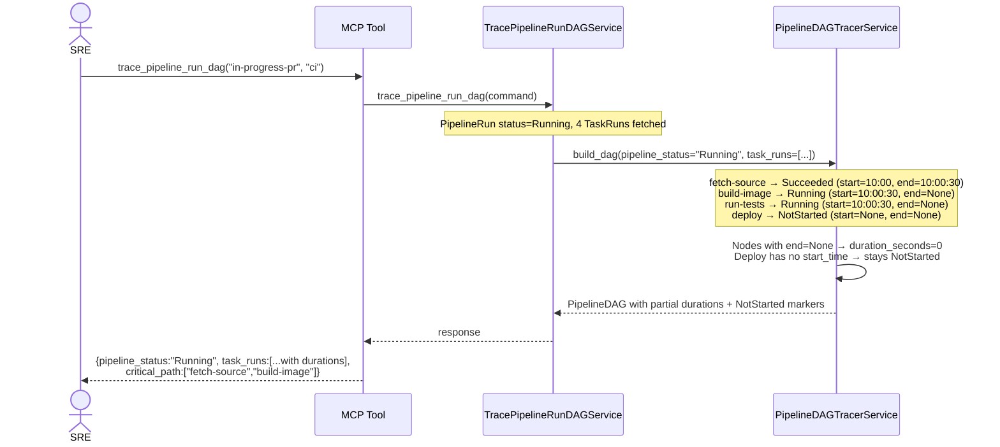

# Use Case 35 — Trace PipelineRun DAG

## Sample Questions

- "Trace the full execution path of PipelineRun deploy-checkout-v5 — show me the complete DAG of TaskRuns with their start times, durations, and dependencies."
- "What is the critical path for the payment-service pipeline — which tasks are the bottleneck?"
- "Show me the execution DAG for pipeline-run-42, highlight any failed or skipped tasks"
- "Which TaskRuns ran in parallel vs sequentially in the latest CI pipeline?"
- "Give me a visual dependency graph of the deploy-staging PipelineRun with timestamps"

---

Reconstructs the full execution DAG of a Tekton PipelineRun by fetching the PipelineRun CRD and all associated child TaskRuns via label selector.
Computes the critical path (longest sequential chain by duration), identifies parallel execution groups, marks downstream tasks skipped when predecessors fail, and supports fan-in (multiple runAfter).

---

## Flow 1 — Happy Path (deploy-checkout-v5: fetch-source → build-image ∥ run-tests → deploy)

---

## Flow 2 — Error Flows (PipelineRun not found, RBAC denied, Tekton not installed, cluster unreachable)

---

## Flow 3 — Mid-Pipeline Failure (run-tests fails → deploy skipped)

---

## Flow 4 — In-Progress PipelineRun (partial DAG with Running markers)

---

## Key Points

- Fetches PipelineRun by **name + namespace** via K8s CustomObjectsApi (`tekton.dev/v1/pipelineruns`)
- Lists child TaskRuns via **label selector** `tekton.dev/pipelineRun=<name>`
- **Critical path** = longest sequential chain by summed `duration_seconds`
- **Downstream skipping**: when a task fails, all tasks that depend on it (directly or transitively) are marked as skipped
- **Fan-in** supported: TaskRun with multiple `runAfter` predecessors waits for all of them
- Failed PipelineRun: returns `failed_tasks` + `skipped_tasks` lists; cancelled PipelineRun: includes `cancelled_at_tasks`
- PipelineRun without `pipelineRef` → `pipeline_ref="inline"` or `"unknown"`

## Test Coverage

| Test | File | Scenario |
|---|---|---|
| `test_tc1_four_taskruns_correct_dag` | `test_trace_pipeline_run_dag.py` | 4 TaskRuns with correct deps |
| `test_critical_path_identifies_longest_chain` | `test_trace_pipeline_run_dag.py` | Critical path = fetch-source→build-image→deploy |
| `test_parallel_tasks_detected` | `test_trace_pipeline_run_dag.py` | build-image ∥ run-tests detected |
| `test_tc2_failed_task_downstream_skipped` | `test_trace_pipeline_run_dag.py` | Failed run-tests → deploy skipped |
| `test_tc3_all_succeeded_critical_path_correct` | `test_trace_pipeline_run_dag.py` | All succeeded, critical path found |
| `test_tc4_in_progress_partial_dag` | `test_trace_pipeline_run_dag.py` | In-progress: NotStarted/Running markers |
| `test_fan_in_handled` | `test_trace_pipeline_run_dag.py` | Multiple runAfter on task-d |
| `test_cancelled_pipeline_point_identified` | `test_trace_pipeline_run_dag.py` | Cancelled: build-image identified |
| `test_skip_duration_zero_marked` | `test_trace_pipeline_run_dag.py` | Duration 0s (skipped condition) |
| `test_large_pipeline_over_50_taskruns` | `test_trace_pipeline_run_dag.py` | 55 TaskRuns handled |
| `test_get_pipeline_run_404_raises_pipeline_not_found` | `test_trace_pipeline_run_dag.py` | 404 → PipelineNotFoundError |
| `test_list_task_runs_404_raises_tekton_not_installed` | `test_trace_pipeline_run_dag.py` | 404 → TektonNotInstalledError |
| `test_happy_path_returns_expected_keys` | `test_trace_pipeline_run_dag.py` | MCP tool JSON structure |
| `test_pipeline_not_found_propagates` | `test_trace_pipeline_run_dag.py` | Error propagates through service |

## Related Files

- `src/hexawyn/domain/models/pipeline_dag.py` — `TaskRunNode`, `DAGEdge`, `PipelineDAG`
- `src/hexawyn/domain/services/pipeline_dag/pipeline_dag_tracer_service.py` — DAG logic
- `src/hexawyn/application/ports/driven/pipeline_tracer_port.py` — `PipelineRunRecord`, `TaskRunRecord`, `PipelineTracerPort`
- `src/hexawyn/application/ports/driving/trace_pipeline_run_dag/` — Command, Response, ServicePort
- `src/hexawyn/application/use_case/trace_pipeline_run_dag/` — UseCase
- `src/hexawyn/application/service/trace_pipeline_run_dag_service.py` — Application service
- `src/hexawyn/adapters/secondary/tekton_pipeline_tracer_adapter.py` — K8s CRD adapter
- `src/hexawyn/mcp/tools/trace_pipeline_run_dag.py` — MCP entry point
