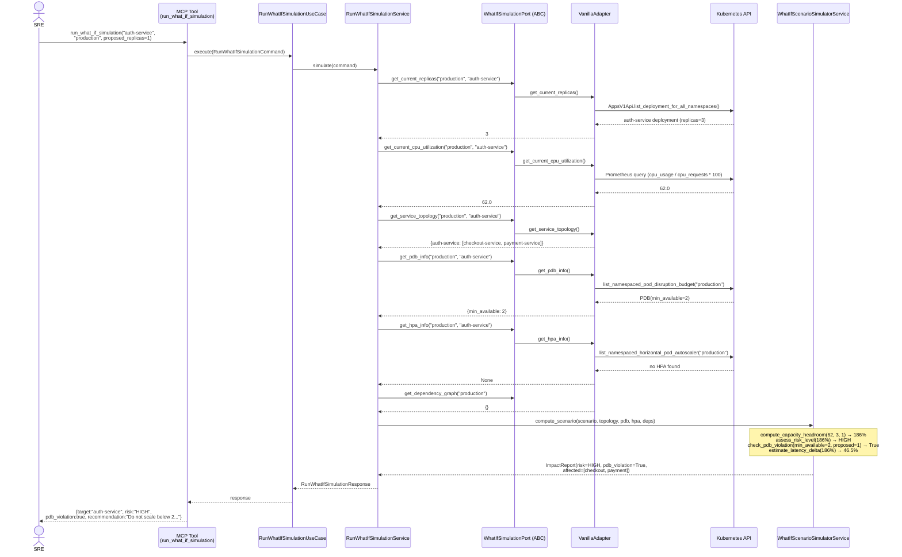
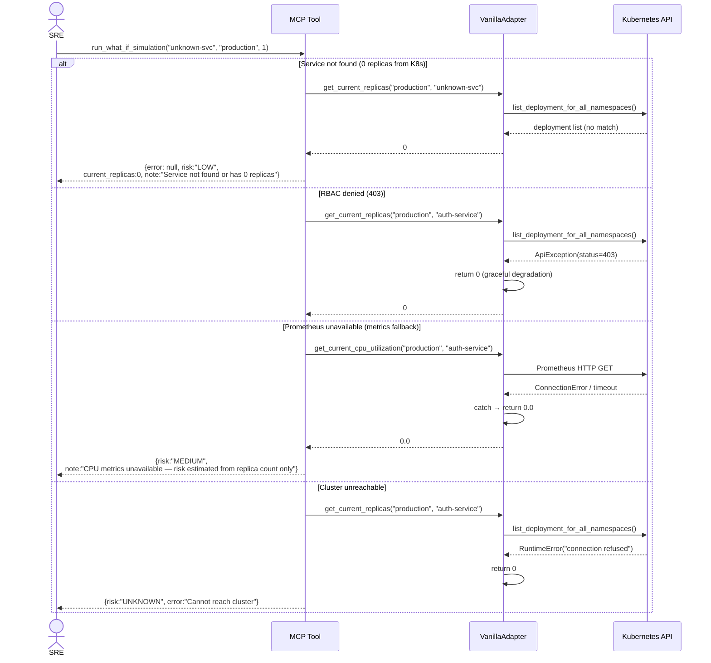
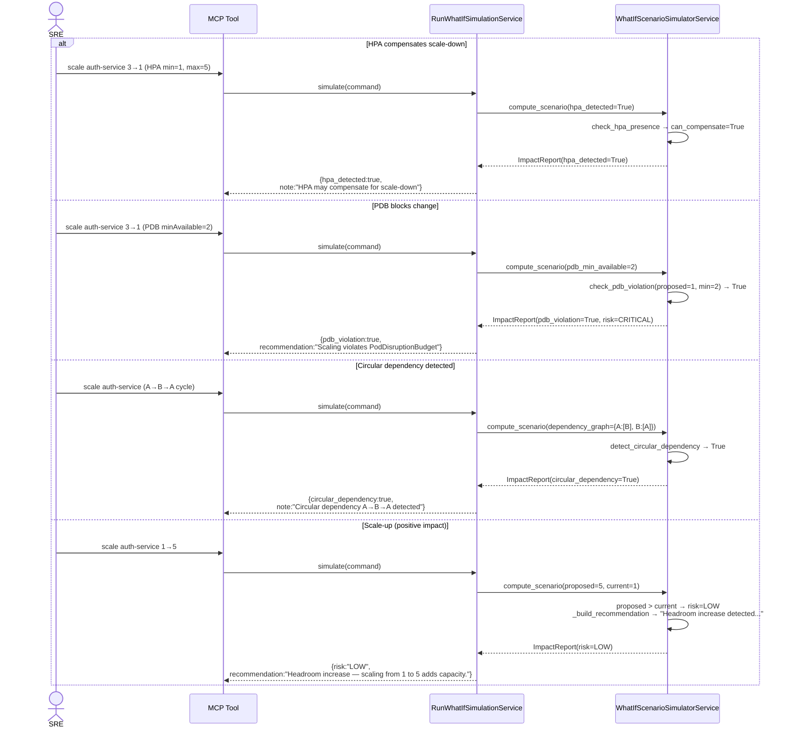
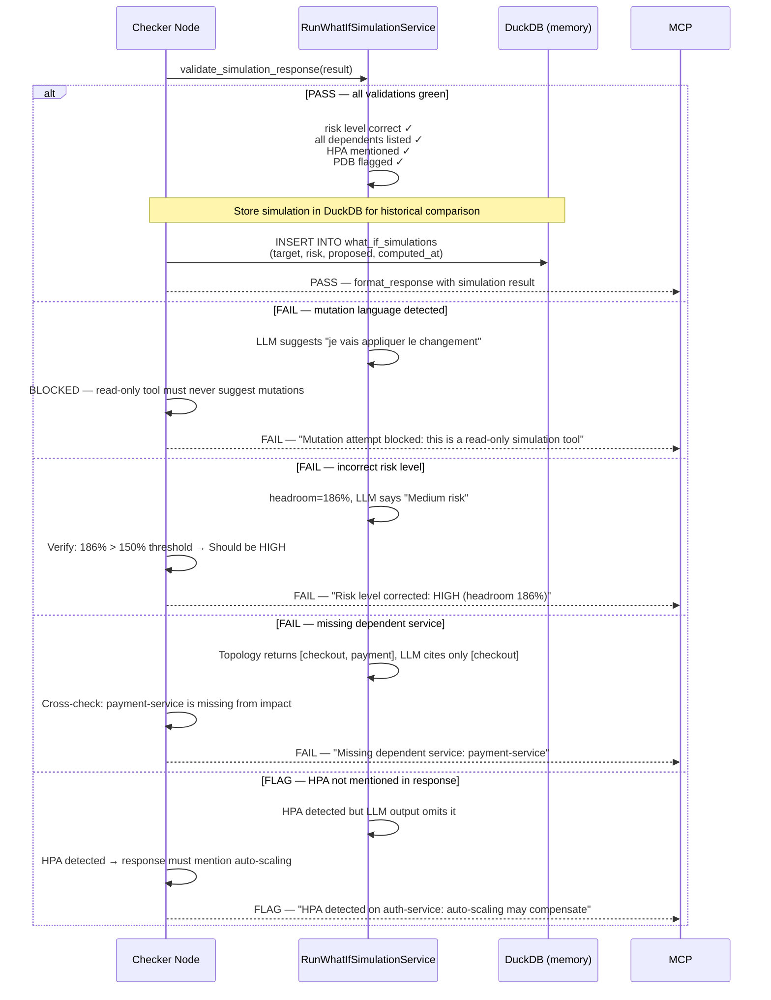

# Use Case 36 — Run What-If Simulation

## Sample Questions

- "What would happen to the cluster if I scale down the auth-service to 1 replica? Simulate the impact on latency, error rate, and dependent services."
- "If I double the replicas of payment-service, which downstream services will be affected?"
- "Simulate scaling the checkout-service from 3 to 1 — is it safe during peak traffic?"
- "Show me the blast radius if I remove the caching layer — which services depend on redis?"
- "What's the risk level of reducing api-gateway to 2 replicas given current CPU usage?"

---

Accepts a target service and a proposed change (e.g. scale replicas), identifies dependent services via topology analysis, evaluates current traffic load vs capacity after the change, estimates risk level (Low/Medium/High/Critical) based on replica headroom, checks PodDisruptionBudget and HPA constraints, detects circular dependencies, and returns a structured impact report with latency delta and error risk estimation.

---

## Flow 1 — Happy Path (auth-service 3→1, 62% CPU, High risk)

---

## Flow 2 — Error Flows (service not found, RBAC denied, Prometheus unavailable, cluster unreachable)

---

## Flow 3 — Edge Cases (HPA detected, PDB violation, circular dependency, scale-up)

---

## Flow 4 — Checker Node (semantic validation + DuckDB store)

---

## Key Points

- Computes **capacity headroom** post-scale: `current_cpu_utilization × current_replicas / proposed_replicas`
- **Risk levels**: headroom < 80% = Low, 80-150% = Medium, 150-200% = High, >200% = Critical
- **Scale-up always Low risk** — proposed_replicas > current_replicas bypasses headroom checks
- **PodDisruptionBudget** checked via K8s Policy API — scales violating `minAvailable` are flagged
- **HPA detection** via K8s Autoscaling API — if HPA `min_replicas > proposed`, auto-scaling can compensate
- **Circular dependency** detected via DFS traversal of the service dependency graph (A→B→A cycle)
- **Read-only tool** — checker node BLOCKS any response suggesting direct mutation (apply/scale/delete)
- Prometheus unavailable → risk estimated from replica count alone with caveat noted in response

## Test Coverage

| Test | File | Scenario |
|---|---|---|
| `test_3_to_1_at_62_pct_is_high` | `test_what_if_scenario_simulator_service.py` | 3→1 at 62% CPU → HIGH risk |
| `test_5_to_3_at_20_pct_is_low` | `test_what_if_scenario_simulator_service.py` | 5→3 at 20% CPU → LOW risk |
| `test_headroom_over_200_is_critical` | `test_what_if_scenario_simulator_service.py` | Headroom >200% → CRITICAL |
| `test_scale_up_always_low` | `test_what_if_scenario_simulator_service.py` | 1→5 scale-up → LOW risk |
| `test_violates_pdb_min_available_2` | `test_what_if_scenario_simulator_service.py` | PDB minAvailable=2, proposed=1 → violation |
| `test_hpa_can_compensate_scale_down` | `test_what_if_scenario_simulator_service.py` | HPA min=1, max=5, proposed=1 → compensates |
| `test_circular_dependency_detected` | `test_what_if_scenario_simulator_service.py` | A→B→A cycle → detected |
| `test_no_dependents_isolated_change` | `test_what_if_scenario_simulator_service.py` | No dependents → isolated change |
| `test_simulate_high_risk_scenario` | `test_run_what_if_simulation_service.py` | Full orchestration → HIGH, PDB violation |
| `test_vanilla_adapter_implements_port` | `test_run_what_if_simulation_mcp_and_adapter.py` | VanillaAdapter implements WhatIfSimulationPort |
| `test_get_pdb_info_returns_none_when_no_pdb` | `test_run_what_if_simulation_mcp_and_adapter.py` | No PDB → None returned |
| `test_get_hpa_info_returns_none_when_no_hpa` | `test_run_what_if_simulation_mcp_and_adapter.py` | No HPA → None returned |
| `test_get_current_replicas_returns_zero_for_unknown` | `test_run_what_if_simulation_mcp_and_adapter.py` | Unknown service → 0 replicas |
| `test_tool_returns_error_on_exception` | `test_run_what_if_simulation_mcp_and_adapter.py` | Adapter fails → error in response |
| `test_tool_returns_structured_result` | `test_run_what_if_simulation_mcp_and_adapter.py` | MCP tool returns correct JSON structure |

## Related Files

- `src/hexawyn/domain/models/simulation.py` — `ScenarioInput`, `ImpactReport`, `ServiceImpact`, `RiskLevel`
- `src/hexawyn/domain/services/simulation/what_if_scenario_simulator_service.py` — Headroom, risk, PDB, HPA, circular dependency detection
- `src/hexawyn/application/ports/driven/what_if_simulation_port.py` — `WhatIfSimulationPort` ABC + `DependentServiceData`, `PDBData`, `HPAData`
- `src/hexawyn/application/ports/driving/run_what_if_simulation/` — Command, Response, ServicePort
- `src/hexawyn/application/service/run_what_if_simulation_service.py` — Application service (orchestrates port + engine)
- `src/hexawyn/application/use_case/run_what_if_simulation/` — UseCase (thin delegation)
- `src/hexawyn/adapters/secondary/vanilla/vanilla_adapter.py` — VanillaAdapter implements WhatIfSimulationPort
- `src/hexawyn/mcp/tools/run_what_if_simulation.py` — MCP entry point
