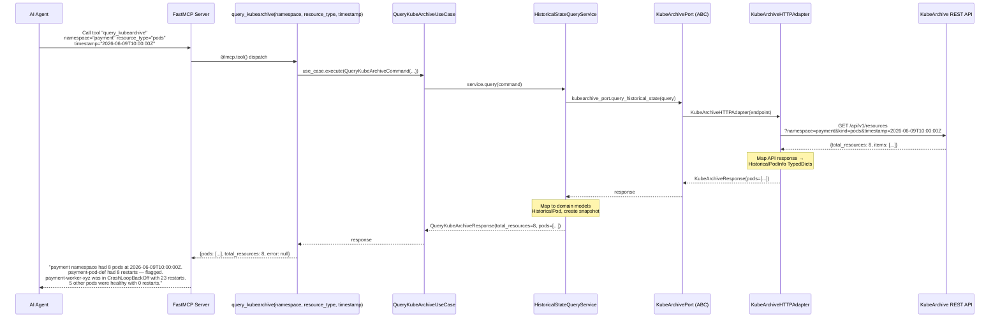
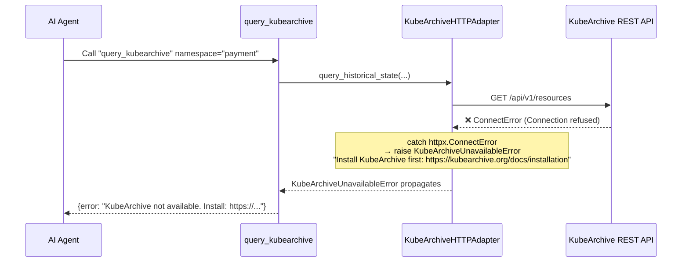
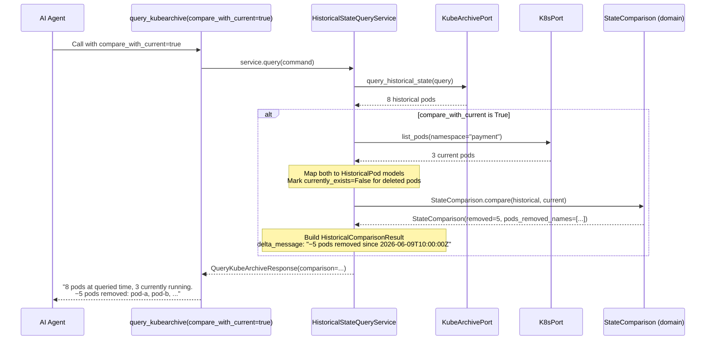
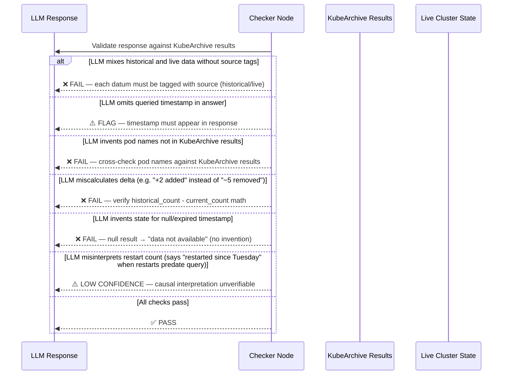

# Use Case 40 — Query KubeArchive for Historical Resource State

## Sample Questions

- "Query KubeArchive for the historical state of all pods in the payment namespace from last Tuesday — what was the pod count and which ones were restarting?"
- "What was the state of pods in the production namespace at 2026-06-09T10:00:00Z?"
- "How many pods were running in staging last Monday and which ones were crashing?"
- "Compare the pods in the payment namespace now vs last week — what changed?"
- "Show me which deployments existed in the ci namespace on June 1st"
- "Were there any pods in CrashLoopBackOff in production last Tuesday?"
- "Give me a historical snapshot of all pods in the payment namespace and compare with the live state"

---

An AI agent asks to query KubeArchive for the historical state of Kubernetes resources at a specific point in time. The flow goes through: MCP Tool → QueryKubeArchiveUseCase → HistoricalStateQueryService → KubeArchivePort (driven port) → KubeArchiveHTTPAdapter → KubeArchive REST API. The service maps KubeArchive API responses to domain models, runs restart detection and failing pod filtering, and optionally compares historical vs current state via K8sPort.

### Flow 1 — Happy Path: Query Historical Pod State

### Flow 2 — Error: KubeArchive Unreachable / Not Installed

### Flow 3 — Comparison Mode: Historical vs Current State

### Flow 4 — Checker Node: Semantic Validation (LangGraph)

## Key Points

- **Historical state query** — queries KubeArchive REST API for pod state at a specific ISO 8601 timestamp
- **Restart detection** — flags pods with restart_count > 5 and pods in failing phases (CrashLoopBackOff, Error, ImagePullBackOff, Evicted)
- **Comparison mode** — compares historical vs current state, shows delta (pods added/removed), marks pods that no longer exist as `currently_exists=False`
- **Error translation** — HTTP errors (ConnectError, HTTPStatusError, TimeoutException) translated to `KubeArchiveUnavailableError`; expired timestamps handled gracefully
- **KubeArchive not installed** — returns installation hint URL instead of crashing

## Test Coverage

| Test | File | Status |
|---|---|---|
| `test_is_frozen_dataclass` | `tests/unit/test_historical_pod.py` | ✅ |
| `test_restarting_pods_filtered` | `tests/unit/test_historical_pod.py` | ✅ |
| `test_failing_pods_filtered` | `tests/unit/test_historical_pod.py` | ✅ |
| `test_delta_shows_added_pods` | `tests/unit/test_historical_pod.py` | ✅ |
| `test_delta_shows_removed_pods` | `tests/unit/test_historical_pod.py` | ✅ |
| `test_inherits_from_hexawyn_error` | `tests/unit/test_kubearchive_errors.py` | ✅ |
| `test_message_includes_timestamp_and_retention` | `tests/unit/test_kubearchive_errors.py` | ✅ |
| `test_has_query_historical_state_method` | `tests/unit/test_kubearchive_port.py` | ✅ |
| `test_is_frozen` | `tests/unit/test_query_kubearchive_command.py` | ✅ |
| `test_delegates_to_service_port` | `tests/unit/test_query_kubearchive_use_case.py` | ✅ |
| `test_query_returns_pods_from_kubearchive` | `tests/unit/test_historical_state_query_service.py` | ✅ |
| `test_compare_with_current_mode` | `tests/unit/test_historical_state_query_service.py` | ✅ |
| `test_kubearchive_unavailable` | `tests/unit/test_historical_state_query_service.py` | ✅ |
| `test_implements_kubearchive_port` | `tests/unit/test_kubearchive_http_adapter.py` | ✅ |
| `test_query_historical_state_happy_path` | `tests/unit/test_kubearchive_http_adapter.py` | ✅ |
| `test_kubearchive_unreachable` | `tests/unit/test_kubearchive_http_adapter.py` | ✅ |
| `test_http_error_translated` | `tests/unit/test_kubearchive_http_adapter.py` | ✅ |
| `test_returns_pods_for_namespace` | `tests/unit/test_query_kubearchive.py` | ✅ |
| `test_handles_error_gracefully` | `tests/unit/test_query_kubearchive.py` | ✅ |
| `test_with_comparison_mode` | `tests/unit/test_query_kubearchive.py` | ✅ |

## Related Files

- `src/hexawyn/domain/models/historical_pod.py` — HistoricalPod, HistoricalStateSnapshot, StateComparison, PodRestartStatus
- `src/hexawyn/domain/errors.py` — KubeArchiveUnavailableError, HistoricalDataWindowExpiredError
- `src/hexawyn/application/ports/driven/kubearchive_port.py` — KubeArchivePort ABC + TypedDicts
- `src/hexawyn/application/ports/driving/query_kubearchive/` — Command, Response, ServicePort ABC
- `src/hexawyn/application/service/historical_state_query_service.py` — service implementation
- `src/hexawyn/application/use_case/query_kubearchive/` — QueryKubeArchiveUseCase
- `src/hexawyn/adapters/secondary/kubearchive_http_adapter.py` — KubeArchiveHTTPAdapter
- `src/hexawyn/mcp/tools/query_kubearchive.py` — MCP tool
