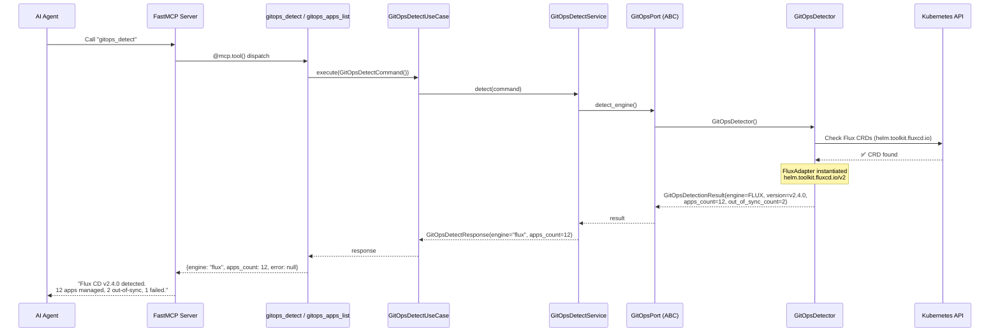
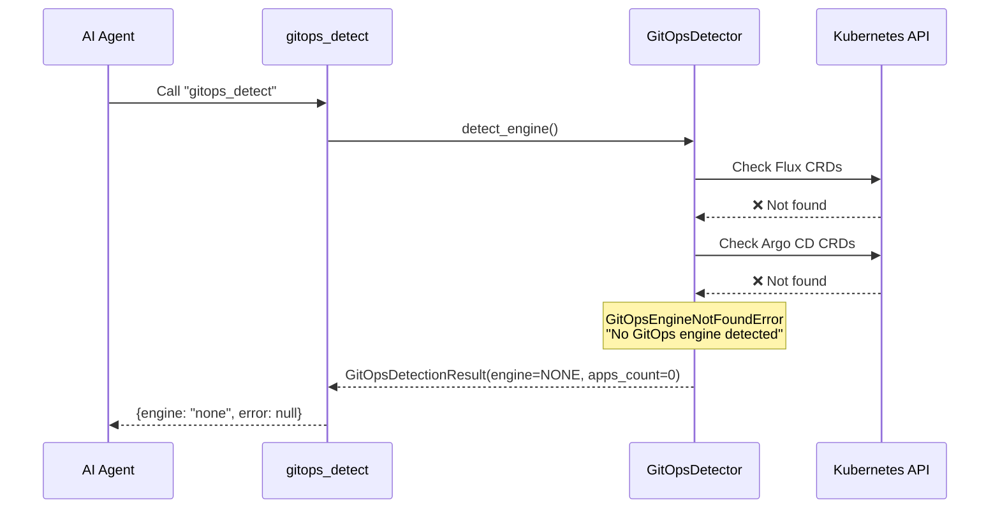
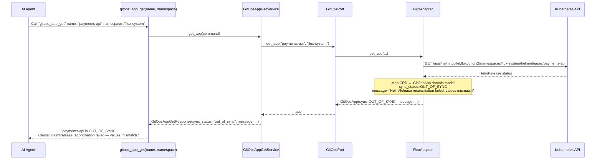
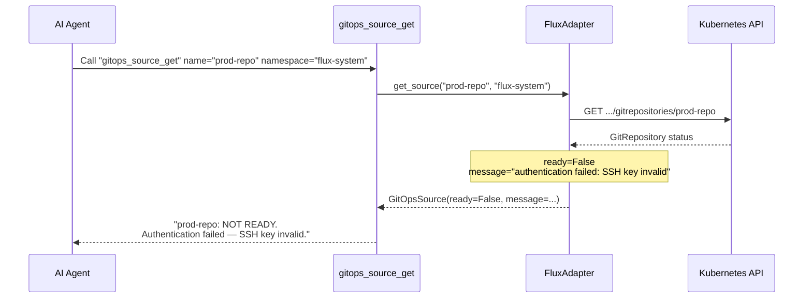

# Use Case 41 — GitOps Detection (Flux CD / Argo CD)

## Sample Questions

- "Does my cluster use Flux or Argo CD?"
- "Which GitOps engine is installed and show me its apps"
- "Montre-moi le statut de toutes mes apps Argo CD"
- "Why is my payments-api HelmRelease not synced with Git?"
- "What is the latest commit deployed to my cluster via GitOps?"

---

Seven MCP tools for GitOps detection: `gitops_detect` (auto-detects Flux vs Argo CD), `gitops_apps_list` (lists all HelmReleases/Kustomizations/Applications), `gitops_app_get` (detail with sync message), `gitops_app_status` (sync + health), `gitops_app_sync` (read-only sync status), `gitops_sources_list` (GitRepositories, HelmRepositories), `gitops_source_get` (source connection status). All tools are read-only — no sync triggered.

### Flow 1 — Happy Path: Auto-Detect + List Apps

### Flow 2 — Error: No GitOps Engine Found

### Flow 3 — App Out-of-Sync with Detailed Cause

### Flow 4 — Source Connection Failure

## Key Points

- **Auto-detection** — checks Flux CRDs first (`helm.toolkit.fluxcd.io`), then Argo CD CRDs (`argoproj.io`), returns `NONE` if neither found
- **7 tools, read-only** — no sync/trigger operations; operators retain full control via `flux reconcile` or Argo CD UI
- **Out-of-sync causes** — `message` field in GitOpsApp captures the exact reconciliation error
- **Source health** — GitRepository/HelmRepository `ready` status with connection error details
- **Engine-agnostic** — FluxAdapter handles HelmRelease, Kustomization; ArgoCDAdapter handles Application, AppProject

## Test Coverage

| Test | File | Status |
|---|---|---|
| `test_flux_detected` | `tests/unit/test_gitops_detect.py` | ✅ |
| `test_none_detected` | `tests/unit/test_gitops_detect.py` | ✅ |
| `test_tool_returns_detection` | `tests/unit/test_gitops_detect.py` | ✅ |
| `test_tool_returns_apps` | `tests/unit/test_gitops_tools.py` | ✅ |
| `test_tool_returns_app_detail` | `tests/unit/test_gitops_tools.py` | ✅ |
| `test_tool_returns_status` | `tests/unit/test_gitops_tools.py` | ✅ |
| `test_tool_returns_sync_status_read_only` | `tests/unit/test_gitops_tools.py` | ✅ |
| `test_tool_returns_sources` | `tests/unit/test_gitops_tools.py` | ✅ |
| `test_tool_returns_source_detail` | `tests/unit/test_gitops_tools.py` | ✅ |
| `test_all_gitops_tools_have_register` | `tests/unit/test_gitops_tools.py` | ✅ |

## Related Files

- `src/hexawyn/domain/models/gitops.py` — GitOpsApp, GitOpsSource, GitOpsDetectionResult
- `src/hexawyn/domain/errors.py` — GitOpsEngineNotFoundError
- `src/hexawyn/application/ports/driven/gitops_port.py` — GitOpsPort ABC
- `src/hexawyn/adapters/secondary/gitops/gitops_detector.py` — GitOpsDetector
- `src/hexawyn/adapters/secondary/gitops/flux_adapter.py` — FluxAdapter
- `src/hexawyn/adapters/secondary/gitops/argocd_adapter.py` — ArgoCDAdapter
- `src/hexawyn/mcp/tools/gitops_detect.py` — detect tool
- `src/hexawyn/mcp/tools/gitops_apps_list.py` — list tool
- `src/hexawyn/mcp/tools/gitops_app_get.py` — get tool
- `src/hexawyn/mcp/tools/gitops_app_status.py` — status tool
- `src/hexawyn/mcp/tools/gitops_app_sync.py` — sync status tool
- `src/hexawyn/mcp/tools/gitops_sources_list.py` — sources list tool
- `src/hexawyn/mcp/tools/gitops_source_get.py` — source get tool
