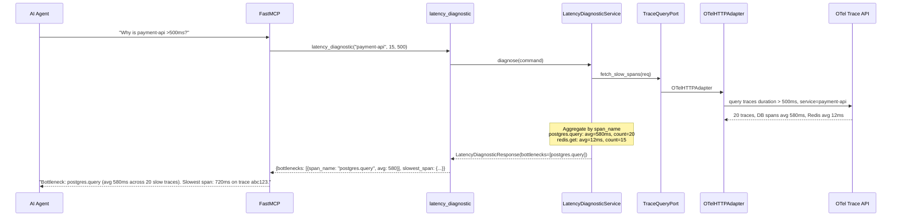
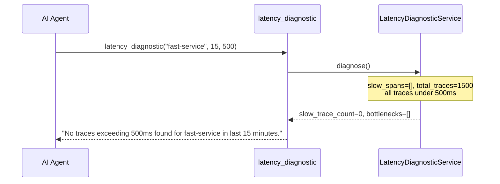
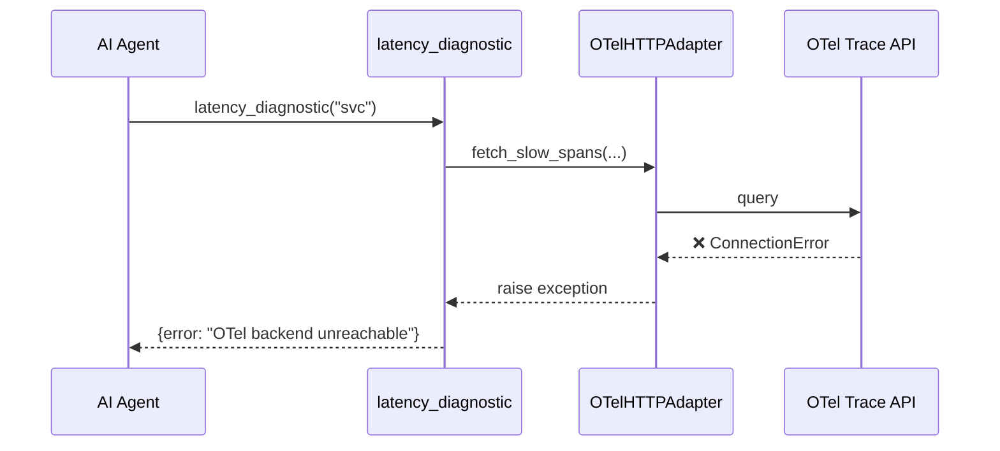

# Use Case 41 — Latency Diagnostic

## Sample Questions

- "Why is the payment-api service taking more than 500ms to respond for the last 15 minutes?"
- "Identify the root cause of latency spikes on the checkout service"
- "Which internal call is causing slow responses on the auth-service?"
- "Show me the span breakdown for slow traces on the order service"
- "What is the bottleneck span causing high latency on the payment API?"

---

One MCP tool: `latency_diagnostic`. Queries OTel traces, filters by duration > threshold, aggregates span durations per operation, ranks bottlenecks by average duration.

### Flow 1 — Happy Path: DB Bottleneck Detected



### Flow 2 — No Slow Traces Found



### Flow 3 — OTel Unreachable



### Flow 4 — Checker Node: Span Validity

```mermaid
sequenceDiagram
    participant Checker as Checker Node
    participant LLM as LLM Response

    Checker->>LLM: Validate bottleneck claims
    alt LLM says "DB is bottleneck" but no DB spans in data
        Checker-->>LLM: ❌ FAIL — bottleneck must match actual spans
    alt LLM cites 45000ms span (clearly anomalous)
        Checker-->>LLM: ⚠️ FLAG — value exceeds timeout threshold, verify
    alt LLM gives generic answer with no span data cited
        Checker-->>LLM: ❌ FAIL — must cite specific span names
    else All checks pass
        Checker-->>LLM: ✅ PASS
    end
```

## Key Points

- **Span aggregation** — groups by `span_name`, computes average duration per operation
- **Ranking** — sorted by avg_duration_ms descending
- **Bottleneck** — the span with highest average duration across slow traces
- **Threshold** — only traces > threshold_ms are analyzed

## Test Coverage

| Test | File | Status |
|---|---|---|
| `test_db_bottleneck` | `tests/unit/test_latency_diagnostic.py` | ✅ |
| `test_no_slow_traces` | `tests/unit/test_latency_diagnostic.py` | ✅ |
| `test_returns_bottleneck` | `tests/unit/test_latency_diagnostic_tool.py` | ✅ |

## Related Files

- `src/hexawyn/domain/models/latency_diagnostic.py` — TraceSpan, SpanBreakdown, LatencyDiagnosticResult
- `src/hexawyn/application/ports/driven/trace_query_port.py` — TraceQueryPort ABC
- `src/hexawyn/adapters/secondary/gitops/otel_http_adapter.py` — OTelHTTPAdapter
- `src/hexawyn/mcp/tools/latency_diagnostic.py` — MCP tool
