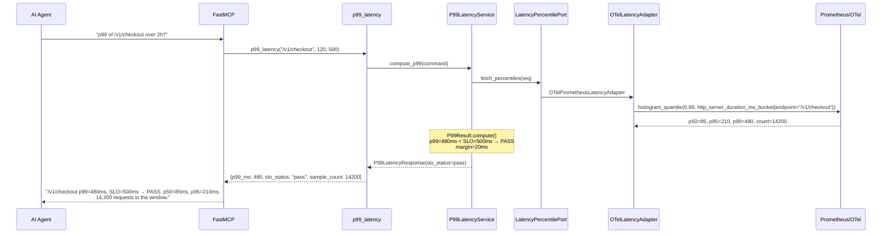
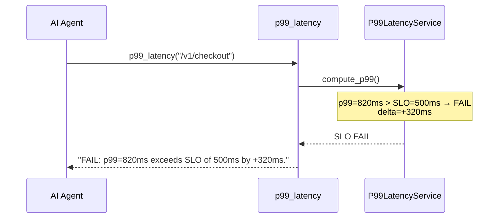
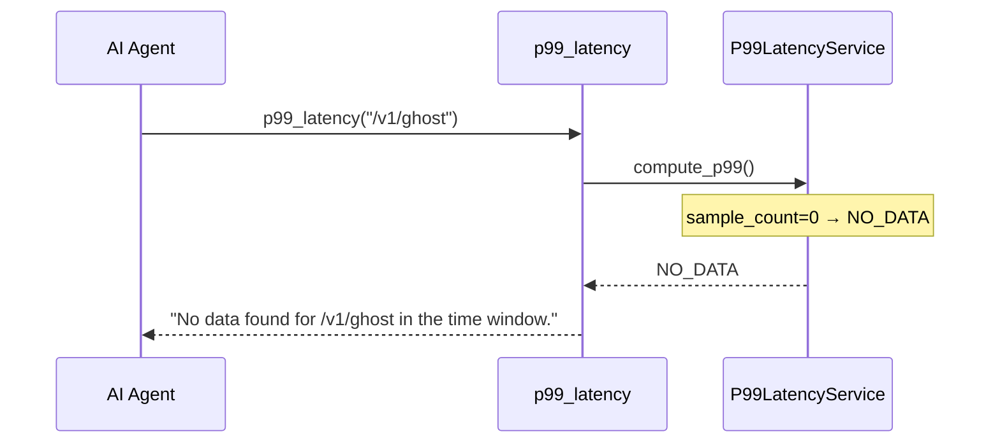

# Use Case 42 — P99 Latency Percentile

## Sample Questions

- "What is the 99th percentile latency of /v1/checkout over the last 2 hours?"
- "Is the checkout endpoint meeting its 500ms SLO?"
- "Compute p50, p95, and p99 latency for the payments API"
- "What is the tail latency for the search endpoint in the last hour?"
- "Show me the SLO compliance status for /v1/orders"

---

One MCP tool: `p99_latency`. Queries OTel Prometheus histogram metrics, computes p50/p95/p99, compares against SLO threshold, returns pass/fail status.

### Flow 1 — Happy Path: SLO Pass



### Flow 2 — SLO Fail



### Flow 3 — No Data



### Flow 4 — Checker Node: SLO Validation

```mermaid
sequenceDiagram
    participant Checker as Checker Node
    participant LLM as LLM Response

    Checker->>LLM: Validate SLO computation
    alt LLM says "SLO failed" for p99=480ms, SLO=500ms
        Checker-->>LLM: ❌ FAIL — p99 < threshold must be PASS
    alt LLM cites wrong percentile (p95=480 instead of p99=480)
        Checker-->>LLM: ❌ FAIL — check each percentile against result
    else All checks pass
        Checker-->>LLM: ✅ PASS
    end
```

## Key Points

- **p50, p95, p99** — full latency profile for the endpoint
- **SLO comparison** — `slo_delta_ms = p99 - slo_threshold`, pass if ≤ 0
- **NO_DATA** — when sample_count=0 (endpoint not instrumented or no traffic)
- **Histogram-based** — uses Prometheus histogram buckets via OTel

## Test Coverage

| Test | File | Status |
|---|---|---|
| `test_slo_pass` | `tests/unit/test_p99_latency.py` | ✅ |
| `test_slo_fail` | `tests/unit/test_p99_latency.py` | ✅ |
| `test_no_data` | `tests/unit/test_p99_latency.py` | ✅ |
| `test_returns_percentiles` | `tests/unit/test_p99_latency_tool.py` | ✅ |

## Related Files

- `src/hexawyn/domain/models/p99_latency.py` — LatencyPercentiles, P99Result
- `src/hexawyn/application/ports/driven/latency_percentile_port.py` — LatencyPercentilePort ABC
- `src/hexawyn/adapters/secondary/gitops/otel_latency_adapter.py` — OTel adapter
- `src/hexawyn/mcp/tools/p99_latency.py` — MCP tool
