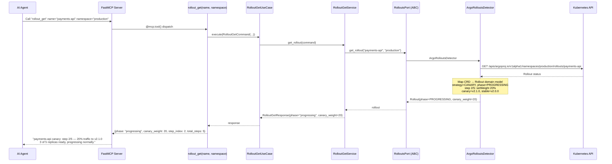
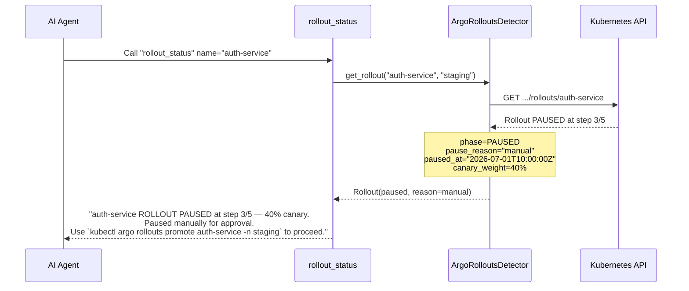
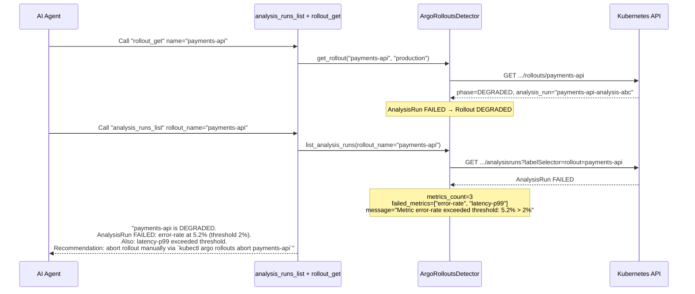
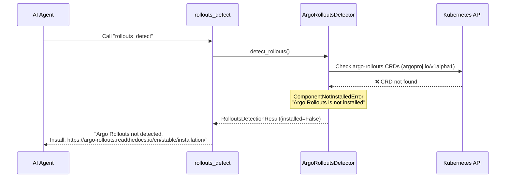

# Use Case 42 — Argo Rollouts (Progressive Delivery)

## Sample Questions

- "Is my canary rollout for payments-api healthy?"
- "Why is my blue-green deployment blocked?"
- "Are there any rollouts in progress in my cluster?"
- "What is the error rate of the canary version of my service?"
- "Has the automated analysis passed for my rollout?"
- "Are there any failed AnalysisRuns linked to my rollout?"
- "Should I promote or abort the auth-service rollout?"

---

Five MCP tools for Argo Rollouts: `rollouts_detect` (detects installation + version), `rollouts_list` (lists all Rollouts with strategy and phase), `rollout_get` (detailed status with step info and canary weight), `rollout_status` (real-time phase + canary weight), `analysis_runs_list` (AnalysisRuns with failed metrics). All tools are read-only — promote, abort, and retry are NEVER available.

### Flow 1 — Happy Path: Canary Rollout Progression

### Flow 2 — Paused Rollout with Manual Approval

### Flow 3 — AnalysisRun Failed, Rollout Degraded

### Flow 4 — Argo Rollouts Not Installed

## Key Points

- **Read-only only** — `rollout_promote`, `rollout_abort`, `rollout_retry` are NEVER exposed; operators must use `kubectl argo rollouts` or the dashboard
- **Canary weight tracking** — every Rollout reports `canary_weight` (0-100%) per step
- **Pause reasons** — `manual`, `duration`, or `analysis` captured in `pause_reason`
- **AnalysisRun linking** — `analysis_run_name` field connects Rollout to its active AnalysisRun
- **Failed metrics** — AnalysisRun lists every failed metric with threshold-violation message

## Test Coverage

| Test | File | Status |
|---|---|---|
| `test_tool_returns_detection` | `tests/unit/test_rollouts_tools.py` | ✅ |
| `test_tool_returns_rollouts` | `tests/unit/test_rollouts_tools.py` | ✅ |
| `test_tool_returns_detail` | `tests/unit/test_rollouts_tools.py` | ✅ |
| `test_tool_returns_status` | `tests/unit/test_rollouts_tools.py` | ✅ |
| `test_tool_returns_analysis_runs` | `tests/unit/test_rollouts_tools.py` | ✅ |
| `test_all_rollouts_tools_have_register` | `tests/unit/test_rollouts_tools.py` | ✅ |

## Related Files

- `src/hexawyn/domain/models/rollouts.py` — Rollout, AnalysisRun, RolloutsDetectionResult, RolloutStepStatus
- `src/hexawyn/domain/errors.py` — ComponentNotInstalledError
- `src/hexawyn/application/ports/driven/rollouts_port.py` — RolloutsPort ABC
- `src/hexawyn/adapters/secondary/gitops/argo_rollouts_detector.py` — ArgoRolloutsDetector
- `src/hexawyn/mcp/tools/rollouts_detect.py` — detect tool
- `src/hexawyn/mcp/tools/rollouts_list.py` — list tool
- `src/hexawyn/mcp/tools/rollout_get.py` — get tool
- `src/hexawyn/mcp/tools/rollout_status.py` — status tool
- `src/hexawyn/mcp/tools/analysis_runs_list.py` — analysis runs tool
