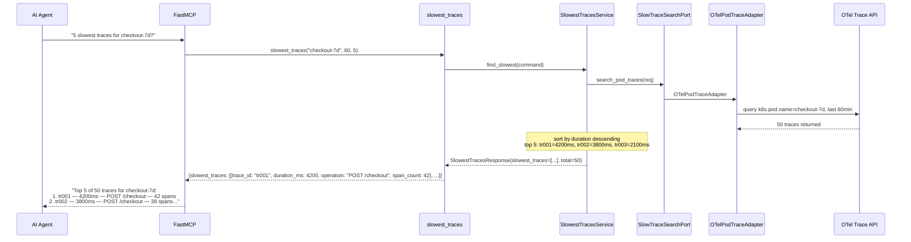
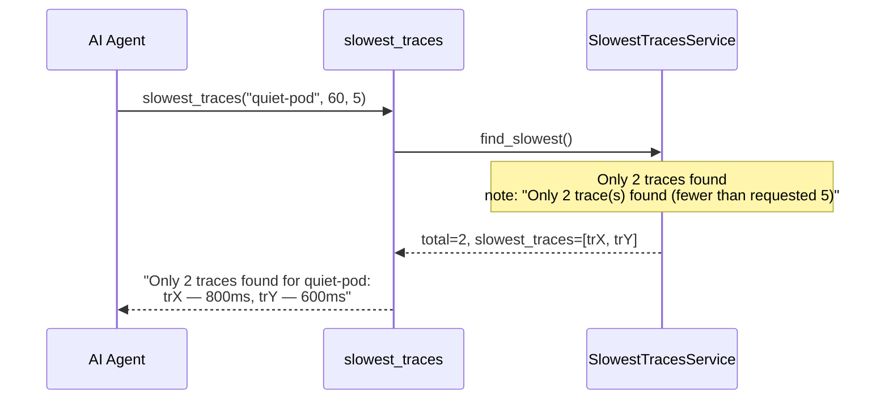
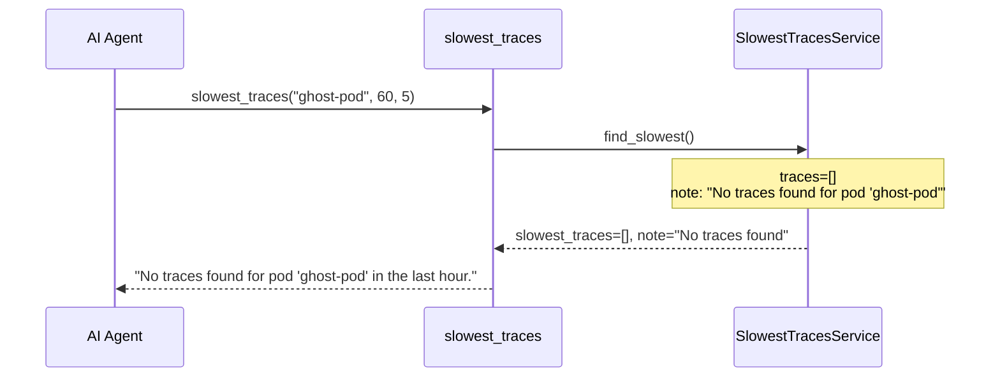

# Use Case 43 — Slowest Traces per Pod

## Sample Questions

- "Show me the 5 slowest traces for pod checkout-7d in the last hour"
- "What are the slowest requests for the payments pod?"
- "Rank the top 5 traces by duration for pod auth-service-abc"
- "Find the worst-performing traces for the checkout pod this hour"
- "List the longest running spans for pod frontend-deploy"

---

One MCP tool: `slowest_traces`. Queries OTel traces filtered by pod name (k8s.pod.name), ranks by total duration descending, returns top N.

### Flow 1 — Happy Path: Top 5 Returned



### Flow 2 — Fewer Than Requested



### Flow 3 — Pod Not Found



### Flow 4 — Checker Node: Sample Bias

```mermaid
sequenceDiagram
    participant Checker as Checker Node
    participant LLM as LLM Response

    Checker->>LLM: Validate trace ranking
    alt OTel uses 10% sampling, LLM presents count as absolute
        Checker-->>LLM: ⚠️ FLAG — extrapolate: "~500 traces estimated (10% sampling)"
    alt LLM omits span count from trace summary
        Checker-->>LLM: ⚠️ FLAG — span_count must be included per trace
    else All checks pass
        Checker-->>LLM: ✅ PASS
    end
```

## Key Points

- **Ranking** — traces sorted by total duration descending, top N returned
- **Pod filter** — uses `k8s.pod.name` attribute for exact match
- **Truncation** — if fewer traces than top_n, all returned with note
- **Span count** — each trace includes span_count for complexity assessment

## Test Coverage

| Test | File | Status |
|---|---|---|
| `test_ranked` | `tests/unit/test_slowest_traces.py` | ✅ |
| `test_top_n_truncation` | `tests/unit/test_slowest_traces.py` | ✅ |
| `test_empty` | `tests/unit/test_slowest_traces.py` | ✅ |
| `test_returns_top_n` | `tests/unit/test_slowest_traces_tool.py` | ✅ |

## Related Files

- `src/hexawyn/domain/models/slowest_traces.py` — SlowTrace, SlowestTracesResult
- `src/hexawyn/application/ports/driven/slow_trace_search_port.py` — SlowTraceSearchPort ABC
- `src/hexawyn/adapters/secondary/gitops/otel_pod_trace_adapter.py` — OTelPodTraceAdapter
- `src/hexawyn/mcp/tools/slowest_traces.py` — MCP tool
