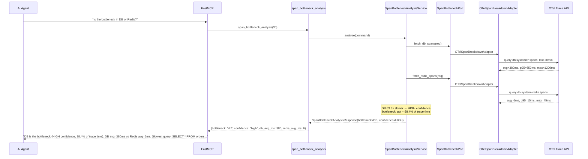
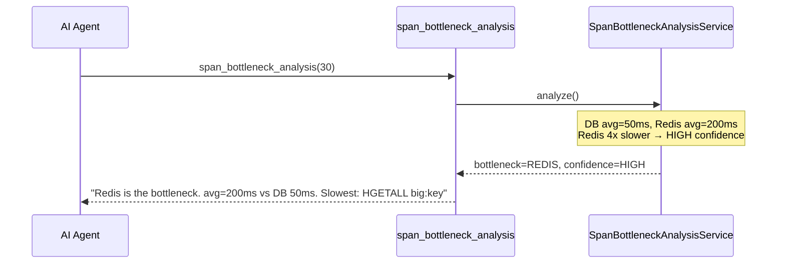
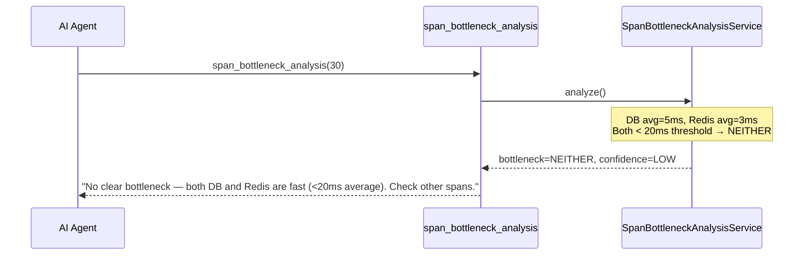
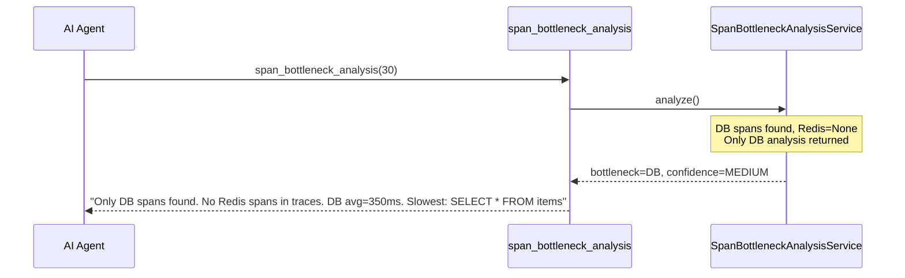

# Use Case 44 — Span Bottleneck Analysis (DB vs Redis)

## Sample Questions

- "Is the bottleneck in the database or in the Redis cache?"
- "Which is slower based on OTel traces — DB queries or Redis commands?"
- "Is my database the bottleneck in our request flow?"
- "What is the slowest DB query and Redis command in the last 30 minutes?"

---

One MCP tool: `span_bottleneck_analysis`. Retrieves OTel traces, categorizes DB vs Redis spans, computes avg/p95/max, and identifies the dominant bottleneck with confidence.

### Flow 1 — Happy Path: DB Bottleneck Detected

### Flow 2 — Redis Bottleneck

### Flow 3 — Neither / Both Fast

### Flow 4 — No Redis Spans Found

## Key Points

- **DB vs Redis ratio** — >= 4x → HIGH confidence, >= 2x → MEDIUM, otherwise LOW
- **Both fast** — if both < 20ms average, NEITHER flagged
- **Redis missing** — no Redis spans → DB only, MEDIUM confidence
- **Slowest operation** — surfaces the exact query/command causing the delay

## Test Coverage

| Test | File | Status |
|---|---|---|
| `test_db_bottleneck_high_confidence` | `tests/unit/test_span_bottleneck.py` | ✅ |
| `test_redis_bottleneck` | `tests/unit/test_span_bottleneck.py` | ✅ |
| `test_no_bottleneck_both_fast` | `tests/unit/test_span_bottleneck.py` | ✅ |
| `test_db_only_no_redis_spans` | `tests/unit/test_span_bottleneck.py` | ✅ |
| `test_returns_db_bottleneck` | `tests/unit/test_span_bottleneck_tool.py` | ✅ |

## Related Files

- `src/hexawyn/domain/models/span_bottleneck.py` — SpanBreakdown, BottleneckResult
- `src/hexawyn/application/ports/driven/span_bottleneck_port.py` — SpanBottleneckPort ABC
- `src/hexawyn/application/service/span_bottleneck_analysis_service.py` — service
- `src/hexawyn/adapters/secondary/gitops/otel_span_breakdown_adapter.py` — OTel adapter
- `src/hexawyn/mcp/tools/span_bottleneck_analysis.py` — MCP tool
