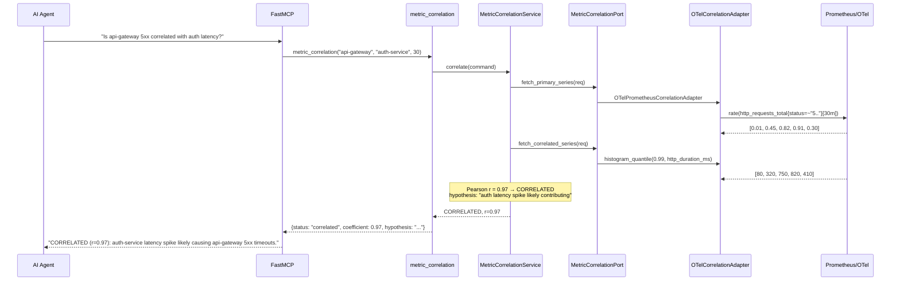
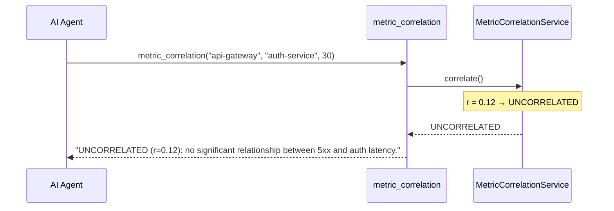
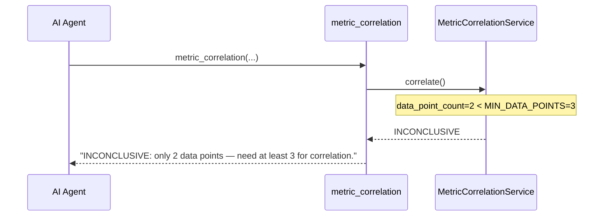
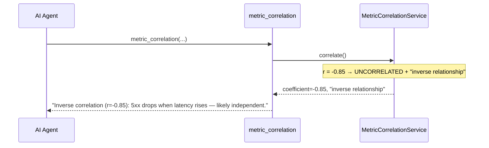

# Use Case 45 — Metric Correlation (5xx ↔ Latency)

## Sample Questions

- "Is the spike in 5xx error rate on api-gateway correlated with latency on auth-service?"
- "Are the payment-service errors caused by database latency?"
- "Correlate the latency spike on auth-service with the error spike on the gateway"
- "Is there a causal relationship between the checkout errors and Redis slowness?"
- "Overlay 5xx rate and p99 latency for the last 30 minutes and check correlation"

---

One MCP tool: `metric_correlation`. Fetches two time series from OTel/Prometheus, computes Pearson correlation coefficient, determines correlated/uncorrelated/inconclusive, generates causal hypothesis.

### Flow 1 — Happy Path: Correlated

### Flow 2 — Uncorrelated

### Flow 3 — Insufficient Data

### Flow 4 — Negative Correlation (Inverse)

## Key Points

- **Pearson coefficient** — linear correlation between two time series
- **Threshold** — |r| ≥ 0.7 → correlated, |r| < 0.3 → uncorrelated, between → inconclusive
- **Minimum 3 data points** — avoids spurious correlation on tiny samples
- **Negative correlation** — detected and reported as inverse relationship

## Test Coverage

| Test | File | Status |
|---|---|---|
| `test_correlated` | `tests/unit/test_metric_correlation.py` | ✅ |
| `test_uncorrelated` | `tests/unit/test_metric_correlation.py` | ✅ |
| `test_insufficient_data` | `tests/unit/test_metric_correlation.py` | ✅ |
| `test_negative_correlation` | `tests/unit/test_metric_correlation.py` | ✅ |

## Related Files

- `src/hexawyn/domain/models/metric_correlation.py` — CorrelationResult
- `src/hexawyn/application/ports/driven/metric_correlation_port.py` — MetricCorrelationPort ABC
- `src/hexawyn/adapters/secondary/gitops/otel_correlation_adapter.py` — OTel adapter
- `src/hexawyn/mcp/tools/metric_correlation.py` — MCP tool
