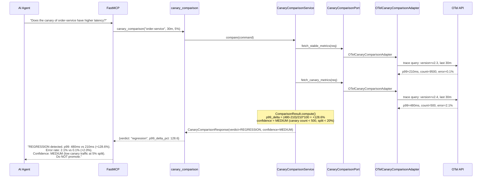
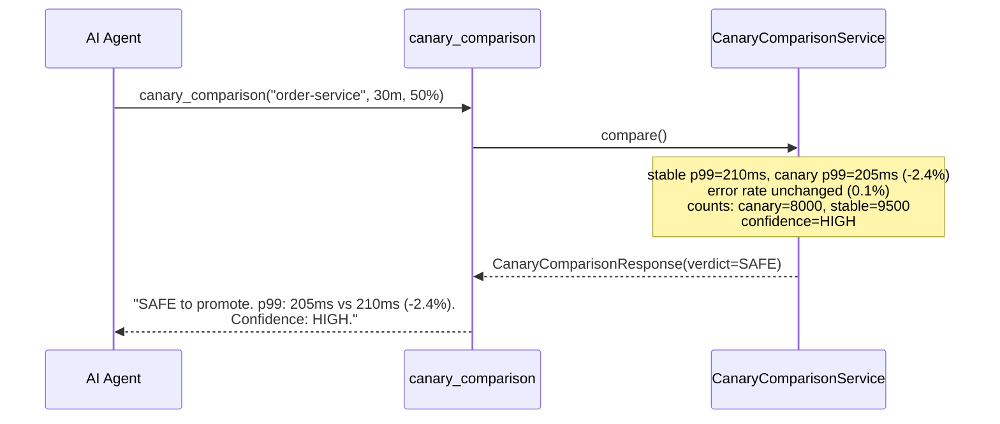
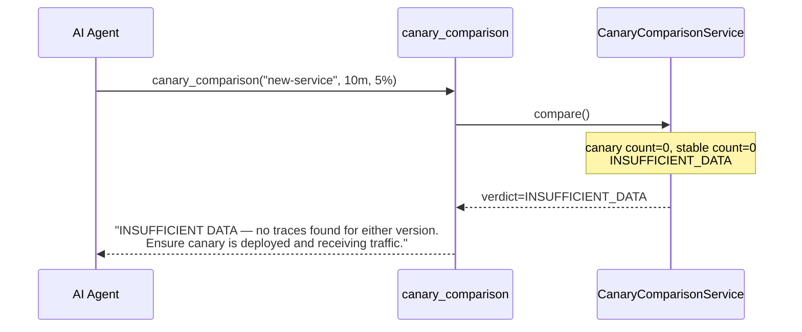

# Use Case 46 — Canary vs Stable OTel Comparison

## Sample Questions

- "Does the canary version of the order service have higher latency or error rate?"
- "Is the canary safe to promote based on OTel metrics?"
- "Compare p99 latency between the canary and stable deployments"
- "What is the error rate delta for the payments canary vs stable?"
- "Should I promote or rollback the current canary based on real-time telemetry?"

---

One MCP tool for canary comparison: `canary_comparison`. Compares OTel metrics (p50/p95/p99, error rate) between canary and stable versions, computes deltas, adjusts confidence based on traffic split, and returns a verdict.

### Flow 1 — Happy Path: Canary Regression Detected

### Flow 2 — Canary Safe

### Flow 3 — Insufficient Data

## Key Points

- **Metric deltas** — computes `(canary - stable) / stable * 100` for p99 and error rate
- **Confidence adjustment** — LOW if canary count < `min_sample` (500), MEDIUM if traffic split < 20%, HIGH otherwise
- **Regression threshold** — p99 increase > 10% OR error rate increase > 0.5pp → REGRESSION
- **Read-only** — never triggers promote or rollback; operators decide

## Test Coverage

| Test | File | Status |
|---|---|---|
| `test_canary_regression` | `tests/unit/test_canary_comparison.py` | ✅ |
| `test_canary_safe` | `tests/unit/test_canary_comparison.py` | ✅ |
| `test_low_confidence` | `tests/unit/test_canary_comparison.py` | ✅ |
| `test_insufficient_data` | `tests/unit/test_canary_comparison.py` | ✅ |
| `test_returns_regression` | `tests/unit/test_canary_comparison_tool.py` | ✅ |
| `test_returns_safe` | `tests/unit/test_canary_comparison_tool.py` | ✅ |

## Related Files

- `src/hexawyn/domain/models/canary_comparison.py` — VersionMetrics, ComparisonResult, CanaryComparisonRequest
- `src/hexawyn/application/ports/driven/canary_comparison_port.py` — CanaryComparisonPort ABC
- `src/hexawyn/application/service/canary_comparison_service.py` — service
- `src/hexawyn/adapters/secondary/gitops/otel_canary_comparison_adapter.py` — OTel adapter
- `src/hexawyn/mcp/tools/canary_comparison.py` — MCP tool
