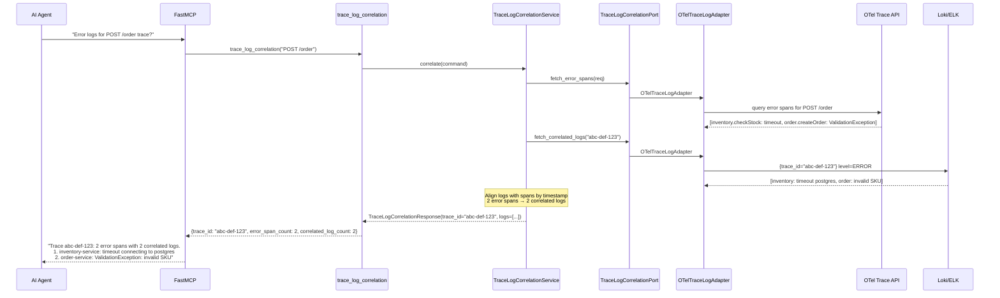
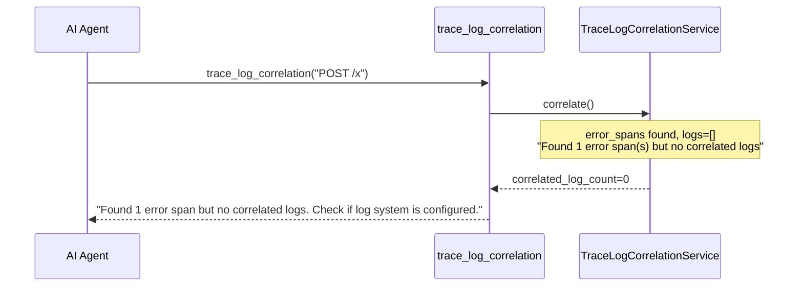
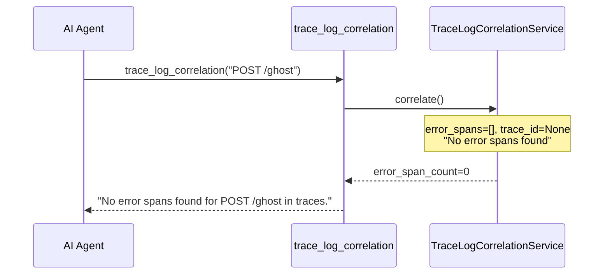

# Use Case 46 — Trace-Log Correlation

## Sample Questions

- "What are the error logs associated with the failed trace for POST /order?"
- "Find the error logs for the most recent failed checkout request"
- "Correlate the failed trace abc-def-123 with the application error logs"
- "Show me the application errors that happened during the failed payments trace"
- "What went wrong in the last failed POST /order request — show logs and spans"

---

One MCP tool: `trace_log_correlation`. Retrieves OTel error spans, correlates trace_id with log system (Loki/ELK), returns matching ERROR/FATAL log lines in trace timeline order.

### Flow 1 — Happy Path: Logs Correlated



### Flow 2 — Spans But No Logs



### Flow 3 — No Error Spans



### Flow 4 — Checker Node: Log-Span Alignment

```mermaid
sequenceDiagram
    participant Checker as Checker Node
    participant LLM as LLM Response

    Checker->>LLM: Validate log-span correlation
    alt LLM cites a log not in correlated_logs list
        Checker-->>LLM: ❌ FAIL — log must be in returned data
    alt LLM reorders logs breaking chronological order
        Checker-->>LLM: ⚠️ FLAG — logs must be in timestamp order
    alt LLM says "error caused by DB" but no DB span in error_spans
        Checker-->>LLM: ❌ FAIL — attribution must match span data
    else All checks pass
        Checker-->>LLM: ✅ PASS
    end
```

## Key Points

- **Error span extraction** — OTel spans with error=true or status_code=ERROR
- **Log correlation** — matches trace_id in log system (Loki/ELK)
- **Chronological order** — logs sorted by timestamp, aligned with span timeline
- **Graceful degradation** — spans without logs still returned with context

## Test Coverage

| Test | File | Status |
|---|---|---|
| `test_correlation_found` | `tests/unit/test_trace_log_correlation.py` | ✅ |
| `test_spans_but_no_logs` | `tests/unit/test_trace_log_correlation.py` | ✅ |
| `test_no_error_spans_found` | `tests/unit/test_trace_log_correlation.py` | ✅ |
| `test_returns_correlation` | `tests/unit/test_trace_log_correlation_tool.py` | ✅ |

## Related Files

- `src/hexawyn/domain/models/trace_log_correlation.py` — TraceLogSpan, CorrelatedLog, TraceLogResult
- `src/hexawyn/application/ports/driven/trace_log_correlation_port.py` — TraceLogCorrelationPort ABC
- `src/hexawyn/adapters/secondary/gitops/otel_trace_log_adapter.py` — OTelTraceLogAdapter
- `src/hexawyn/mcp/tools/trace_log_correlation.py` — MCP tool
