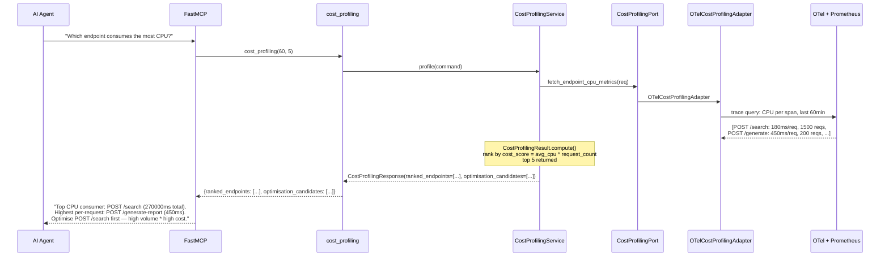
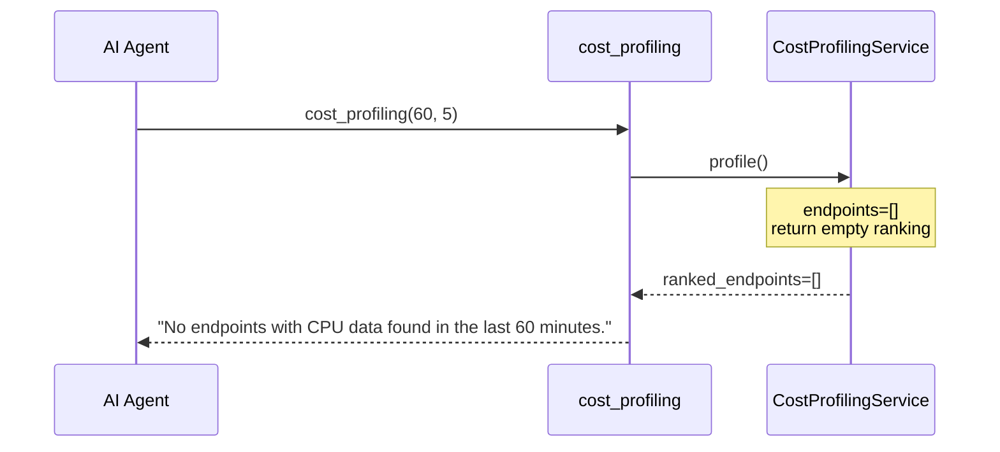

# Use Case 47 — Endpoint CPU Cost Profiling

## Sample Questions

- "Which endpoint consumes the most CPU resources per request?"
- "What are the top 5 most expensive endpoints in terms of CPU?"
- "Identify optimisation candidates based on CPU cost profiling"
- "Which endpoints have high frequency AND high CPU cost?"
- "Rank my HTTP endpoints by total CPU consumption over the last hour"

---

One MCP tool for CPU cost profiling: `cost_profiling`. Queries OTel traces enriched with CPU metrics per endpoint, ranks by total CPU cost (avg_ms * request_count), and identifies optimisation candidates.

### Flow 1 — Happy Path: Cost Ranking

### Flow 2 — No Data / No CPU Metrics

## Key Points

- **cost_score** = `avg_cpu_ms_per_request * request_count` — ranks by total CPU consumption
- **Optimisation candidates** — highest total cost + highest per-request cost (if different)
- **Zero-CPU exclusion** — endpoints with 0ms CPU are excluded from ranking
- **Route templates** — grouped by route pattern, not full URLs with parameters

## Test Coverage

| Test | File | Status |
|---|---|---|
| `test_ranking_and_candidates` | `tests/unit/test_cost_profiling.py` | ✅ |
| `test_empty_endpoints` | `tests/unit/test_cost_profiling.py` | ✅ |
| `test_excludes_endpoints_with_no_cpu` | `tests/unit/test_cost_profiling.py` | ✅ |
| `test_returns_ranking` | `tests/unit/test_cost_profiling_tool.py` | ✅ |

## Related Files

- `src/hexawyn/domain/models/cost_profiling.py` — EndpointCPUProfile, CostProfilingResult, OptimisationCandidate
- `src/hexawyn/application/ports/driven/cost_profiling_port.py` — CostProfilingPort ABC
- `src/hexawyn/application/service/cost_profiling_service.py` — service
- `src/hexawyn/adapters/secondary/gitops/otel_cost_profiling_adapter.py` — OTel adapter
- `src/hexawyn/mcp/tools/cost_profiling.py` — MCP tool
