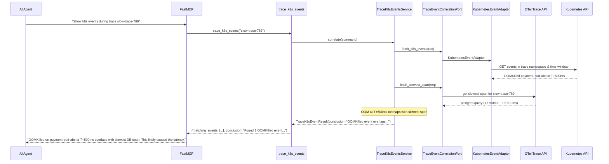
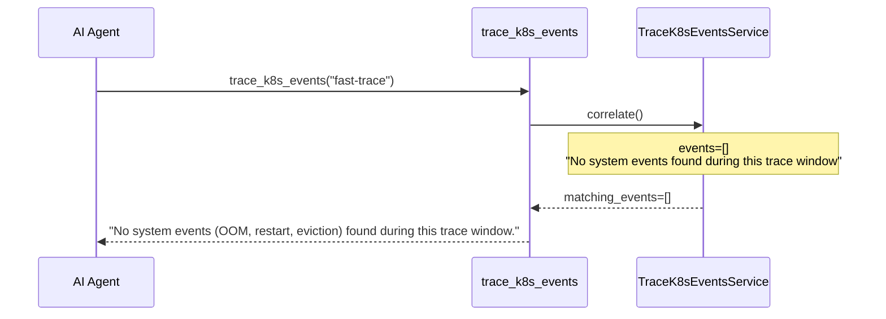
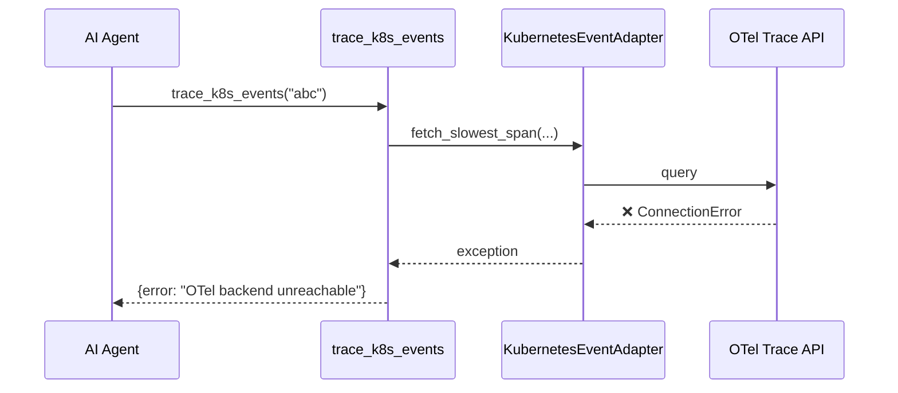

# Use Case 47 — Trace K8s Events Correlation

## Sample Questions

- "Show me all system events (OOM, restart, eviction) during this slow trace"
- "Were there any OOMKilled or eviction events during trace slow-trace-789?"
- "Correlate k8s events with the slowest span in this trace"
- "Did infrastructure events cause the performance degradation in this trace?"
- "List all OOMKilled, restart, and eviction events in the trace time window"

---

One MCP tool: `trace_k8s_events`. Correlates k8s system events (OOMKilled, container restart, eviction) with a specific OTel trace to determine if infrastructure caused the slowdown.

### Flow 1 — Happy Path: OOM Correlated



### Flow 2 — No Events



### Flow 3 — OTel Unreachable



### Flow 4 — Checker Node: Event Attribution

```mermaid
sequenceDiagram
    participant Checker as Checker Node
    participant LLM as LLM Response

    Checker->>LLM: Validate event attribution
    alt LLM claims OOM caused latency but no OOM events in data
        Checker-->>LLM: ❌ FAIL — event type must match actual data
    alt LLM ignores eviction event in results
        Checker-->>LLM: ⚠️ FLAG — all event types must be cited
    alt Event outside trace window cited as cause
        Checker-->>LLM: ❌ FAIL — event must temporally overlap with trace
    else All checks pass
        Checker-->>LLM: ✅ PASS
    end
```

## Key Points

- **Event filtering** — OOMKilled, ContainerRestart, Eviction only
- **Time window** — trace start to end (± buffer)
- **Overlap detection** — compares event timestamp with slowest span
- **Cross-namespace** — can check events across namespaces

## Test Coverage

| Test | File | Status |
|---|---|---|
| `test_overlap_found` | `tests/unit/test_trace_k8s_events.py` | ✅ |
| `test_no_events` | `tests/unit/test_trace_k8s_events.py` | ✅ |
| `test_eviction_event` | `tests/unit/test_trace_k8s_events.py` | ✅ |
| `test_returns_events` | `tests/unit/test_trace_k8s_events_tool.py` | ✅ |

## Related Files

- `src/hexawyn/domain/models/trace_k8s_events.py` — K8sEvent, TraceEventResult
- `src/hexawyn/application/ports/driven/trace_event_correlation_port.py` — TraceEventCorrelationPort ABC
- `src/hexawyn/adapters/secondary/gitops/kubernetes_event_adapter.py` — KubernetesEventAdapter
- `src/hexawyn/mcp/tools/trace_k8s_events.py` — MCP tool
