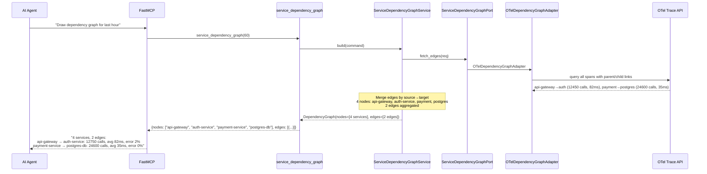
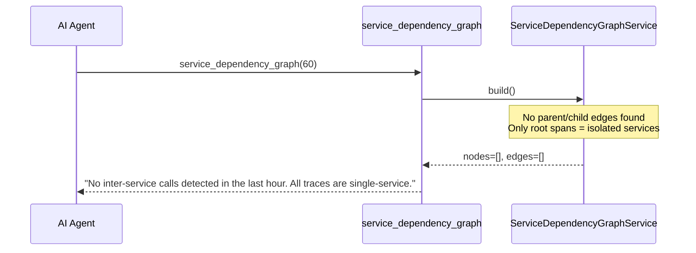
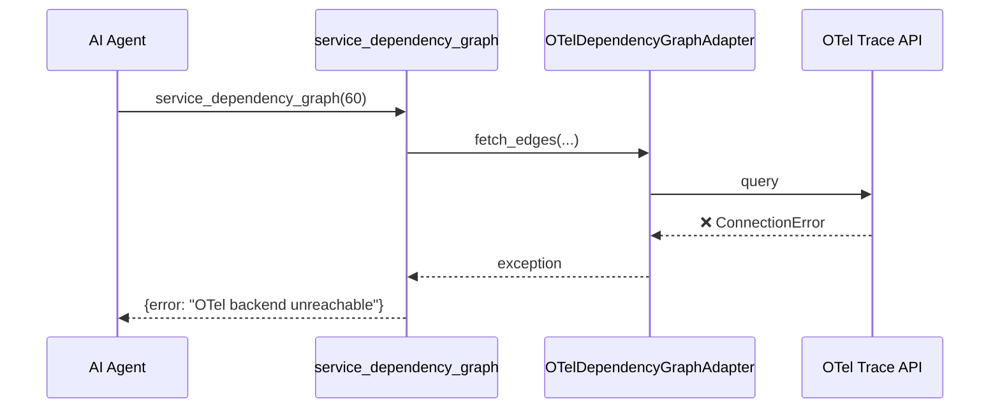

# Use Case 48 — Service Dependency Graph

## Sample Questions

- "Draw the dependency graph between services for the last hour"
- "Show me the runtime service interactions derived from OTel traces"
- "What is the call graph between my microservices?"
- "Which service calls which based on actual trace data?"
- "Build a dependency map from spans showing caller-callee relationships"

---

One MCP tool: `service_dependency_graph`. Extracts service-to-service edges from OTel span parent/child relationships, builds a directed graph with call counts, avg latency, and error rate per edge.

### Flow 1 — Happy Path: Graph Built



### Flow 2 — Isolated Nodes



### Flow 3 — OTel Unreachable



### Flow 4 — Checker Node: New Service Detection

```mermaid
sequenceDiagram
    participant Checker as Checker Node
    participant LLM as LLM Response

    Checker->>LLM: Validate graph accuracy
    alt LLM shows only unidirectional edge when bidirectional exists
        Checker-->>LLM: ⚠️ FLAG — "A→B AND B→A both detected, show both directions"
    alt LLM rounds call count without caveat (sampled data)
        Checker-->>LLM: ⚠️ FLAG — "extrapolated from X% sampling"
    else All checks pass
        Checker-->>LLM: ✅ PASS
    end
```

## Key Points

- **Edge extraction** — `source→target` from span parent/child service.name attributes
- **Aggregation** — multiple raw edges merged into single edge with summed call_count
- **Error rate** — `total_errors / call_count` per edge

## Test Coverage

| Test | File | Status |
|---|---|---|
| `test_build_from_spans` | `tests/unit/test_service_dependency_graph.py` | ✅ |
| `test_no_edges` | `tests/unit/test_service_dependency_graph.py` | ✅ |
| `test_returns_graph` | `tests/unit/test_service_dependency_graph_tool.py` | ✅ |

## Related Files

- `src/hexawyn/domain/models/service_dependency_graph.py` — ServiceNode, ServiceEdge, DependencyGraph
- `src/hexawyn/application/ports/driven/service_dependency_graph_port.py` — ServiceDependencyGraphPort ABC
- `src/hexawyn/adapters/secondary/gitops/otel_dependency_graph_adapter.py` — OTelDependencyGraphAdapter
- `src/hexawyn/mcp/tools/service_dependency_graph.py` — MCP tool
