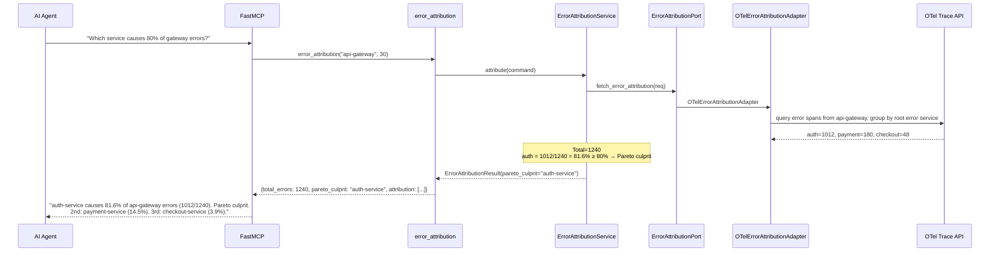
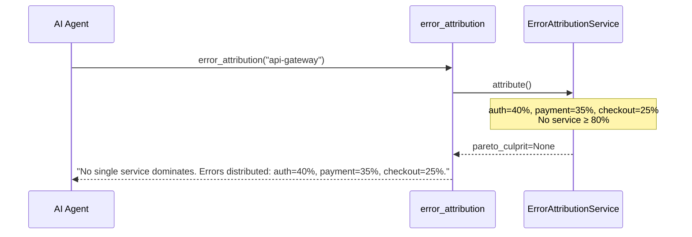
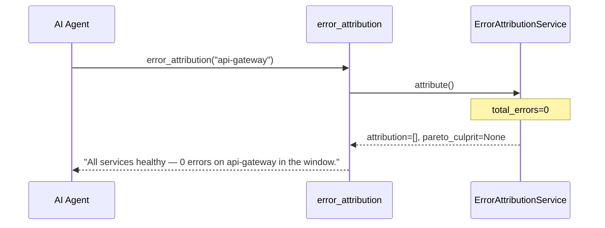

# Use Case 49 — Error Attribution (Pareto Analysis)

## Sample Questions

- "Which downstream service is responsible for 80% of api-gateway errors?"
- "Who causes the most errors on the gateway?"
- "Rank downstream services by error count"
- "Is there a Pareto culprit for the gateway errors?"
- "Attribute gateway 5xx errors to originating services"

---

One MCP tool: `error_attribution`. Identifies root error span for each gateway error, aggregates by service, flags services exceeding 80% as Pareto culprit.

### Flow 1 — Happy Path: Pareto Culprit Found



### Flow 2 — No Clear Culprit



### Flow 3 — No Errors



### Flow 4 — Checker Node: Attribution Validation

```mermaid
sequenceDiagram
    participant Checker as Checker Node
    participant LLM as LLM Response
    participant DuckDB as DuckDB

    Checker->>LLM: Validate attribution accuracy
    alt Percentage math incorrect (auth=1012/1240 ≠ 70%)
        Checker-->>LLM: ❌ FAIL — (count/total)*100
    alt Cascade error attributed to intermediate service
        Checker-->>LLM: ❌ FAIL — root cause is deepest error span
    alt Sum of percentages exceeds 100%
        Checker-->>LLM: ❌ FAIL — percentages must sum to ~100%
    else All checks pass
        Checker-->>LLM: ✅ PASS
    end
    Checker->>DuckDB: Check if culprit is recurrent from previous windows
```

## Key Points

- **Root error span** — deepest span with error=true (not intermediate)
- **Pareto** — service ≥ 80% of errors flagged as culprit
- **Gateway self-error** — if error originates in gateway itself, noted separately
- **Recurrence** — DuckDB tracks repeat offenders across time windows

## Test Coverage

| Test | File | Status |
|---|---|---|
| `test_pareto_culprit` | `tests/unit/test_error_attribution.py` | ✅ |
| `test_no_errors` | `tests/unit/test_error_attribution.py` | ✅ |
| `test_no_pareto` | `tests/unit/test_error_attribution.py` | ✅ |
| `test_returns_culprit` | `tests/unit/test_error_attribution_tool.py` | ✅ |

## Related Files

- `src/hexawyn/domain/models/error_attribution.py` — ServiceErrorCount, ErrorAttributionResult
- `src/hexawyn/application/ports/driven/error_attribution_port.py` — ErrorAttributionPort ABC
- `src/hexawyn/adapters/secondary/gitops/otel_error_attribution_adapter.py` — adapter
- `src/hexawyn/mcp/tools/error_attribution.py` — MCP tool
