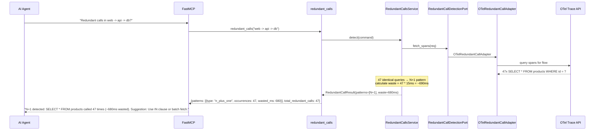
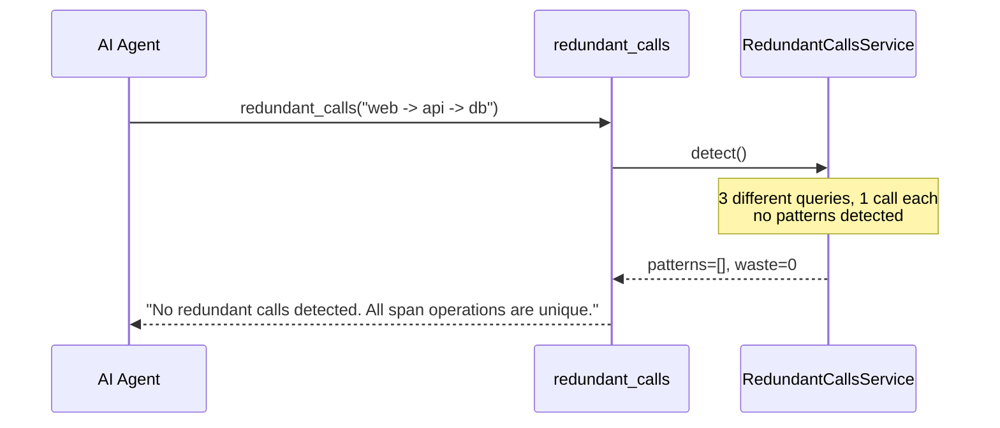
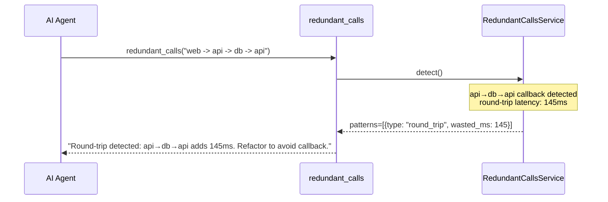

# Use Case 50 — Redundant Call Detection

## Sample Questions

- "Are there any redundant or unnecessary calls in the web -> api -> db -> api flow?"
- "Does this trace have N+1 query patterns?"
- "Detect duplicate DB queries and round-trips in the checkout flow"
- "Show me wasted calls in the payments trace"
- "Are there N+1 patterns or circular calls in the last trace?"

---

One MCP tool: `redundant_calls`. Analyses span operations in a trace flow, detects N+1 patterns (≥5 identical calls), duplicates (≥2), and round-trips. Returns optimisation suggestions.

### Flow 1 — Happy Path: N+1 Detected



### Flow 2 — No Redundancy



### Flow 3 — Round-Trip



### Flow 4 — Checker Node: Pattern Validation

```mermaid
sequenceDiagram
    participant Checker as Checker Node
    participant LLM as LLM Response

    Checker->>LLM: Validate redundancy claims
    alt LLM says "N+1 detected" for 3 identical calls (threshold=5)
        Checker-->>LLM: ❌ FAIL — N+1 needs ≥5 identical calls
    alt LLM suggests batching but pattern is intentional polling
        Checker-->>LLM: ⚠️ FLAG — verify if repeated calls are intentional
    alt LLM calculates waste incorrectly
        Checker-->>LLM: ❌ FAIL — waste = sum(duration) - avg(duration)
    else All checks pass
        Checker-->>LLM: ✅ PASS
    end
```

## Key Points

- **N+1 detection** — ≥5 identical span operations → suggest batching/caching
- **Duplicate detection** — ≥2 identical calls → suggest result caching
- **Round-trip** — A→B→A callback paths detected
- **Waste calculation** — `sum(durations) - avg(duration)` per redundant group

## Test Coverage

| Test | File | Status |
|---|---|---|
| `test_n_plus_one` | `tests/unit/test_redundant_calls.py` | ✅ |
| `test_duplicate` | `tests/unit/test_redundant_calls.py` | ✅ |
| `test_no_redundancy` | `tests/unit/test_redundant_calls.py` | ✅ |
| `test_returns_n_plus_one` | `tests/unit/test_redundant_calls_tool.py` | ✅ |

## Related Files

- `src/hexawyn/domain/models/redundant_calls.py` — SpanInfo, RedundancyPattern, RedundantCallResult
- `src/hexawyn/application/ports/driven/redundant_call_detection_port.py` — RedundantCallDetectionPort ABC
- `src/hexawyn/adapters/secondary/gitops/otel_redundant_call_adapter.py` — adapter
- `src/hexawyn/mcp/tools/redundant_calls.py` — MCP tool
