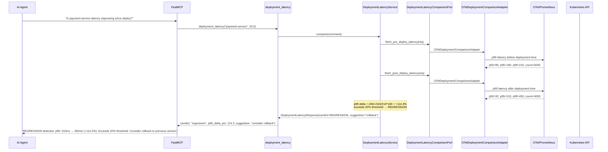
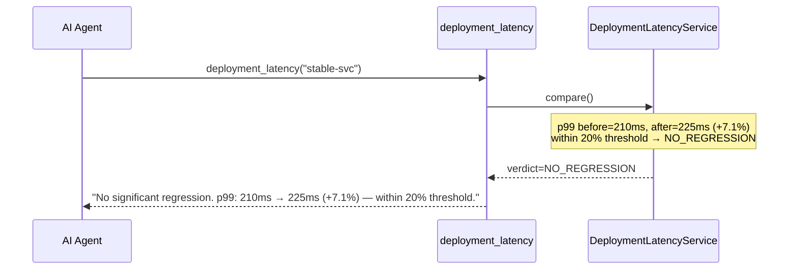
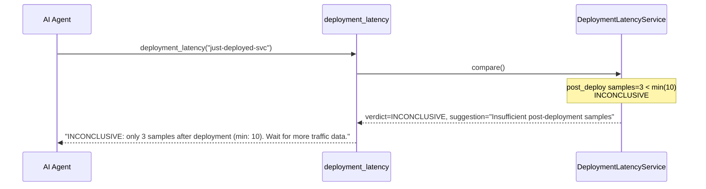

# Use Case 51 — Deployment Latency Comparison

## Sample Questions

- "Is the latency of payment-service increasing since the last deployment?"
- "Did the latest deployment introduce a performance regression?"
- "Compare service latency before and after the deployment 3 hours ago"
- "Is there a p99 regression after the rollout?"
- "Should we rollback based on the latency delta?"

---

One MCP tool: `deployment_latency`. Compares pre-deploy vs post-deploy OTel/p99 latencies, computes percentage deltas, returns regression verdict with rollback suggestion if p99 exceeds threshold.

### Flow 1 — Happy Path: Regression Detected



### Flow 2 — No Regression



### Flow 3 — Insufficient Data



### Flow 4 — Checker Node: Deployment Timestamp Validation

```mermaid
sequenceDiagram
    participant Checker as Checker Node
    participant LLM as LLM Response

    Checker->>LLM: Validate deployment comparison
    alt LLM says "rollback" for -150% improvement (misread sign)
        Checker-->>LLM: ❌ FAIL — sign of delta must be correct
    alt LLM claims regression but delta is within threshold
        Checker-->>LLM: ❌ FAIL — verdict must match threshold
    alt LLM omits before/after absolute values
        Checker-->>LLM: ⚠️ FLAG — p99 absolute values must be cited with deltas
    else All checks pass
        Checker-->>LLM: ✅ PASS
    end
```

## Key Points

- **Delta formula** — `(after - before) / before * 100` per percentile
- **Regression threshold** — p99 delta ≥ 20% → REGRESSION, suggest rollback
- **Improvement** — p99 delta ≤ -20% → IMPROVED
- **Min samples** — post-deployment must have ≥ 10 samples, otherwise INCONCLUSIVE

## Test Coverage

| Test | File | Status |
|---|---|---|
| `test_regression` | `tests/unit/test_deployment_latency.py` | ✅ |
| `test_no_regression` | `tests/unit/test_deployment_latency.py` | ✅ |
| `test_insufficient_data` | `tests/unit/test_deployment_latency.py` | ✅ |
| `test_returns_regression` | `tests/unit/test_deployment_latency_tool.py` | ✅ |

## Related Files

- `src/hexawyn/domain/models/deployment_latency.py` — WindowLatency, DeploymentComparisonResult
- `src/hexawyn/application/ports/driven/deployment_latency_comparison_port.py` — DeploymentLatencyComparisonPort ABC
- `src/hexawyn/adapters/secondary/gitops/otel_deployment_comparison_adapter.py` — adapter
- `src/hexawyn/mcp/tools/deployment_latency.py` — MCP tool
