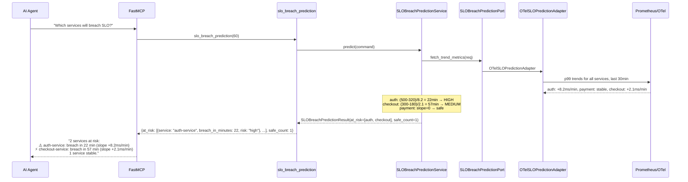
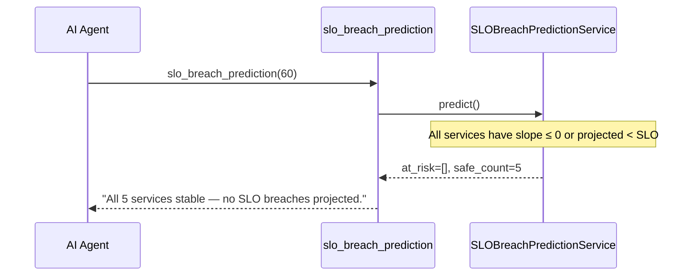
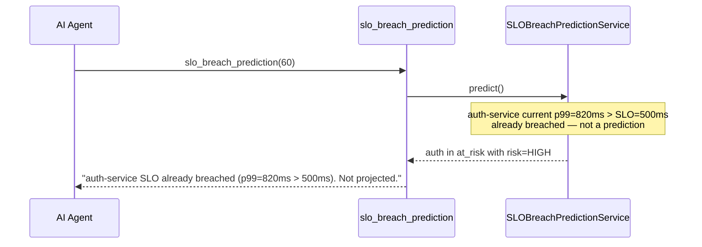

# Use Case 52 — SLO Breach Prediction

## Sample Questions

- "Which services are at risk of violating their latency SLO in the next hour?"
- "Will any service breach its p99 SLO within the next 60 minutes?"
- "Predict which services need attention before they breach their SLO"
- "Is the auth-service trending toward an SLO violation?"
- "Show me services with degrading p99 latency and projected breach times"

---

One MCP tool: `slo_breach_prediction`. Computes trend slope from recent metrics, extrapolates p99, compares against SLO, returns ranked risk list with time-to-breach.

### Flow 1 — Happy Path: Risk Detected



### Flow 2 — All Stable



### Flow 3 — Already Breached



### Flow 4 — Checker Node: Math Validation

```mermaid
sequenceDiagram
    participant Checker as Checker Node
    participant LLM as LLM Response

    Checker->>LLM: Validate prediction math
    alt breach_in_minutes calculation wrong
        Checker-->>LLM: ❌ FAIL — (slo-current)/slope
    alt LLM presents prediction as certainty
        Checker-->>LLM: ⚠️ FLAG — must use "projected IF current trend continues"
    alt Stale data used (>2 min old)
        Checker-->>LLM: ⚠️ FLAG — flag data staleness in response
    else All checks pass
        Checker-->>LLM: ✅ PASS
    end
```

## Key Points

- **Trend slope** — linear regression on last 30 min p99 values
- **Breach time** — `(slo - current_p99) / slope` if slope > 0
- **Risk levels** — HIGH (breach ≤ 30min), MEDIUM (≤ 60min), LOW (>60min)
- **Already breached** — services above SLO flagged separately from predictions

## Test Coverage

| Test | File | Status |
|---|---|---|
| `test_ranked_risks` | `tests/unit/test_slo_breach_prediction.py` | ✅ |
| `test_no_risk` | `tests/unit/test_slo_breach_prediction.py` | ✅ |
| `test_returns_risks` | `tests/unit/test_slo_breach_prediction_tool.py` | ✅ |

## Related Files

- `src/hexawyn/domain/models/slo_breach_prediction.py` — ServiceRisk, SLOBreachPredictionResult
- `src/hexawyn/application/ports/driven/slo_breach_prediction_port.py` — SLOBreachPredictionPort ABC
- `src/hexawyn/adapters/secondary/gitops/otel_slo_prediction_adapter.py` — adapter
- `src/hexawyn/mcp/tools/slo_breach_prediction.py` — MCP tool
