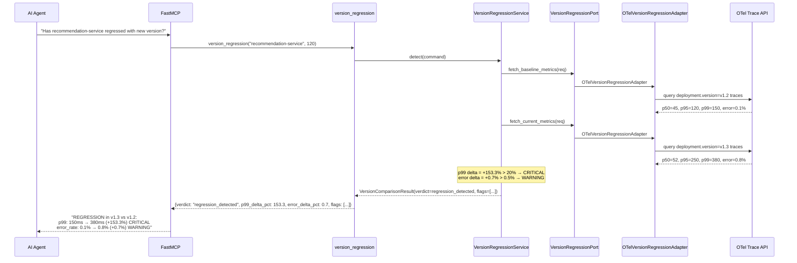
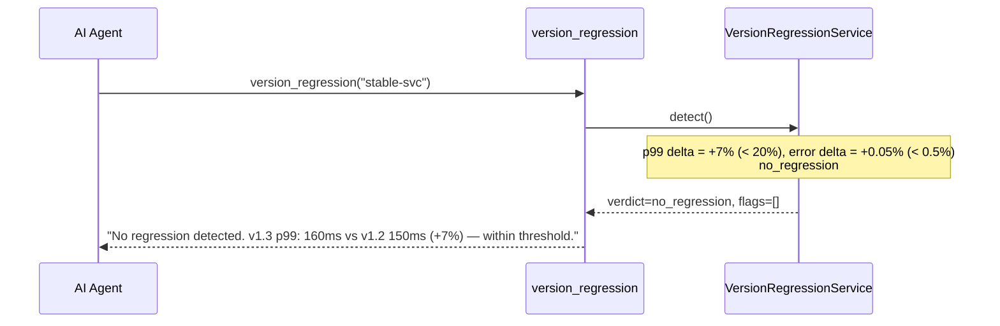
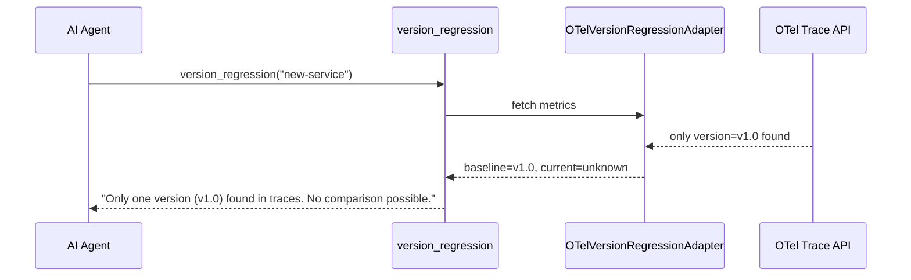

# Use Case 53 — Version Regression Detection

## Sample Questions

- "Have new versions of the recommendation service introduced a regression?"
- "Did v1.3 of the checkout service cause a latency regression?"
- "Compare p99 and error rate between the latest two deployments of auth-service"
- "Is the new release of the payment API slower than the previous version?"
- "Detect if the latest canary version has deteriorated from the stable baseline"

---

One MCP tool: `version_regression`. Groups OTel traces by deployment.version, compares latest version against previous baseline, flags regressions exceeding thresholds (p99 +20%, error rate +0.5%).

### Flow 1 — Happy Path: Regression Detected



### Flow 2 — No Regression



### Flow 3 — Only One Version



### Flow 4 — Checker Node: Validation

```mermaid
sequenceDiagram
    participant Checker as Checker Node
    participant LLM as LLM Response
    participant DuckDB as DuckDB

    Checker->>LLM: Validate version comparison
    alt Delta % incorrect (math error)
        Checker-->>LLM: ❌ FAIL — (current-baseline)/baseline*100
    alt LLM flags regression below threshold
        Checker-->>LLM: ❌ FAIL — threshold must be respected
    alt Rollback misinterpreted as regression
        Checker-->>LLM: ❌ FAIL — chronological order matters
    else All checks pass
        Checker-->>LLM: ✅ PASS
    end
    Checker->>DuckDB: Store version comparison for recurrence detection
```

## Key Points

- **Version grouping** — `deployment.version` OTel attribute + k8s image tag fallback
- **p99 threshold** — ≥ +20% → CRITICAL flag
- **Error threshold** — ≥ +0.5pp → WARNING flag
- **DuckDB** — stores comparisons for detecting recurrence patterns across releases

## Test Coverage

| Test | File | Status |
|---|---|---|
| `test_regression` | `tests/unit/test_version_regression.py` | ✅ |
| `test_no_regression` | `tests/unit/test_version_regression.py` | ✅ |
| `test_error_rate_regression` | `tests/unit/test_version_regression.py` | ✅ |
| `test_returns_regression` | `tests/unit/test_version_regression_tool.py` | ✅ |

## Related Files

- `src/hexawyn/domain/models/version_regression.py` — VersionMetrics, RegressionFlag, VersionComparisonResult
- `src/hexawyn/application/ports/driven/version_regression_port.py` — VersionRegressionPort ABC
- `src/hexawyn/adapters/secondary/gitops/otel_version_regression_adapter.py` — adapter
- `src/hexawyn/mcp/tools/version_regression.py` — MCP tool
