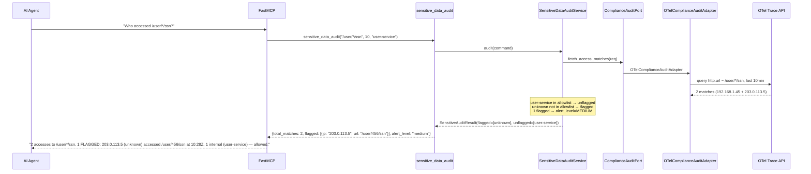
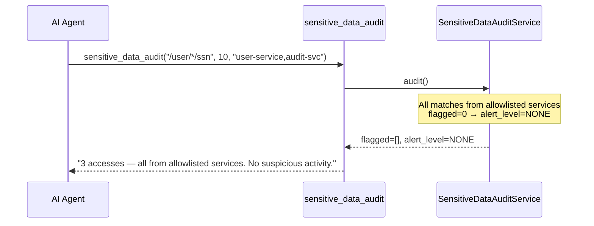
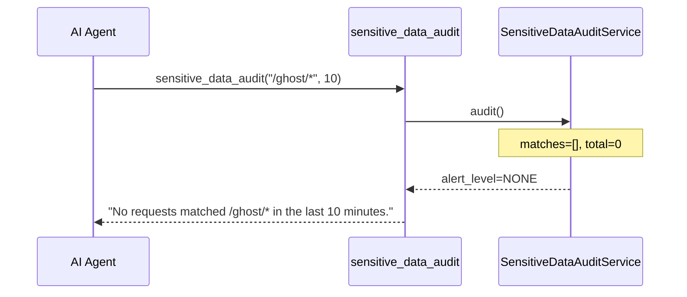

# Use Case 54 — Sensitive Data Access Audit

## Sample Questions

- "Has any request accessed sensitive data like /user/*/ssn in the last 10 minutes?"
- "Who accessed the PII endpoints in the last hour?"
- "Flag any external IPs accessing /admin/pii"
- "Show me all requests to /user/*/ssn from non-internal services"
- "Audit sensitive endpoint access with allowlist filtering"

---

One MCP tool: `sensitive_data_audit`. Queries OTel traces matching sensitive URL patterns, flags requests from non-allowlisted callers as suspicious, returns alert level.

### Flow 1 — Happy Path: External Access Flagged



### Flow 2 — All Allowlisted



### Flow 3 — No Matches



### Flow 4 — Checker Node: Alert Level Validation

```mermaid
sequenceDiagram
    participant Checker as Checker Node
    participant LLM as LLM Response

    Checker->>LLM: Validate audit claims
    alt LLM says "HIGH alert" for 2 flagged (threshold >5)
        Checker-->>LLM: ❌ FAIL — alert_level must match count (HIGH >5, MEDIUM >0)
    alt LLM reports caller as "external" when IP is internal
        Checker-->>LLM: ⚠️ FLAG — verify caller_ip is truly external vs allowlist
    alt LLM omits user_id from span attribute
        Checker-->>LLM: ⚠️ FLAG — user_id should be surfaced if available in span
    else All checks pass
        Checker-->>LLM: ✅ PASS
    end
```

## Key Points

- **Allowlist** — expected callers excluded from flagged results
- **Alert level** — HIGH (>5 flagged), MEDIUM (>0), NONE (0)
- **Pattern matching** — wildcard pattern support (e.g. /user/*/ssn)
- **Caller attribution** — caller_ip, caller_service, user_id from OTel attributes

## Test Coverage

| Test | File | Status |
|---|---|---|
| `test_flags_external` | `tests/unit/test_sensitive_data_audit.py` | ✅ |
| `test_allowlisted_excluded` | `tests/unit/test_sensitive_data_audit.py` | ✅ |
| `test_no_matches` | `tests/unit/test_sensitive_data_audit.py` | ✅ |
| `test_returns_flagged` | `tests/unit/test_sensitive_data_audit_tool.py` | ✅ |

## Related Files

- `src/hexawyn/domain/models/sensitive_data_audit.py` — AccessMatch, SensitiveAuditResult
- `src/hexawyn/application/ports/driven/compliance_audit_port.py` — ComplianceAuditPort ABC
- `src/hexawyn/adapters/secondary/gitops/otel_compliance_audit_adapter.py` — adapter
- `src/hexawyn/mcp/tools/sensitive_data_audit.py` — MCP tool
