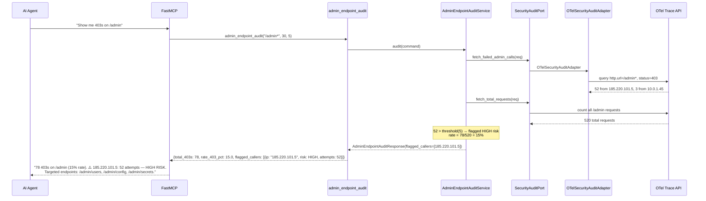
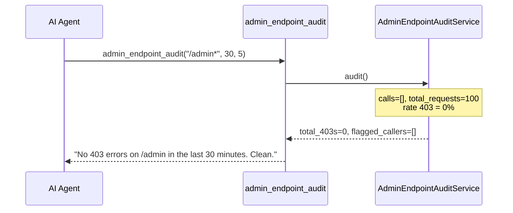
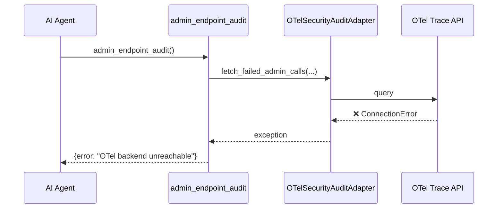

# Use Case 55 — Admin Endpoint Security Audit

## Sample Questions

- "Show me all calls to /admin that failed with a 403"
- "Are there unauthorized access attempts on the admin endpoints?"
- "Who is repeatedly hitting /admin endpoints with 403 errors?"
- "What is the 403 rate on /admin in the last 30 minutes?"
- "Flag any IPs that have more than 5 failed admin calls in the last hour"

---

One MCP tool: `admin_endpoint_audit`. Queries OTel traces for http.status_code=403 on /admin*, groups by caller IP, flags callers exceeding threshold as HIGH risk.

### Flow 1 — Happy Path: High-Risk Caller Detected



### Flow 2 — Clean (No 403s)



### Flow 3 — OTel Unreachable



### Flow 4 — Checker Node: False Positive Prevention

```mermaid
sequenceDiagram
    participant Checker as Checker Node
    participant LLM as LLM Response

    Checker->>LLM: Validate security audit assessment
    alt LLM flags IP with 2 attempts as "high risk" (threshold=5)
        Checker-->>LLM: ❌ FAIL — flag count must match threshold
    alt LLM reports 403 IP but omits total request count for rate context
        Checker-->>LLM: ⚠️ FLAG — rate_403_pct must be cited with total_requests
    alt LLM says "attack detected" without listing specific endpoints
        Checker-->>LLM: ⚠️ FLAG — targeted endpoints must be listed
    else All checks pass
        Checker-->>LLM: ✅ PASS
    end
```

## Key Points

- **Caller grouping** — by caller_ip, attempts counted per IP
- **Flag threshold** — attempts >= flag_threshold (default: 5) → HIGH risk
- **403 rate** — `total_403s / total_requests * 100`
- **Endpoint tracking** — unique endpoints listed per flagged caller

## Test Coverage

| Test | File | Status |
|---|---|---|
| `test_high_risk_detected` | `tests/unit/test_admin_endpoint_audit.py` | ✅ |
| `test_no_403s` | `tests/unit/test_admin_endpoint_audit.py` | ✅ |
| `test_no_flag_below_threshold` | `tests/unit/test_admin_endpoint_audit.py` | ✅ |
| `test_returns_flagged_callers` | `tests/unit/test_admin_endpoint_audit_tool.py` | ✅ |

## Related Files

- `src/hexawyn/domain/models/admin_endpoint_audit.py` — FailedAdminCall, CallerSummary, AdminAuditResult
- `src/hexawyn/application/ports/driven/security_audit_port.py` — SecurityAuditPort ABC
- `src/hexawyn/adapters/secondary/gitops/otel_security_audit_adapter.py` — OTelSecurityAuditAdapter
- `src/hexawyn/mcp/tools/admin_endpoint_audit.py` — MCP tool
