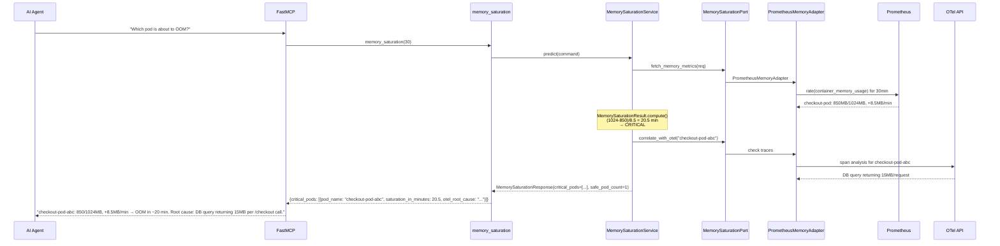
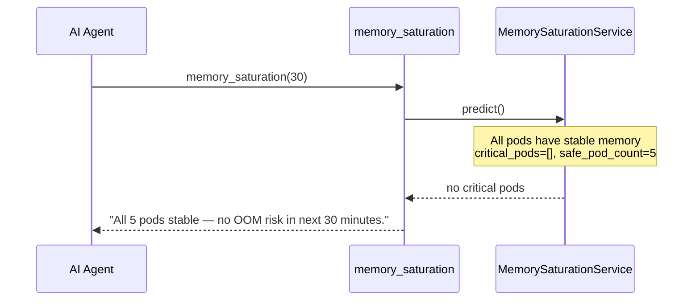

# Use Case 56 — Memory Saturation Prediction

## Sample Questions

- "Which pod is going to OOM in the next 30 minutes?"
- "Predict which pods are at risk of memory saturation"
- "Is there a memory leak in the checkout service right now?"
- "Show me pods with growing memory and their projected saturation time"
- "Why is the checkout pod consuming more memory?"

---

One MCP tool for memory saturation prediction: `memory_saturation`. Queries Prometheus for memory trends, extrapolates time-to-saturation, and correlates with OTel traces for root cause.

### Flow 1 — Happy Path: Critical Pod Detected

### Flow 2 — All Stable

## Key Points

- **saturation_in_minutes** = `(limit - current) / growth_rate` — linear extrapolation
- **CRITICAL** if saturation < 15 min, **AT_RISK** if < 30 min, otherwise **STABLE**
- **No limit** → node capacity (32GB default) used as ceiling
- **OTel correlation** — identifies the downstream call causing memory growth

## Test Coverage

| Test | File | Status |
|---|---|---|
| `test_compute_critical` | `tests/unit/test_memory_saturation.py` | ✅ |
| `test_no_risk` | `tests/unit/test_memory_saturation.py` | ✅ |
| `test_returns_critical_pods` | `tests/unit/test_memory_saturation_tool.py` | ✅ |

## Related Files

- `src/hexawyn/domain/models/memory_saturation.py` — MemoryPrediction, MemorySaturationResult
- `src/hexawyn/application/ports/driven/memory_saturation_port.py` — MemorySaturationPort ABC
- `src/hexawyn/adapters/secondary/gitops/prometheus_memory_adapter.py` — Prometheus adapter
- `src/hexawyn/mcp/tools/memory_saturation.py` — MCP tool
