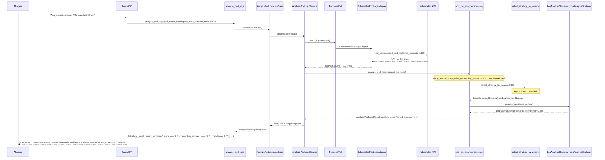
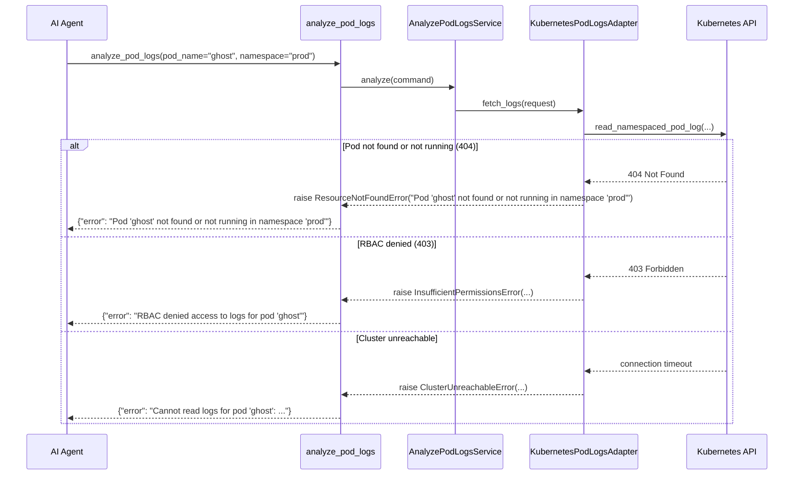

# Use Case 57 — Analyze Pod Logs Over a Time Window

## Sample Questions

- "Analyze the logs of pod api-gateway-7f9b in the last 30 minutes — are there recurring error patterns or connection timeouts?"
- "Are there any connection refused errors in the payment-service pod logs?"
- "Why does checkout-api keep throwing errors — check its logs for the last hour"
- "How many errors and warnings has the auth-service pod logged recently?"
- "Can you spot any recurring failure patterns in the worker pod's logs?"

---

One MCP tool: `analyze_pod_logs`. Retrieves a pod's logs over a time window,
auto-selects a `LogAnalysisStrategy` (SMART/HYBRID/STREAMING) purely by line
count, extracts recurring error patterns, and separately categorizes
connection-timeout vs connection-refused issues with a confidence score.

### Flow 1 — Happy Path: SMART Strategy with Recurring Errors



### Flow 2 — Error Handling: Pod Not Found / RBAC / Cluster Unreachable



### Flow 3 — Checker Node: False Positive Prevention

```mermaid
sequenceDiagram
    participant Checker as Checker Node
    participant LLM as LLM Response

    Checker->>LLM: Validate pod log analysis assessment
    alt LLM reports "critical outage" for a single low-confidence pattern
        Checker-->>LLM: ❌ FAIL — confidence below threshold, downgrade severity
    alt LLM merges connection_timeouts and connection_refused into one bucket
        Checker-->>LLM: ⚠️ FLAG — categories must stay separate per the domain result
    else All checks pass
        Checker-->>LLM: ✅ PASS
    end
```

## Key Points

- **Volume-based Strategy selection** — SMART <1000 lines, HYBRID 1000–10000, STREAMING >10000, decided purely by line count in `select_strategy_by_volume` (domain), independent of the pre-existing context-aware `StrategySelector`.
- **Connection issues categorized separately** — `connection_timeouts` and `connection_refused` are distinct lists, each entry carrying its own confidence score, never merged with generic patterns.
- **Pod restart handling** — if the pod restarted within the window, current and previous container logs are fetched and analyzed as separate `runs`, with `restarts_detected=True`.
- **Binary/non-UTF8 sanitization** — raw log bytes are decoded with `errors="replace"`; any resulting replacement character sets `sanitized_binary=True`.
- **JSON-structured logs** — lines that parse as a JSON object have their `msg`/`message`/`error`/`level` fields extracted (`is_json=True`) instead of being treated as raw text.

## Test Coverage

| Test | File | Status |
|---|---|---|
| `test_smart_for_under_1000_lines` | `tests/unit/log_analysis/test_volume_selector.py` | ✅ |
| `test_streaming_above_10000` | `tests/unit/log_analysis/test_volume_selector.py` | ✅ |
| `test_extracts_connection_timeouts` / `test_extracts_connection_refused` | `tests/unit/log_analysis/test_patterns.py` | ✅ |
| `test_selects_smart_strategy_under_1000_lines` (TC1) | `tests/unit/log_analysis/test_pod_log_analyzer.py` | ✅ |
| `test_selects_streaming_strategy_above_10000_lines` (TC2) | `tests/unit/log_analysis/test_pod_log_analyzer.py` | ✅ |
| `test_no_errors_returns_no_anomalies_report` (TC3) | `tests/unit/log_analysis/test_pod_log_analyzer.py` | ✅ |
| `test_pod_not_found_raises_resource_not_found` (TC4) | `tests/unit/test_kubernetes_pod_logs_adapter.py` | ✅ |
| `test_detects_restart_and_splits_runs` | `tests/unit/log_analysis/test_pod_log_analyzer.py` | ✅ |
| `test_non_utf8_bytes_are_sanitized` | `tests/unit/test_kubernetes_pod_logs_adapter.py` | ✅ |
| `test_json_structured_line_is_parsed` | `tests/unit/test_kubernetes_pod_logs_adapter.py` | ✅ |
| `test_handles_error` | `tests/unit/test_analyze_pod_logs_tool.py` | ✅ |

## Related Files

- `src/hexawyn/domain/models/analyze_pod_logs.py` — PodLogLine, ConnectionIssue, LogPatternMatch, PodRunSummary, AnalyzePodLogsRequest/Result
- `src/hexawyn/domain/services/log_analysis/strategy_port.py` — LogAnalysisStrategy (ILogAnalysisStrategy port)
- `src/hexawyn/domain/services/log_analysis/strategy.py` — SmartSummaryStrategy, StreamingStrategy, HybridStrategy, StrategySelector
- `src/hexawyn/domain/services/log_analysis/patterns.py` — categorize_connection_issues
- `src/hexawyn/domain/services/log_analysis/volume_selector.py` — select_strategy_by_volume
- `src/hexawyn/domain/services/log_analysis/pod_log_analyzer.py` — analyze_pod_logs (domain orchestration)
- `src/hexawyn/application/ports/driven/pod_logs_port.py` — PodLogsPort ABC
- `src/hexawyn/application/service/analyze_pod_logs_service.py` — AnalyzePodLogsService
- `src/hexawyn/application/use_case/analyze_pod_logs/analyze_pod_logs_use_case.py` — AnalyzePodLogsUseCase
- `src/hexawyn/adapters/secondary/gitops/kubernetes_pod_logs_adapter.py` — KubernetesPodLogsAdapter
- `src/hexawyn/mcp/tools/analyze_pod_logs.py` — MCP tool
